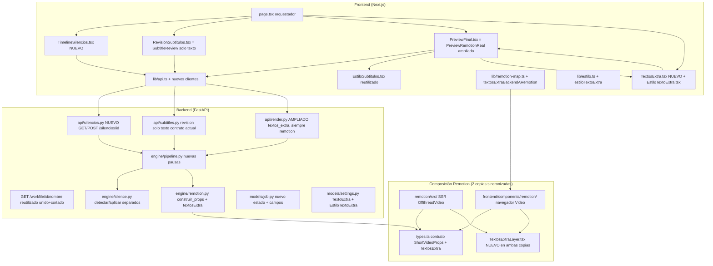
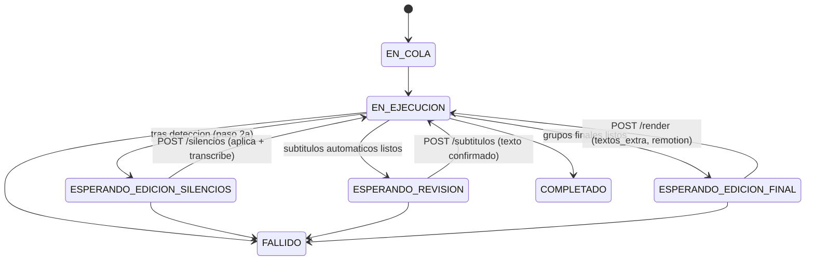

# Documento de Diseño: Edición Avanzada de Shorts

> Feature: `edicion-avanzada-shorts` · Tipo: `feature` · Flujo: `design-first`
> Artefactos: Diseño de **Alto Nivel** (visión, arquitectura, diagramas de flujo/estados, componentes, modelos de datos, contratos de API) + **Bajo Nivel** (firmas de funciones, pseudocódigo de algoritmos clave, cambios por archivo).
>
> **Convención obligatoria del proyecto:** todo el código, los comentarios y este documento están en **ESPAÑOL**.

---

## 1. Visión general (Overview)

Esta feature amplía el editor de "shorts" verticales con **cuatro capacidades de edición manual** que hoy no existen o son totalmente automáticas, manteniendo intacto el render final con **Remotion** y **reutilizando** la infraestructura de previsualización en vivo con `@remotion/player` ya entregada en la feature previa (PR #19, steering `previsualizacion-video-real-remotion.md`).

Las cuatro capacidades son:

1. **Timeline tipo CapCut web para cortes de silencio** — antes de transcribir, el usuario ve sobre el vídeo **unido** (pre-corte) los tramos de silencio detectados, los ajusta (mover/estirar/achicar/añadir/eliminar) y confirma; con esos tramos se reconstruye el vídeo recortado que alimenta la transcripción.
2. **Revisión de subtítulos (solo texto)** — el subtitulado automático ya funciona bien; la pausa muestra los grupos con su texto para que el usuario **confirme** que está correcto, permitiendo una **corrección ligera del TEXTO** (igual que el review actual `SubtitleReview.tsx`). **No** se editan tiempos (inicio/fin), **no** se dividen/unen grupos y **no** hay re-timing: los tiempos por palabra provienen de la transcripción sobre el vídeo ya recortado y no se recalculan.
3. **Textos extra tipo "hook"** — 1 o 2 overlays de texto **plano sin animación**, con controles de estilo **independientes** de los subtítulos, aplicados al vídeo final, con rango temporal y posición ajustables y previsualización en vivo.
4. **Simplificación del flujo de render** — se elimina la elección de motor: **siempre Remotion**. La etapa que hoy es `esperando_eleccion_render` pasa a ser la etapa final de "preview + edición final + render Remotion". El código de ffmpeg permanece en el repo pero no se usa en este flujo.

El diseño es **aditivo y retrocompatible**: no rompe `ShortVideoProps` (se extiende con un campo `textosExtra` opcional), mantiene sincronizadas las **dos copias** de la composición Remotion (`remotion/src/` SSR y `frontend/components/remotion/` navegador) y reutiliza las funciones puras existentes (`remotion-map.ts`, `estilo.ts`, `EstiloSubtitulos`, preview `@remotion/player`). La revisión de subtítulos reutiliza el enfoque de solo texto ya existente (`SubtitleReview.tsx`).

**Orden de flujo confirmado:** editar silencios a mano en el timeline → **CORTAR** → **TRANSCRIBIR** → **SUBTÍTULOS automáticos** → **PAUSA de REVISIÓN** que muestra el texto para confirmar (con edición ligera de texto) → **preview final + textos extra** → **render Remotion**.

### 1.1 Suposiciones de diseño explícitas

- **S1.** El corte de silencios se aplica **antes** de transcribir. Los subtítulos se generan sobre el vídeo YA recortado, por lo que **no** hay que re-mapear subtítulos existentes tras editar silencios (el flujo actual `CORTAR_SILENCIOS → TRANSCRIBIR` ya cumple este orden).
- **S2.** La detección de silencios para el timeline reutiliza las funciones **puras** ya existentes en `backend/app/engine/silence.py` (`parsear_silencedetect`, `calcular_segmentos_conservar`, `construir_filtro_recorte`, `obtener_duracion`). Se refactoriza `cortar_silencios` para separar **detección** (nueva pausa) de **aplicación** (reanudación).
- **S3.** El vídeo **unido** (pre-corte) debe servirse por HTTP para el timeline. Hoy `GET /workfile/{job_id}/{nombre}` sirve el vídeo cortado; se reutiliza el mismo endpoint apuntando al artefacto `unido.mp4`.
- **S4.** La pausa de subtítulos es una **revisión de solo texto** que reutiliza el enfoque actual (`SubtitleReview.tsx` y el contrato de `POST /subtitulos/{id}`). Se mantiene el estado `ESPERANDO_REVISION` con su **contrato ACTUAL** (grupos con texto), **sin** ampliarlo a tiempos ni a palabras editables. Como los subtítulos se generan sobre el vídeo YA recortado y el automático funciona bien, no se editan tiempos ni se dividen/unen grupos.
- **S5.** La clave de OpenAI se persiste en `localStorage` del navegador (hoy es transitoria en estado React). Es una decisión con **implicación de seguridad** que el usuario asume explícitamente (§9).
- **S6.** El "scrubbing/preview en vivo" del timeline de silencios sobre el vídeo unido con `@remotion/player` es **nice-to-have**: el diseño lo contempla pero su ausencia no bloquea la feature.
- **S7.** Los textos extra son **texto plano sin animación**; se agregan en la **etapa final** sobre el vídeo ya recortado/producido; cada uno con **punto de entrada/salida (in/out)** y estilo **independiente**; su posición usa los **mismos** controles que los subtítulos (posición vertical % + horizontal), **sin** arrastre libre x/y. Máximo 2 textos.

### 1.2 Reutilización de la feature previa (PR #19)

| Activo existente | Reutilización en esta feature |
|---|---|
| `@remotion/player` (preview) | Timeline de silencios (fondo = vídeo unido) y preview de textos extra en la etapa final (fondo = vídeo cortado) |
| `SubtitleReview.tsx` (revisión de solo texto) | Base de la pausa de revisión de subtítulos: mostrar grupos con su texto y permitir corrección ligera del texto |
| `EstiloSubtitulos.tsx` | Panel de estilo de subtítulos **y** (como componente hermano) panel de estilo de textos extra |
| `remotion-map.ts` (`gruposBackendARemotion`, `redondearMitadAPar`, `calcularDurationInFrames`) | Mapeo de grupos (revisados) y de textos extra segundos→ms; se añade `textosExtraBackendARemotion` con el mismo criterio de redondeo |
| `estilo.ts` (`estiloDesdeAjustes`, `ajustesConEstilo`) | Proyección de estilo de subtítulos; se añade proyección hermana para textos extra |
| `PreviewRemotionReal.tsx` | Base del componente de la etapa final (preview + textos extra + confirmar render) |
| Contrato `ShortVideoProps` / `types.ts` (2 copias) | Se extiende **aditivamente** con `textosExtra` |
| `GET /render/{id}` (`construir_respuesta_render`) | Se amplía con `textos_extra` y datos del vídeo unido/cortado |

---

## 2. Arquitectura (Alto Nivel)

### 2.1 Diagrama de componentes



### 2.2 Flujo completo del usuario


### 2.3 Diagrama de estados del Job



> **Nota sobre nombres de estado:** se reutiliza `ESPERANDO_ELECCION_RENDER` renombrándolo semánticamente a `ESPERANDO_EDICION_FINAL` (valor de string `"esperando_edicion_final"`). Para minimizar rupturas se documenta como el mismo punto de pausa del pipeline (antes "elegir motor", ahora "preview + textos extra + render Remotion"). Ver §8.1 sobre compatibilidad.

---

## 3. Componentes e Interfaces (Alto Nivel)

### 3.1 Backend — nuevos/ampliados

#### Componente: `api/silencios.py` (NUEVO)
**Propósito:** exponer los tramos de silencio detectados sobre el vídeo unido y aceptar los tramos editados para reanudar el pipeline.

**Responsabilidades:**
- `GET /silencios/{job_id}`: devolver tramos detectados, duración total del vídeo unido, y URL del vídeo unido para el timeline.
- `POST /silencios/{job_id}`: validar y aplicar los tramos editados, reconstruir el vídeo recortado y continuar a TRANSCRIBIR.

#### Componente: `engine/silence.py` (REFACTOR)
Se separa la orquestación monolítica `cortar_silencios` en dos fases puras/inyectables:
- **Detección**: `detectar_silencios(entrada, ...) -> ResultadoDeteccionSilencios` (silencios + duración).
- **Aplicación**: `aplicar_tramos_borrado(entrada, salida, tramos_borrar, duracion, runner) -> Path`.

Las funciones puras existentes (`calcular_segmentos_conservar`, `construir_filtro_recorte`) se reutilizan; se añade `segmentos_conservar_desde_borrado` (complemento de los tramos a borrar).

#### Componente: `api/subtitles.py` (SIN CAMBIOS DE ALCANCE)
La pausa de revisión mantiene el contrato **actual** de solo texto: `GET /subtitulos/{id}` devuelve los grupos con su texto (para revisarlos) y `POST /subtitulos/{id}` acepta el texto confirmado/corregido. **No** se editan tiempos, **no** hay split/merge y **no** se recalcula el reparto de karaoke: los tiempos por palabra provienen de la transcripción sobre el vídeo ya recortado.

#### Componente: `engine/remotion.py` (AMPLIADO)
`construir_props` acepta `textos_extra` y añade el campo `textosExtra` al `props.json`. Nuevo mapeo puro `mapear_texto_extra_a_props`.

### 3.2 Frontend — nuevos/ampliados

#### Componente: `TimelineSilencios.tsx` (NUEVO)
**Interfaz (props):**
```typescript
export interface TimelineSilenciosProps {
  jobId: string;
  baseUrl?: string;
  /** Se invoca cuando los tramos se envían correctamente (reanudación). */
  onEnviado?: () => void;
  // Inyecciones para tests:
  obtenerFn?: typeof obtenerSilencios;
  enviarFn?: typeof enviarSilencios;
}
```
**Responsabilidades:** cargar tramos + duración + URL del vídeo unido; renderizar una línea de tiempo con **bloques arrastrables** (los tramos A BORRAR) sobre la duración total; permitir mover/estirar/achicar/añadir/eliminar bloques; opcionalmente montar `<Player>` con el vídeo unido como fondo para scrubbing (nice-to-have); enviar los tramos editados.

#### Componente: `RevisionSubtitulos.tsx` (reutiliza `SubtitleReview.tsx`, solo texto)
**Interfaz (props):**
```typescript
export interface RevisionSubtitulosProps {
  jobId: string;
  baseUrl?: string;
  onEnviado?: () => void;
  obtenerFn?: typeof obtenerSubtitulos;
  enviarFn?: typeof enviarSubtitulos;
}
```
**Responsabilidades:** mostrar los grupos con su **texto** para que el usuario **confirme** que el subtitulado automático está bien, permitiendo **corrección ligera del texto** (igual que el review actual). **No** incluye controles de tiempo (`inicio_s`/`fin_s`), **no** permite dividir/unir grupos y **no** recalcula el reparto de karaoke. Puede mantenerse la reutilización directa de `SubtitleReview.tsx` o una versión mínima equivalente.

#### Componente: `PreviewFinal.tsx` (= `PreviewRemotionReal.tsx` ampliado)
Es la **pantalla de edición final** (estado `ESPERANDO_EDICION_FINAL`), que se muestra **después** de que el vídeo ya está producido/recortado. Sobre el vídeo ya recortado ofrece **preview en vivo** con `@remotion/player`, añade la sección de **textos extra** (montar/gestionar `TextosExtra.tsx`), inyecta `textosExtra` en `inputProps` para que los overlays se vean en la preview, y en "Confirmar y renderizar" envía los textos extra al backend. Ya no muestra elección de motor (siempre Remotion).

#### Componente: `TextosExtra.tsx` + `EstiloTextoExtra.tsx` (NUEVOS)
Gestiona una lista de **0..2** textos extra mediante un botón **"Agregar texto"**. Cada texto se coloca en el vídeo definiendo su **punto de entrada (in) y salida (out) en segundos** (campos numéricos o marcadores en un mini-timeline) y tiene **estilo independiente** mediante `EstiloTextoExtra` (componente hermano de `EstiloSubtitulos`, mismos tipos de control: fuente, tamaño, color, posición vertical %/horizontal %). El texto es **plano, sin animación**. La preview en vivo refleja cada texto entre su in/out.

---

## 4. Modelos de Datos (Alto Nivel)

### 4.1 Backend (Pydantic — `models/settings.py` y `models/job.py`)

```python
# --- Tramos de silencio para el timeline (NUEVO) ---
class TramoSilencio(BaseModel):
    """Un tramo [inicio_s, fin_s] marcado para BORRAR del vídeo unido."""
    inicio_s: float = Field(ge=0.0)
    fin_s: float = Field(ge=0.0)
    # Invariante de validación: fin_s > inicio_s (ver validar_tramos)

# --- Texto extra tipo hook (NUEVO) ---
class EstiloTextoExtra(BaseModel):
    """Estilo INDEPENDIENTE de los subtítulos, mismos tipos de campo."""
    fuente: str = Field(default=config.DEFAULT_FUENTE)
    tamano: int = Field(default=64)             # rango motor 12..200
    color: str = Field(default="#FFFFFF")       # #RRGGBB
    color_borde: str = Field(default="#000000") # #RRGGBB
    grosor_borde: int = Field(default=6)        # 0..20
    negrita: bool = Field(default=True)
    pos_vertical_pct: float = Field(default=20.0)   # 0..100
    pos_horizontal_pct: float = Field(default=50.0) # 0..100

class TextoExtra(BaseModel):
    """Un overlay de texto plano SIN animación aplicado al vídeo final."""
    texto: str
    inicio_s: float = Field(ge=0.0)
    fin_s: float = Field(ge=0.0)
    estilo: EstiloTextoExtra = Field(default_factory=EstiloTextoExtra)

# --- Grupo de subtítulo para REVISIÓN de texto (reutiliza GrupoSubtitulo existente) ---
# Ya existe GrupoSubtitulo{texto, inicio_s, fin_s, palabras?: List[Palabra]}.
# En la revisión solo se corrige `texto`; inicio_s/fin_s y palabras NO se editan.
```

**Cambios en `models/job.py`:**
```python
class JobStatus(str, Enum):
    EN_COLA = "en_cola"
    EN_EJECUCION = "en_ejecucion"
    ESPERANDO_EDICION_SILENCIOS = "esperando_edicion_silencios"  # NUEVO (antes de transcribir)
    ESPERANDO_REVISION = "esperando_revision"                    # revisión de solo texto (contrato actual)
    ESPERANDO_EDICION_FINAL = "esperando_edicion_final"          # renombra ESPERANDO_ELECCION_RENDER
    COMPLETADO = "completado"
    FALLIDO = "fallido"

class JobState(BaseModel):
    # ... campos existentes ...
    unido_path: Optional[str] = None          # NUEVO: vídeo pre-corte para el timeline
    silencios_detectados: Optional[List[TramoSilencio]] = None  # NUEVO
    duracion_unido_s: Optional[float] = None  # NUEVO
    textos_extra: Optional[List[TextoExtra]] = None  # NUEVO (persistido en pausa final)
```

### 4.2 Frontend (`lib/types.ts`)

```typescript
export interface TramoSilencio { inicio_s: number; fin_s: number; }

export interface SilenciosEdicion {
  job_id: string;
  estado: JobStatus;
  editable: boolean;
  /** URL HTTP del vídeo UNIDO (pre-corte) para el timeline. */
  video_url: string | null;
  video_nombre: string | null;
  duracion_s: number;          // duración del vídeo unido
  fps: number; ancho: number; alto: number;
  tramos: TramoSilencio[];     // silencios detectados (a borrar)
}

export interface EstiloTextoExtra {
  fuente: string; tamano: number; color: string;
  colorBorde: string; grosorBorde: number; negrita: boolean;
  posVerticalPct: number; posHorizontalPct: number;
}

export interface TextoExtra {
  texto: string; inicioMs: number; finMs: number; estilo: EstiloTextoExtra;
}
```

### 4.3 Contrato de composición (`types.ts` — extensión ADITIVA)

```typescript
/** Overlay de texto plano SIN animación (NUEVO, aditivo). */
export type TextoExtraProps = {
  texto: string;
  inicioMs: number;
  finMs: number;
  estilo: EstiloTextoExtra; // camelCase, mismos campos que Estilo + posHorizontalPct
};

export type EstiloTextoExtra = {
  fuente: string; tamano: number; color: string;
  colorBorde: string; grosorBorde: number; negrita: boolean;
  posVerticalPct: number; posHorizontalPct: number;
};

export type ShortVideoProps = {
  videoSrc: string; fps: number; width: number; height: number;
  durationInFrames: number; estilo: Estilo; combineTokensWithinMs: number;
  grupos: Grupo[];
  /** NUEVO (opcional para retrocompatibilidad): overlays de texto plano. */
  textosExtra?: TextoExtraProps[];
};
```

> **Retrocompatibilidad de `ShortVideoProps`:** `textosExtra` es **opcional** (`?`). Un `props.json` sin ese campo produce el render actual (sin overlays). El backend siempre lo emite como `[]` cuando no hay textos extra.

---

## 5. Contratos de API (Alto Nivel)

Errores homogéneos en todos los endpoints (`error_envelope`): `JOB_NOT_FOUND` (404), `INVALID_REQUEST` (400), `CONFLICT` (409).

### 5.1 `GET /silencios/{job_id}`
Devuelve los tramos detectados + datos del vídeo unido. Solo lectura.
```json
{
  "job_id": "abc",
  "estado": "esperando_edicion_silencios",
  "editable": true,
  "video_url": "http://127.0.0.1:8000/workfile/abc/unido.mp4",
  "video_nombre": "unido.mp4",
  "duracion_s": 42.5,
  "fps": 30, "ancho": 1080, "alto": 1920,
  "tramos": [{"inicio_s": 3.2, "fin_s": 4.1}, {"inicio_s": 10.0, "fin_s": 11.5}]
}
```
- `404 JOB_NOT_FOUND` si no existe. Si el Job no está en `ESPERANDO_EDICION_SILENCIOS`, `editable=false` y `tramos` los disponibles (posiblemente vacíos).

### 5.2 `POST /silencios/{job_id}`
Envía los tramos a BORRAR editados y reanuda (aplica corte + transcribe).
```json
{ "tramos": [{"inicio_s": 3.0, "fin_s": 4.3}, {"inicio_s": 20.1, "fin_s": 22.0}] }
```
Respuesta `202`: `{ "job_id": "abc", "estado": "en_ejecucion" }`.
- `404` si no existe · `409 CONFLICT` si no está en `ESPERANDO_EDICION_SILENCIOS` · `400 INVALID_REQUEST` si algún tramo tiene `fin_s <= inicio_s`, sale de `[0, duracion_unido_s]`, o la lista no es serializable.

### 5.3 `GET /subtitulos/{job_id}` (contrato ACTUAL — solo texto)
Devuelve los grupos con su **texto** para la revisión. Mantiene el contrato de solo texto ya existente (los tiempos se muestran informativos pero no son editables):
```json
{
  "job_id": "abc", "estado": "esperando_revision", "editable": true,
  "grupos": [
    {"texto": "hola mundo", "inicio_s": 0.0, "fin_s": 1.2},
    {"texto": "adios", "inicio_s": 1.2, "fin_s": 2.0}
  ]
}
```

### 5.4 `POST /subtitulos/{job_id}` (contrato ACTUAL — texto confirmado)
Mantiene el contrato de **solo texto** existente: acepta el texto confirmado/corregido de cada grupo. El número de grupos y sus tiempos **no** cambian (no hay split/merge ni edición de tiempos). No se recalcula el reparto de karaoke: los tiempos por palabra provienen de la transcripción sobre el vídeo ya recortado.
```json
{
  "grupos": [
    {"texto": "hola mundo"},
    {"texto": "adios"}
  ]
}
```
Respuesta `202`. Errores:
- `409 CONFLICT` si no está en `ESPERANDO_REVISION`.
- `400 INVALID_REQUEST` si: la cantidad de grupos no coincide con la propuesta, o algún `texto` queda vacío tras `trim`.

### 5.5 `GET /render/{job_id}` (AMPLIADO)
Añade `textos_extra` (últimos enviados o `[]`) y mantiene los datos del vídeo cortado. `editable` es `true` si el estado es `ESPERANDO_EDICION_FINAL`. **Ya no** incluye semántica de elección de motor (`motor_preferido` se conserva como campo por compatibilidad pero la UI lo ignora).

### 5.6 `POST /render/{job_id}` (AMPLIADO — siempre Remotion)
```json
{ "textos_extra": [
    {"texto":"MIRA ESTO", "inicio_s":0.0, "fin_s":2.0,
     "estilo": {"fuente":"Inter","tamano":72,"color":"#FFE100",
                "color_borde":"#000000","grosor_borde":8,"negrita":true,
                "pos_vertical_pct":15.0,"pos_horizontal_pct":50.0}}
] }
```
- El campo `motor` se vuelve **opcional**; si se envía, solo se acepta `"remotion"` (cualquier otro valor → `400`). Por defecto el backend usa `remotion`.
- `409 CONFLICT` si no está en `ESPERANDO_EDICION_FINAL`.
- `400 INVALID_REQUEST` si hay más de 2 textos extra, algún texto tiene rango inválido, o el estilo está fuera de rango (§7.3).
- Respuesta `202`. Reanuda el render **siempre con Remotion**, persistiendo `textos_extra` en el Job para que `construir_props` los incluya.

---

## 6. Bajo Nivel — Interfaces/Tipos núcleo y firmas de funciones

### 6.1 Backend — firmas nuevas/modificadas

```python
# engine/silence.py (REFACTOR)

@dataclass(frozen=True)
class ResultadoDeteccionSilencios:
    silencios: List[Tuple[float, float]]  # tramos a borrar (inicio, fin)
    duracion: float                        # duración total del vídeo unido

def detectar_silencios(
    entrada: Union[str, Path],
    *,
    umbral_db: float,
    margen_ms: float,
    modo: str = "db",                # "db" | "voz"
    runner: Runner = ejecutar_comando,
    detector_voz=deteccion_voz_silero,
) -> ResultadoDeteccionSilencios: ...
"""Detecta silencios SIN recortar. Reutiliza silencedetect/VAD + obtener_duracion.
   NO aplica margen aquí: el margen se aplica al calcular segmentos a conservar."""

def segmentos_conservar_desde_borrado(
    tramos_borrar: List[Tuple[float, float]],
    duracion: float,
) -> List[Tuple[float, float]]:
    """Complemento PURO de los tramos a BORRAR dentro de [0, duracion].
       Sin margen (los tramos ya vienen editados por el usuario).
       Garantiza: ordenado, sin solapes, nunca vacío (si todo se borra -> [(0,0)]? ver §7.1),
       clamp a [0, duracion]."""

def aplicar_tramos_borrado(
    entrada: Union[str, Path],
    salida: Union[str, Path],
    tramos_borrar: List[Tuple[float, float]],
    duracion: float,
    *,
    runner: Runner = ejecutar_comando,
) -> Path:
    """Reconstruye el vídeo recortado conservando el complemento de tramos_borrar,
       usando construir_filtro_recorte + comando_recorte_ffmpeg (reutilizados)."""
```

```python
# engine/remotion.py (AMPLIADO)

def mapear_texto_extra_a_props(t: TextoExtra) -> Dict[str, object]:
    """{texto, inicioMs, finMs, estilo:{...camelCase...}} con _ms_desde_segundos."""

def construir_props(
    entrada, grupos, subtitulos, resolucion, fps, duration_in_frames,
    combine_tokens_ms, video_src=None,
    textos_extra: Sequence[TextoExtra] = (),   # NUEVO
) -> Dict[str, object]:
    """Añade props["textosExtra"] = [mapear_texto_extra_a_props(t) ...]."""
```

```python
# models/settings.py (NUEVO — validación de textos extra)

def validar_texto_extra(t: TextoExtra, duracion_s: float) -> List[str]:
    """Devuelve rutas de campo inválidas: rango temporal, estilo fuera de RANGOS_MOTOR."""

def validar_tramos_silencio(
    tramos: List[TramoSilencio], duracion_s: float
) -> List[str]:
    """Cada tramo: 0 <= inicio < fin <= duracion. Devuelve lista de errores (vacía si válidos)."""
```

### 6.2 Frontend — firmas nuevas (`lib/`)

```typescript
// lib/remotion-map.ts (AMPLIADO)
export function textosExtraBackendARemotion(
  textos: readonly TextoExtra[],
): TextoExtraProps[];
// Reutiliza redondearMitadAPar/_ms_desde_segundos criterio para inicioMs/finMs.

// lib/estilo.ts (AMPLIADO)
export function estiloTextoExtraDesdeAjustes(t: EstiloTextoExtraBackend): EstiloTextoExtra;
export function ajustesTextoExtra(base: EstiloTextoExtra, e: EstiloTextoExtra): EstiloTextoExtra;

// lib/api.ts (clientes)
export function obtenerSilencios(jobId, opts): Promise<SilenciosEdicion>;
export function enviarSilencios(jobId, tramos: TramoSilencio[], opts): Promise<ProcesarResponse>;
export function enviarSubtitulos(jobId, grupos: GrupoSubtituloTexto[], opts): Promise<ProcesarResponse>; // solo texto (contrato actual)
export function confirmarRenderFinal(jobId, textosExtra: TextoExtra[], opts): Promise<ProcesarResponse>;
```

---

## 7. Bajo Nivel — Pseudocódigo de los algoritmos clave

### 7.1 Cálculo de segmentos a conservar desde tramos a borrar

```pascal
ALGORITMO segmentos_conservar_desde_borrado(tramos_borrar, duracion)
ENTRADA: tramos_borrar: lista de (inicio, fin); duracion > 0
SALIDA: segmentos a CONSERVAR (complemento), ordenados, sin solapes

INICIO
  SI duracion <= 0 ENTONCES DEVOLVER [(0.0, 0.0)] FIN SI

  // (1) Normalizar y clamp a [0, duracion]; descartar tramos degenerados
  normalizados <- lista vacia
  PARA CADA (ini, fin) EN tramos_borrar HACER
    ini_c <- max(0, min(ini, duracion))
    fin_c <- max(0, min(fin, duracion))
    SI fin_c > ini_c ENTONCES normalizados.agregar((ini_c, fin_c)) FIN SI
  FIN PARA
  ordenar normalizados por inicio

  // (2) Fusionar borrados solapados (mismo criterio que calcular_segmentos_conservar)
  borrados <- fusionar_solapados(normalizados)

  // (3) Complemento dentro de [0, duracion] = lo que se CONSERVA
  conservar <- lista vacia
  cursor <- 0.0
  PARA CADA (ini, fin) EN borrados HACER
    SI ini > cursor ENTONCES conservar.agregar((cursor, ini)) FIN SI
    cursor <- max(cursor, fin)
  FIN PARA
  SI cursor < duracion ENTONCES conservar.agregar((cursor, duracion)) FIN SI

  // (4) Nunca vacio: si el usuario marca TODO para borrar, se conserva el video entero
  //     para no producir un video de 0s (decision de diseno D-VACIO).
  SI conservar esta vacia ENTONCES DEVOLVER [(0.0, duracion)] FIN SI
  DEVOLVER conservar
FIN
```

**Preconditions:** `duracion > 0`; tramos con reales finitos.
**Postconditions:** salida ordenada, sin solapes, contenida en `[0, duracion]`, **no vacía**; es exactamente el complemento de los tramos a borrar fusionados (salvo el caso D-VACIO).
**Decisión D-VACIO:** si tras el complemento no queda nada (todo marcado para borrar), se conserva el vídeo entero para evitar un artefacto de 0 s (y el frontend advierte al usuario).

### 7.2 Detección → pausa → aplicación (orquestación en el pipeline)

```pascal
ALGORITMO paso_cortar_silencios(job, unido, ajustes)
INICIO
  // FASE A (antes de la pausa): detectar sin recortar
  SI ajustes.silencios.activado ENTONCES
    det <- detectar_silencios(unido, umbral=ajustes.silencios.umbral_db,
                              margen_ms=ajustes.silencios.margen_ms,
                              modo=ajustes.silencios.modo)
    persistir job.unido_path <- unido
    persistir job.silencios_detectados <- det.silencios
    persistir job.duracion_unido_s <- det.duracion
    DEVOLVER ResultadoPipeline(pendiente_edicion_silencios=True, unido=unido)
  SINO
    // Silencios desactivados: no hay pausa; cortado = unido (no-op) y se continua
    DEVOLVER continuar_a_transcribir(unido)
  FIN SI
FIN

ALGORITMO reanudar_desde_silencios(job, tramos_editados)
INICIO
  segmentos <- segmentos_conservar_desde_borrado(tramos_editados, job.duracion_unido_s)
  cortado <- aplicar_tramos_borrado(job.unido_path, job.resolve("cortado.mp4"),
                                    tramos_editados, job.duracion_unido_s)
  // Continua el pipeline: TRANSCRIBIR -> SUBTITULOS -> PAUSA de REVISION de texto ...
  DEVOLVER continuar_pipeline_desde_transcribir(cortado)
FIN
```

**Nota de progreso:** la detección reporta en el rango `CORTAR_SILENCIOS` (25–40 %); la pausa se registra en 25 %; la aplicación al reanudar continúa desde 30 % hacia TRANSCRIBIR (40 %). Monotonía de porcentaje garantizada por el `JobManager` existente.

### 7.3 Validación de estilo de textos extra

```pascal
ALGORITMO validar_texto_extra(t, duracion_s)
INICIO
  errores <- lista vacia
  SI NO (0 <= t.inicio_s < t.fin_s <= duracion_s) ENTONCES errores.agregar("rango_temporal") FIN SI
  SI NO (12 <= t.estilo.tamano <= 200) ENTONCES errores.agregar("estilo.tamano") FIN SI
  SI NO (0 <= t.estilo.grosor_borde <= 20) ENTONCES errores.agregar("estilo.grosor_borde") FIN SI
  SI NO (0 <= t.estilo.pos_vertical_pct <= 100) ENTONCES errores.agregar("estilo.pos_vertical_pct") FIN SI
  SI NO (0 <= t.estilo.pos_horizontal_pct <= 100) ENTONCES errores.agregar("estilo.pos_horizontal_pct") FIN SI
  SI NO color_valido(t.estilo.color) ENTONCES errores.agregar("estilo.color") FIN SI
  SI NO color_valido(t.estilo.color_borde) ENTONCES errores.agregar("estilo.color_borde") FIN SI
  DEVOLVER errores
FIN
```

### 7.4 Overlay de texto plano en la composición (Remotion, ambas copias)

```pascal
COMPONENTE TextosExtraLayer(textosExtra, fps)
INICIO
  frame <- useCurrentFrame(); ms <- (frame / fps) * 1000
  PARA CADA t EN textosExtra HACER
    SI ms >= t.inicioMs Y ms < t.finMs ENTONCES
      renderizar <div> con:
        posicion absoluta: top = t.estilo.posVerticalPct%,
                           left = t.estilo.posHorizontalPct% (centrado con translateX(-50%))
        fontFamily/fontSize/color/fontWeight segun t.estilo
        WebkitTextStroke si grosorBorde > 0
        SIN interpolate/opacidad (texto PLANO, sin animacion)
    FIN SI
  FIN PARA
FIN
```

> **Sincronía crítica:** `TextosExtraLayer.tsx` se añade **idéntico** en `remotion/src/` y `frontend/components/remotion/`. La única diferencia permitida entre copias sigue siendo `FondoVideo` (`OffthreadVideo` SSR vs `Video` navegador). `ShortVideo.tsx` de ambas copias monta `<Captions>` y, debajo/encima, `<TextosExtraLayer>`.

---

## 8. Cambios por archivo (Bajo Nivel)

### 8.1 Backend

| Archivo | Cambio |
|---|---|
| `models/job.py` | Añadir `ESPERANDO_EDICION_SILENCIOS`; renombrar `ESPERANDO_ELECCION_RENDER` → `ESPERANDO_EDICION_FINAL` (nuevo valor `"esperando_edicion_final"`). Añadir campos `unido_path`, `silencios_detectados`, `duracion_unido_s`, `textos_extra`. |
| `models/settings.py` | Añadir `TramoSilencio`, `EstiloTextoExtra`, `TextoExtra`; funciones `validar_texto_extra`, `validar_tramos_silencio`; añadir rangos de estilo de texto extra a `RANGOS_MOTOR` (reutilizando límites de subtítulos). |
| `engine/silence.py` | Refactor: extraer `detectar_silencios` + `ResultadoDeteccionSilencios` y `aplicar_tramos_borrado`; añadir `segmentos_conservar_desde_borrado`. `cortar_silencios` se conserva (compatibilidad) implementado en términos de las nuevas funciones. |
| `engine/remotion.py` | `construir_props` acepta `textos_extra`; nuevo `mapear_texto_extra_a_props`; emite `props["textosExtra"]`. |
| `engine/pipeline.py` | Partir `CORTAR_SILENCIOS` en detección→pausa (`pendiente_edicion_silencios`) y aplicación en reanudación. Nueva función `reanudar_desde_silencios`. `preparar_grupos_y_pausar` pasa a marcar `ESPERANDO_EDICION_FINAL`. `renderizar_con_motor_elegido` fija `motor="remotion"` por defecto en este flujo (ffmpeg permanece pero no se invoca). Propagar `textos_extra` al render. Añadir flag `pendiente_edicion_silencios` a `ResultadoPipeline`. |
| `jobs/runner.py` | Nuevo `reanudar_silencios_job` + `lanzar_reanudacion_silencios`; persistir pausa de silencios sin limpiar workdir; en la reanudación final pasar `textos_extra` a `reanudar_pipeline`. |
| `jobs/manager.py` | `marcar_esperando_edicion_silencios(job_id, unido_path, silencios, duracion)`; renombrar `marcar_esperando_eleccion_render` → `marcar_esperando_edicion_final`; setter de `textos_extra`. |
| `api/silencios.py` | NUEVO router: `GET/POST /silencios/{id}`. |
| `api/subtitles.py` | **Sin cambios de alcance**: se mantiene el contrato ACTUAL de solo texto (`GET` devuelve grupos con texto; `POST` acepta el texto confirmado/corregido). Sin split/merge, sin edición de tiempos, sin reparto de karaoke. |
| `api/render.py` | `GET` añade `textos_extra`; `POST` acepta `textos_extra`, hace `motor` opcional (solo `"remotion"`), valida textos extra, persiste y reanuda siempre con Remotion. |
| `main.py` | Registrar el router `silencios`. |

**Compatibilidad de estado (renombrado):** para no romper tests/persistencia existentes, se documenta que `ESPERANDO_EDICION_FINAL` ocupa el mismo punto lógico que el antiguo `ESPERANDO_ELECCION_RENDER`. Los tests que referencien el valor antiguo se actualizan al nuevo string en la fase de implementación.

### 8.2 Frontend

| Archivo | Cambio |
|---|---|
| `lib/types.ts` | Añadir `TramoSilencio`, `SilenciosEdicion`, `EstiloTextoExtra`, `TextoExtra`; ampliar `RenderEleccion` con `textos_extra`; añadir estado `esperando_edicion_silencios`/`esperando_edicion_final` a `JobStatus`. La revisión de subtítulos mantiene su tipo ACTUAL de solo texto. |
| `lib/remotion-map.ts` | Añadir `textosExtraBackendARemotion` (reutiliza `redondearMitadAPar`). |
| `lib/estilo.ts` | Añadir `estiloTextoExtraDesdeAjustes` / `ajustesTextoExtra`. |
| `lib/api.ts` | Añadir `obtenerSilencios`, `enviarSilencios` (silencios), `confirmarRenderFinal`; mantener el cliente de revisión de subtítulos de solo texto ya existente; persistencia de la OpenAI key en `localStorage` (helpers `guardarApiKeyLocal`/`leerApiKeyLocal`). |
| `components/remotion/types.ts` + `remotion/src/types.ts` | Extensión ADITIVA: `TextoExtraProps`, `EstiloTextoExtra`, `ShortVideoProps.textosExtra?`. **Idénticos en ambas copias.** |
| `components/remotion/ShortVideo.tsx` + `remotion/src/ShortVideo.tsx` | Montar `<TextosExtraLayer>`. Única diferencia permitida sigue siendo `FondoVideo`. |
| `components/remotion/TextosExtraLayer.tsx` + `remotion/src/TextosExtraLayer.tsx` | NUEVOS (idénticos): overlay de texto plano sin animación. |
| `components/TimelineSilencios.tsx` | NUEVO: timeline de bloques arrastrables + (nice-to-have) `<Player>` con vídeo unido. |
| `components/SubtitleReview.tsx` | **Se reutiliza (sin cambio de alcance)**: revisión de solo texto: mostrar grupos con su texto y permitir corrección ligera del texto. Sin controles de tiempo, sin split/merge. |
| `components/TextosExtra.tsx` + `components/EstiloTextoExtra.tsx` | NUEVOS: gestión de 0..2 textos extra + estilo independiente. |
| `components/PreviewRemotionReal.tsx` → `PreviewFinal.tsx` | Inyectar `textosExtra` en `inputProps`; montar `TextosExtra`; "Confirmar y renderizar" envía textos extra; quitar UI de elección de motor. |
| `components/settings/OpenAIKeyInput.tsx` | Persistir la clave en `localStorage` (con nota de seguridad visible). |
| `app/page.tsx` | Orquestar los nuevos estados: `esperando_edicion_silencios` → `TimelineSilencios`; `esperando_revision` → `SubtitleReview` (revisión de texto); `esperando_edicion_final` → `PreviewFinal`. Leer la OpenAI key desde `localStorage` al montar. |

### 8.3 Remotion (subproyecto SSR)

- `remotion/src/types.ts`: extensión aditiva (idéntica a la copia del frontend).
- `remotion/src/ShortVideo.tsx`: montar `TextosExtraLayer` (fondo con `OffthreadVideo`).
- `remotion/src/TextosExtraLayer.tsx`: NUEVO (idéntico a la copia del navegador).
- `remotion/src/Root.tsx`: `defaultProps` añade `textosExtra: []` (retrocompatibilidad del Studio).

---

## 9. Seguridad — Persistencia de la clave de OpenAI en `localStorage`

**Decisión (S5):** hoy la `openai_api_key` es transitoria (estado React + mapa en memoria del backend, nunca serializada). Esta feature la persiste en `localStorage` del navegador para no re-introducirla en cada sesión.

**Implicaciones que el usuario asume explícitamente:**
- La clave queda legible en el navegador (accesible por cualquier script del origen; expuesta a XSS). Es una clave con coste/uso asociado.
- No se envía ni persiste en el backend más allá del mapa transitorio existente (`JobManager._api_keys`, borrado en estado terminal).
- Mitigaciones documentadas: aviso visible en `OpenAIKeyInput`; botón "Olvidar clave" que borra `localStorage`; nunca se registra en logs (se mantiene la garantía actual del backend).

```typescript
// lib/api.ts (helpers)
const CLAVE_LS = 'openai_api_key';
export function guardarApiKeyLocal(k: string): void { try { localStorage.setItem(CLAVE_LS, k); } catch {} }
export function leerApiKeyLocal(): string { try { return localStorage.getItem(CLAVE_LS) ?? ''; } catch { return ''; } }
export function olvidarApiKeyLocal(): void { try { localStorage.removeItem(CLAVE_LS); } catch {} }
```

---

## 10. Manejo de errores

| Escenario | Condición | Respuesta / Recuperación |
|---|---|---|
| Job inexistente | `job_id` no registrado | `404 JOB_NOT_FOUND`; la UI vuelve al estado de progreso. |
| Pausa incorrecta | POST a un endpoint cuando el Job no está en la pausa esperada | `409 CONFLICT`; la UI informa y recarga el estado actual (`GET /progreso`). |
| Tramos de silencio inválidos | `fin<=inicio`, fuera de `[0,duracion]` | `400 INVALID_REQUEST` con lista de índices inválidos; la UI resalta el bloque. |
| Revisión de subtítulos inválida | texto vacío tras `trim` o cantidad de grupos distinta a la propuesta | `400 INVALID_REQUEST` con detalle del grupo; la UI marca el grupo. |
| Textos extra inválidos | >2 textos, rango temporal o estilo fuera de rango | `400 INVALID_REQUEST` con campo; la UI marca el control. |
| Fallo de render Remotion | Node/Chromium ausente o error de render | Job `FALLIDO` con motivo accionable (reutiliza `RemotionError`); **sin** fallback a ffmpeg (decisión aprobada). Se limpian `props.json`/MP4 parcial. |
| Fallo de aplicación de corte | ffmpeg falla al recortar | Job `FALLIDO` en `CORTAR_SILENCIOS` con motivo; workdir se limpia. |
| Error de carga del vídeo en preview | códec/red en el navegador | Aislado por `LimiteErrorVideo` (Error Boundary ya existente); no bloquea la edición ni la confirmación. |

---

## 11. Estrategia de pruebas

### 11.1 Property-Based Testing (convención del repo)
- **Backend:** `hypothesis`. **Frontend:** `fast-check`. Se añaden nuevas propiedades (§12) a las existentes P1/P2/P4.

### 11.2 Pruebas unitarias/integración
- Backend: endpoints nuevos (`test_silencios.py`), refactor de `silence.py` (detección/aplicación equivalentes al `cortar_silencios` previo para las mismas entradas), ampliación de `render.py`, revisión de solo texto de `subtitles.py` (contrato actual conservado), transiciones de estado del pipeline con las nuevas pausas.
- Frontend: `vitest` para `TimelineSilencios`, `SubtitleReview` (revisión de texto), `TextosExtra`, mapeo `textosExtraBackendARemotion`, y sincronía de tipos.
- Remotion SSR: `tsc --noEmit`; verificar que ambas copias de `types.ts`/`ShortVideo.tsx`/`TextosExtraLayer.tsx` sólo difieren en `FondoVideo`.

---

## 12. Propiedades de Correctitud (ejecutables con PBT)

> Convención: se enuncian como cuantificaciones universales verificables. Se añaden a las existentes P1 (mapeo backend↔frontend), P2 (`durationInFrames` con `ceil`), P4 (round-trip de estilo).

### P5 — Complemento de tramos a borrar
Para toda lista de tramos y `duracion > 0`, `segmentos_conservar_desde_borrado`:
- **P5a (complemento exacto):** la unión de los segmentos conservados es exactamente `[0,duracion]` menos la unión (fusionada) de los tramos a borrar (salvo el caso D-VACIO).
- **P5b (sin solapes, ordenado):** para todo `i`, `salida[i].fin <= salida[i+1].inicio`.
- **P5c (clamp):** todo segmento está contenido en `[0, duracion]`.
- **P5d (no vacío):** la salida nunca es una lista vacía.

```python
@given(tramos=listas_de_tramos(), dur=st.floats(0.1, 3600))
def test_p5(tramos, dur):
    segs = segmentos_conservar_desde_borrado(tramos, dur)
    assert segs  # P5d
    for a, b in zip(segs, segs[1:]):
        assert a[1] <= b[0]            # P5b
    for ini, fin in segs:
        assert 0 <= ini <= fin <= dur  # P5c
    # P5a: comparar contra complemento de referencia (fusion + resta de intervalos)
```

### P7 — Coherencia del mapeo de `textosExtra` backend↔frontend
Para todo `TextoExtra`, `mapear_texto_extra_a_props` (Python) y `textosExtraBackendARemotion` (TS) producen los **mismos** `inicioMs`/`finMs` (usando el mismo redondeo banker's `redondearMitadAPar`) y el mismo estilo camelCase.

```typescript
// fast-check (frontend) contra vectores generados por el backend (hypothesis)
fc.assert(fc.property(arbTextoExtra(), (t) => {
  const r = textosExtraBackendARemotion([t])[0];
  expect(r.inicioMs).toBe(refPython.inicioMs(t)); // vector de referencia
  expect(r.finMs).toBe(refPython.finMs(t));
}));
```

### P8 — Validación de rangos de estilo de textos extra
Para todo `TextoExtra`, `validar_texto_extra(t, dur)` devuelve lista vacía **si y solo si** todos los campos de estilo están dentro de sus rangos y el rango temporal cumple `0 <= inicio < fin <= dur` (bicondicional, igual criterio que `validar_ajustes`).

### P9 — Idempotencia/retrocompatibilidad de `ShortVideoProps`
Para todo `props` sin `textosExtra`, `construir_props(..., textos_extra=())` produce `props["textosExtra"] == []` y el resto del contrato es byte-idéntico al de la feature previa (no regresión de P1/P2).

---

## 13. Dependencias

- **Existentes reutilizadas:** FastAPI, Pydantic, ffmpeg/ffprobe, faster-whisper (VAD), `@remotion/player`, Remotion SSR (Node/Chromium), `hypothesis`, `fast-check`, `vitest`, `pytest`.
- **Nuevas:** ninguna dependencia externa nueva. El timeline de bloques arrastrables se implementa con eventos de puntero nativos + React (sin librería de drag & drop) para no ampliar la superficie de dependencias; si se prefiere, `@dnd-kit` es una alternativa evaluable en implementación (no requerida por el diseño).

---

## 14. Resumen de decisiones aprobadas aplicadas

1. **Sin elección de motor:** siempre Remotion; `ESPERANDO_ELECCION_RENDER` → `ESPERANDO_EDICION_FINAL` (preview + textos extra + render). ffmpeg permanece en el repo, no se invoca en este flujo. ✔ §2, §8
2. **Timeline de silencios:** UI custom de bloques arrastrables (tramos a borrar) + `@remotion/player` con vídeo unido (scrubbing nice-to-have). ✔ §3.2, §7.2
3. **Edición de silencios:** mover/estirar/achicar + añadir/eliminar tramos. ✔ §5.2, §7.1
4. **Textos extra:** se agregan en la **etapa final** (pausa `ESPERANDO_EDICION_FINAL`) sobre el vídeo ya recortado/producido, con botón "Agregar texto" y preview en vivo (`@remotion/player`); cada texto con **punto de entrada/salida (in/out en segundos)** y estilo **independiente** (fuente, tamaño, color, posición vertical %/horizontal %), texto plano sin animación. **Máximo 2 textos.** ✔ §4, §7.4
5. **Revisión de subtítulos (solo texto):** el subtitulado automático ya funciona bien; la pausa muestra el texto para confirmar, con corrección ligera del TEXTO (reutiliza `SubtitleReview.tsx`). **Sin** edición de tiempos, **sin** split/merge, **sin** re-timing ni reparto de karaoke. ✔ §5.3/§5.4, §3.2
6. **Documento Alto + Bajo nivel.** ✔ (este documento)
