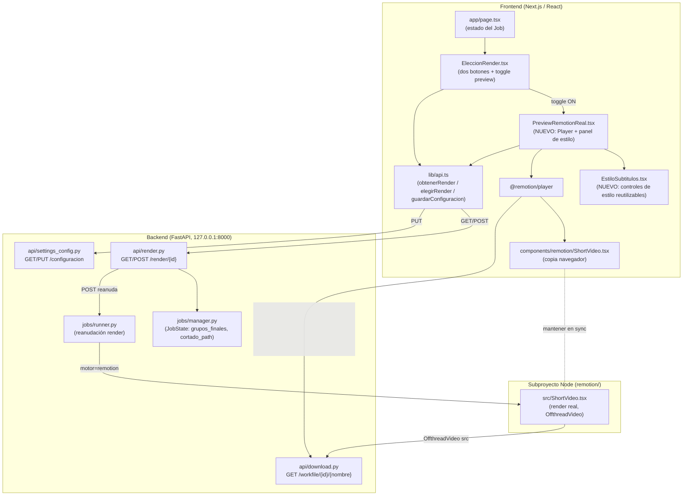
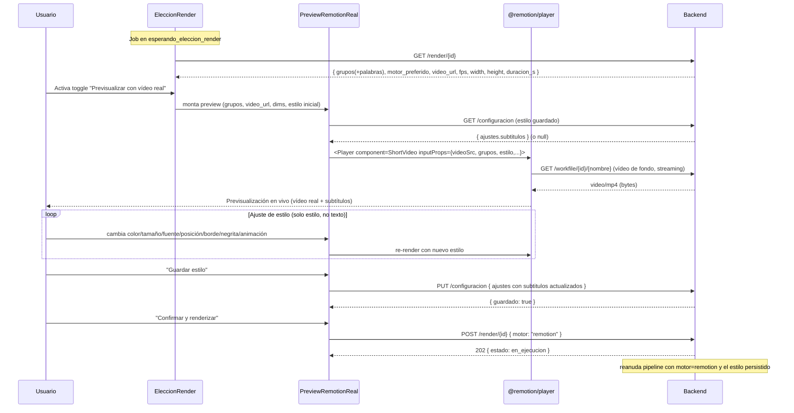
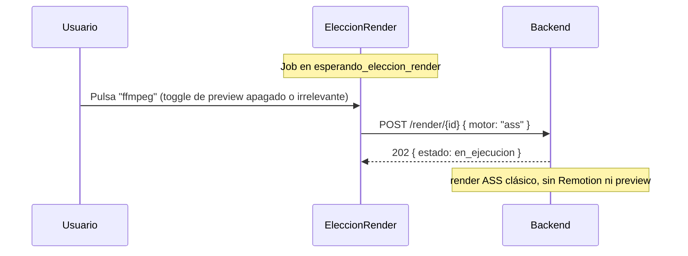

# Documento de Diseño: Previsualización del vídeo REAL con subtítulos (Remotion)

## Overview

Hoy, cuando un Job se pausa en el estado `esperando_eleccion_render`, el usuario ve los subtítulos ya corregidos en **solo texto** (componente `EleccionRender`) y elige el motor con dos botones ("Editar con Remotion" / "ffmpeg"). La página `/playground` permite previsualizar los subtítulos en vivo con `@remotion/player`, pero **sobre fondo blanco y con textos de prueba**, no sobre el vídeo real.

Esta feature introduce un **paso de previsualización del vídeo REAL con subtítulos antes de renderizar**: cuando el usuario elige "Remotion", puede activar (mediante un **toggle**) una vista en vivo (`@remotion/player`) que muestra el **vídeo ya cortado** (cargado por HTTP desde `GET /workfile/{job_id}/{nombre}`) con los **subtítulos reales** (los grupos con sus tiempos de la transcripción) superpuestos. En esa vista solo se puede ajustar el **estilo** (color, tamaño, fuente, posición, borde, negrita, animación), nunca el texto. Un botón "Guardar estilo" persiste el estilo vía `PUT /configuracion` (igual que el playground) y, al confirmar, se dispara el render real de Remotion con ese estilo mediante `POST /render/{job_id}`.

El diseño es **aditivo y sin ruptura**: el flujo de `ffmpeg` sigue funcionando exactamente igual (sin preview de Remotion), el contrato de props de `ShortVideo` no cambia, y las dos copias de la composición (`remotion/src` para render SSR y `frontend/components/remotion` para el navegador) se mantienen en sincronía. El único cambio de backend es **ampliar la respuesta de `GET /render/{job_id}`** para exponer la URL del vídeo de fondo y las palabras con tiempos (necesarias para el karaoke en el preview).

---

## Architecture

### Diagrama de componentes



### Principio arquitectónico clave: sincronía de composiciones y motor de vídeo

La composición `ShortVideo` existe por duplicado y **debe permanecer idéntica en lógica**:

- `remotion/src/ShortVideo.tsx`: usada por el **render SSR** (`node render.mjs`). Usa `<OffthreadVideo>` porque extrae frames con ffmpeg fuera del navegador (más estable para render).
- `frontend/components/remotion/ShortVideo.tsx`: usada por `@remotion/player` **en el navegador** (playground y esta nueva preview).

**Decisión de diseño (motor de vídeo en el navegador):** `<OffthreadVideo>` está pensado para render SSR; en el navegador con `@remotion/player` conviene usar el `<Video>` de `remotion` (o el `<OffthreadVideo>` que degrada a `<Video>` en el player). Para no bifurcar la lógica de la composición y minimizar riesgo, el fondo se abstrae en un **subcomponente de fondo inyectable** (`FondoVideo`) que difiere entre copias:

- En `remotion/src`, `FondoVideo` renderiza `<OffthreadVideo src={videoSrc} />`.
- En `frontend/components/remotion`, `FondoVideo` renderiza `<Video src={videoSrc} />` (de `remotion`), más adecuado para reproducción en vivo en el navegador.

El resto de `ShortVideo` (lógica de fondo blanco cuando `videoSrc === ""`, capa `<Captions>`) permanece idéntico, de modo que el contrato de props (`ShortVideoProps`) **no cambia** y la sincronía se preserva.

---

## Sequence Diagrams

### Flujo: elegir Remotion → previsualizar vídeo real → guardar estilo → confirmar render



### Flujo alternativo: elegir ffmpeg (sin preview)



---

## Components and Interfaces

### Componente 1: `PreviewRemotionReal` (NUEVO, frontend)

**Propósito**: Renderizar la previsualización en vivo del vídeo REAL con los subtítulos reales usando `@remotion/player`, permitir el ajuste de **solo estilo**, persistir el estilo y confirmar el render de Remotion.

**Responsabilidades**:
- Recibir del padre los grupos reales (con palabras/tiempos), la URL del vídeo de fondo y las dimensiones/fps del render.
- Mapear los grupos del backend (segundos) al contrato `Grupo` de Remotion (milisegundos).
- Precargar el estilo guardado (`GET /configuracion`) o el estilo por defecto.
- Ofrecer los controles de estilo (reutilizando `EstiloSubtitulos`), "Guardar estilo" (`PUT /configuracion`) y "Confirmar y renderizar" (`POST /render/{id}` con `motor: "remotion"`).
- No exponer edición de texto.

**Interfaz (props)**:
```typescript
export interface PreviewRemotionRealProps {
  /** Id del Job pausado en esperando_eleccion_render. */
  jobId: string;
  /** Grupos reales de subtítulo (segundos), incluyendo palabras con timing. */
  grupos: GrupoSubtituloConPalabras[];
  /** URL HTTP del vídeo de fondo ya cortado (GET /workfile/{id}/{nombre}). */
  videoUrl: string;
  /** Resolución y fps del render (para dimensionar el Player). */
  width: number;
  height: number;
  fps: number;
  /** Duración del vídeo en segundos (para durationInFrames). */
  duracionS: number;
  baseUrl?: string;
  /** Se invoca cuando el render se confirma correctamente (reanudación). */
  onRenderConfirmado?: () => void;
  /** Inyecciones opcionales para tests. */
  obtenerConfigFn?: typeof obtenerConfiguracion;
  guardarConfigFn?: typeof guardarConfiguracion;
  elegirFn?: typeof elegirRender;
}
```

### Componente 2: `EstiloSubtitulos` (NUEVO, frontend, reutilizable)

**Propósito**: Encapsular los controles de estilo hoy duplicados en `/playground` (color, color de resaltado, tamaño, fuente, posición vertical, animación de entrada, color/grosor de borde, negrita) para reutilizarlos tanto en el playground como en la nueva preview.

**Interfaz**:
```typescript
export interface EstiloSubtitulosProps {
  estilo: Estilo;
  onChange: (estilo: Estilo) => void;
}
```

**Responsabilidades**:
- Renderizar los controles de estilo y emitir cambios inmutables.
- No conocer nada del Job ni de la persistencia (control puro).

> Refactor sugerido (no obligatorio para la funcionalidad): extraer estos controles del `PlaygroundPage` a `EstiloSubtitulos` y hacer que el playground lo consuma, evitando duplicación.

### Componente 3: `EleccionRender` (MODIFICADO, frontend)

**Cambios**:
- Añadir un **toggle** "Previsualizar con vídeo real (Remotion)".
- Cuando el toggle está activo y hay `video_url` disponible, montar `<PreviewRemotionReal>` con los datos de `GET /render/{id}`.
- Mantener intactos los dos botones y el comportamiento de `ffmpeg` (que no usa preview).
- Al confirmar el render desde la preview, propagar `onElegido('remotion')`.

**Interfaz (props ampliada)**: se conserva la actual; internamente pasa a almacenar también `videoUrl`, `fps`, `width`, `height`, `duracionS` obtenidos de la respuesta ampliada del backend.

### Componente 4: `ShortVideo` / `FondoVideo` (MODIFICADO, ambas copias de Remotion)

**Cambios**:
- Extraer el fondo de vídeo a un subcomponente `FondoVideo` que es lo único que difiere entre copias:
  - `remotion/src`: `<OffthreadVideo src={videoSrc} />` (render SSR).
  - `frontend/components/remotion`: `<Video src={videoSrc} />` (reproducción en navegador).
- El resto de la lógica (fondo blanco si `videoSrc === ""`, capa `<Captions>`) permanece idéntico.
- El contrato `ShortVideoProps` **no cambia**.

### Backend 1: `GET /render/{job_id}` (MODIFICADO)

**Propósito**: Además de los grupos y la preselección de motor, exponer los datos necesarios para la preview del vídeo real: URL del vídeo de fondo, dimensiones, fps y duración; y garantizar que los grupos incluyan `palabras` (para el karaoke).

**Contrato de respuesta ampliado** (200):
```jsonc
{
  "job_id": "…",
  "estado": "esperando_eleccion_render",
  "editable": false,
  "motor_preferido": "ass" | "remotion",
  "grupos": [
    {
      "texto": "…",
      "inicio_s": 0.0,
      "fin_s": 1.8,
      "palabras": [ { "texto": "…", "inicio_s": 0.0, "fin_s": 0.4 }, … ]  // puede ser null
    }
  ],
  // --- NUEVO ---
  "video_url": "http://127.0.0.1:8000/workfile/{job_id}/cortado.mp4" | null,
  "video_nombre": "cortado.mp4" | null,
  "fps": 30,
  "ancho": 1080,
  "alto": 1920,
  "duracion_s": 12.3 | null
}
```

**Responsabilidades**:
- Derivar `video_nombre` de `Path(job.cortado_path).name` y `video_url` con `config.BACKEND_HOST`/`BACKEND_PORT` (misma construcción que el pipeline en `renderizar_con_motor_elegido`). Si `cortado_path` es `None`, ambos son `null`.
- Devolver `fps`/`ancho`/`alto` desde `job.ajustes.generales`.
- Devolver `duracion_s` inspeccionando el vídeo cortado (best-effort; `null` si no disponible).
- Mantener `editable`, `motor_preferido` y `grupos` como hasta ahora.

### Backend 2: `GET /workfile/{job_id}/{nombre}` (SIN CAMBIOS)

Ya sirve el vídeo intermedio (`cortado.mp4`) por HTTP para reproducción, con validación de contención del workdir (rechaza path traversal). Es la fuente del fondo del `<Player>`.

### Backend 3: `POST /render/{job_id}` y `GET/PUT /configuracion` (SIN CAMBIOS)

`POST /render/{id}` reanuda el pipeline con el motor elegido (sin fallback). `PUT /configuracion` persiste el estilo dentro de `ajustes.subtitulos`, exactamente como hace el playground. La preview reutiliza estos endpoints sin modificarlos.

---

## Data Models

### Modelo frontend: `GrupoSubtituloConPalabras` (extensión de tipo)

Hoy `GrupoSubtitulo` en `frontend/lib/types.ts` solo declara `texto/inicio_s/fin_s`. Para el karaoke en la preview se amplía (de forma retrocompatible) con `palabras` opcionales:

```typescript
/** Palabra transcrita con tiempos en segundos (para el karaoke). */
export interface PalabraSubtitulo {
  texto: string;
  inicio_s: number | null;
  fin_s: number | null;
}

/** Grupo de subtítulo con palabras opcionales (respuesta ampliada de GET /render). */
export interface GrupoSubtituloConPalabras {
  texto: string;
  inicio_s: number;
  fin_s: number;
  /** Palabras con tiempos; puede faltar (grupos sin timing por palabra). */
  palabras?: PalabraSubtitulo[] | null;
}
```

**Reglas de validación**:
- `inicio_s <= fin_s` a nivel de grupo (garantizado por el backend).
- Si `palabras` está presente, cada palabra usa los tiempos del grupo cuando su `inicio_s`/`fin_s` es `null` (mismo criterio que `remotion.py`).

### Modelo frontend: `RenderEleccion` (respuesta ampliada)

```typescript
export interface RenderEleccion {
  job_id: string;
  estado: JobStatus;
  editable: boolean;
  motor_preferido: MotorRender;
  grupos: GrupoSubtituloConPalabras[];
  // NUEVO
  video_url: string | null;
  video_nombre: string | null;
  fps: number;
  ancho: number;
  alto: number;
  duracion_s: number | null;
}
```

### Modelo Remotion: `Grupo` / `Estilo` (SIN CAMBIOS)

El contrato de la composición (`Grupo` con `startMs/endMs/words`, `Estilo`, `ShortVideoProps`) se conserva. La preview **mapea** de los modelos del backend (segundos) a este contrato (milisegundos).

---

## Algorithmic Pseudocode

Los algoritmos clave se especifican con **firmas reales** (TypeScript en el frontend, Python en el backend) y sus pre/post-condiciones.

### Función 1: `grupoBackendARemotion` (frontend, mapeo puro segundos → ms)

```typescript
function grupoBackendARemotion(g: GrupoSubtituloConPalabras): Grupo
```

**Precondiciones**:
- `g.inicio_s`, `g.fin_s` son números finitos con `g.inicio_s <= g.fin_s`.

**Postcondiciones**:
- Devuelve `Grupo` con `startMs = round(g.inicio_s*1000)`, `endMs = round(g.fin_s*1000)`, garantizando `startMs <= endMs`.
- Si `g.palabras` está presente y no vacío: `words[i]` deriva de cada palabra; una palabra sin timing hereda los tiempos del grupo. Cada palabra cumple `startMs <= endMs`.
- Si `g.palabras` es `null`/ausente/vacío: `words = []` (la composición dividirá `text` por espacios, sin resaltado).
- Función pura: no muta la entrada.

**Nota**: replica exactamente el criterio de `mapear_grupo_a_props_grupo` de `backend/app/engine/remotion.py`, de modo que **preview y render real produzcan el mismo agrupamiento** (Propiedad de coherencia P1).

### Función 2: `estiloDesdeAjustes` / `ajustesConEstilo` (frontend, ida y vuelta)

```typescript
function estiloDesdeAjustes(subtitulos: AjustesSubtitulos): Estilo
function ajustesConEstilo(base: Ajustes, estilo: Estilo): Ajustes
```

**Precondiciones**:
- `subtitulos` tiene colores `#RRGGBB` válidos y valores dentro de rango de UI.

**Postcondiciones**:
- `estiloDesdeAjustes` proyecta los campos de estilo (fuente, tamano, color, colorResaltado, posVerticalPct, animEntradaMs, colorBorde, grosorBorde, negrita) al tipo `Estilo`.
- `ajustesConEstilo` devuelve una copia inmutable de `base` con `subtitulos` actualizado desde `estilo` (los demás ajustes intactos). Es la misma proyección que hoy hace `guardarEstilo` del playground.
- Round-trip: `estiloDesdeAjustes(ajustesConEstilo(base, e).subtitulos)` es igual a `e` para los campos de estilo (Propiedad P4).

### Función 3: `durationInFrames` (frontend)

```typescript
function calcularDurationInFrames(duracionS: number, fps: number, grupos: Grupo[]): number
```

**Precondiciones**: `fps >= 1`.

**Postcondiciones**:
- Si `duracionS > 0`: devuelve `max(1, ceil(duracionS * fps))`.
- Si `duracionS <= 0` o no fiable: cae al mayor `endMs` de los grupos: `max(1, ceil((maxEndMs/1000) * fps))`.
- Mismo criterio que `_calcular_duration_in_frames` del backend (Propiedad de coherencia P2).

### Función 4: `construir_respuesta_render` (backend, ampliación de `GET /render/{id}`)

```python
def construir_respuesta_render(job: JobState) -> dict
```

**Precondiciones**:
- `job` existe en el gestor.

**Postcondiciones**:
- Incluye `job_id`, `estado`, `editable` (`True` sii `estado == ESPERANDO_ELECCION_RENDER`), `motor_preferido`, `grupos` (con `palabras`).
- Si `job.cortado_path` no es `None`: `video_nombre = Path(job.cortado_path).name` y
  `video_url = f"http://{BACKEND_HOST}:{BACKEND_PORT}/workfile/{job.id}/{video_nombre}"`; si no, ambos `None`.
- `fps/ancho/alto` provienen de `job.ajustes.generales`.
- `duracion_s`: duración inspeccionada del vídeo cortado; `None` si falla la inspección (nunca lanza).
- No muta el `job` (solo lectura).

**Pseudocódigo**:
```pascal
ALGORITHM construir_respuesta_render(job)
BEGIN
  grupos ← [ g.model_dump() FOR g IN (job.grupos_finales OR []) ]  // incluye palabras
  editable ← (job.progreso.estado = ESPERANDO_ELECCION_RENDER)

  IF job.cortado_path ≠ NULL THEN
    nombre ← basename(job.cortado_path)
    url    ← "http://" + BACKEND_HOST + ":" + BACKEND_PORT + "/workfile/" + job.id + "/" + nombre
    dur    ← intentar_inspeccionar_duracion(job.cortado_path)   // None si falla
  ELSE
    nombre ← NULL ; url ← NULL ; dur ← NULL
  END IF

  RETURN {
    job_id: job.id, estado: job.progreso.estado, editable,
    motor_preferido: job.ajustes.render.motor_preferido, grupos,
    video_url: url, video_nombre: nombre,
    fps: job.ajustes.generales.fps,
    ancho: job.ajustes.generales.resolucion.ancho,
    alto: job.ajustes.generales.resolucion.alto,
    duracion_s: dur
  }
END
```

---

## Key Functions with Formal Specifications

### `PreviewRemotionReal` — construcción de `inputProps`

```typescript
const inputProps: ShortVideoProps = {
  videoSrc: videoUrl,                 // vídeo REAL (no "")
  fps,
  width,
  height,
  durationInFrames,
  estilo,                             // editable en vivo
  combineTokensWithinMs: AJUSTES_POR_DEFECTO.render.combine_tokens_ms,
  grupos: grupos.map(grupoBackendARemotion),
};
```

**Preconditions**: `videoUrl` es una URL HTTP no vacía; `grupos` es la lista real del backend.

**Postconditions**:
- El `<Player>` muestra el vídeo real de fondo (porque `videoSrc !== ""`) con los subtítulos reales.
- Cambiar `estilo` re-renderiza sin recargar el vídeo (el `videoSrc` no cambia).
- Nunca se modifica el texto de los grupos desde la UI (solo lectura del texto).

### `guardarEstilo` (preview) — persistencia

```typescript
async function guardarEstilo(): Promise<void>
```

**Preconditions**: hay conexión al backend.

**Postconditions**:
- Carga la config vigente (o `AJUSTES_POR_DEFECTO`), aplica `ajustesConEstilo(base, estilo)` y llama a `PUT /configuracion`.
- En éxito, el estilo queda persistido y se reutilizará en el render real y en aperturas futuras (misma semántica que el playground).
- En error de red, informa al usuario y no cambia el estado del Job.

### `confirmarRender` (preview) — disparo del render real

```typescript
async function confirmarRender(): Promise<void>
```

**Preconditions**: el Job está en `esperando_eleccion_render`.

**Postconditions**:
- Llama a `POST /render/{jobId}` con `{ motor: "remotion" }`.
- En `202`, invoca `onRenderConfirmado()` y el pipeline reanuda el render con el estilo persistido.
- Si el backend devuelve `409` (el Job ya no está esperando), muestra el error sin romper la UI.

---

## Example Usage

### Montaje de la preview desde `EleccionRender` (frontend)

```tsx
// Dentro de EleccionRender, tras obtenerRender():
{previewActivo && data.video_url && (
  <PreviewRemotionReal
    jobId={jobId}
    grupos={data.grupos}
    videoUrl={data.video_url}
    width={data.ancho}
    height={data.alto}
    fps={data.fps}
    duracionS={data.duracion_s ?? 0}
    onRenderConfirmado={() => onElegido?.('remotion')}
  />
)}

// Toggle:
<label>
  <input
    type="checkbox"
    checked={previewActivo}
    onChange={(e) => setPreviewActivo(e.target.checked)}
    disabled={!data?.video_url}
  />
  Previsualizar con vídeo real (Remotion)
</label>
```

### Mapeo de un grupo (frontend)

```typescript
// Grupo del backend (segundos) → Grupo de Remotion (ms)
const g = { texto: "hola mundo", inicio_s: 0, fin_s: 2,
            palabras: [ { texto: "hola", inicio_s: 0, fin_s: 1 },
                        { texto: "mundo", inicio_s: 1, fin_s: 2 } ] };
const remotionGrupo = grupoBackendARemotion(g);
// => { text: "hola mundo", startMs: 0, endMs: 2000,
//      words: [ {text:"hola",startMs:0,endMs:1000}, {text:"mundo",startMs:1000,endMs:2000} ] }
```

### `FondoVideo` — diferencia entre copias

```tsx
// remotion/src/ShortVideo.tsx (render SSR)
const FondoVideo = ({ src }: { src: string }) => <OffthreadVideo src={src} />;

// frontend/components/remotion/ShortVideo.tsx (navegador / @remotion/player)
const FondoVideo = ({ src }: { src: string }) => <Video src={src} />;
```

---

## Correctness Properties

- **P1 (coherencia de agrupamiento preview↔render)**: para todo grupo `g` del backend, el mapeo `grupoBackendARemotion(g)` produce los mismos `startMs/endMs/words` que `mapear_grupo_a_props_grupo(g)` del backend. La preview y el render real muestran las mismas palabras/tiempos.
- **P2 (coherencia de duración)**: `calcularDurationInFrames(duracion_s, fps, grupos)` coincide con `_calcular_duration_in_frames` del backend para las mismas entradas.
- **P3 (fondo real en preview)**: si `videoUrl !== ""`, la composición usa vídeo de fondo; si `videoUrl === ""`, usa fondo blanco. (Invariante ya presente en `ShortVideo`).
- **P4 (round-trip de estilo)**: `estiloDesdeAjustes(ajustesConEstilo(base, e).subtitulos)` es igual a `e` en todos los campos de estilo; guardar y recargar el estilo es idempotente.
- **P5 (solo estilo, nunca texto)**: ninguna acción de la preview modifica `grupos[i].texto`; el texto es de solo lectura.
- **P6 (aislamiento de ffmpeg)**: si el usuario elige `ffmpeg`, no se monta el `<Player>` ni se consulta `/workfile`, y el flujo es idéntico al actual.
- **P7 (monotonía de estado)**: `confirmarRender` solo tiene efecto cuando el Job está en `esperando_eleccion_render`; en cualquier otro estado el backend responde `409` y la UI no rompe.
- **P8 (contrato de props invariante)**: `ShortVideoProps` no cambia; ambas copias de la composición aceptan exactamente las mismas props.

---

## Error Handling

### Escenario 1: `cortado_path` ausente / vídeo no servible

**Condición**: `job.cortado_path` es `None` o `GET /workfile` responde `404`.
**Respuesta**: `GET /render` devuelve `video_url: null`; la preview no puede montarse. El toggle queda **deshabilitado** y se muestra un aviso ("La previsualización del vídeo no está disponible; puedes renderizar directamente").
**Recuperación**: el usuario aún puede elegir Remotion o ffmpeg con los botones normales.

### Escenario 2: fallo de carga del vídeo en el `<Player>`

**Condición**: el navegador no puede reproducir el MP4 (códec/red).
**Respuesta**: el Player muestra el fondo del vídeo vacío pero los subtítulos siguen visibles; se registra el error. La preview no bloquea la confirmación.
**Recuperación**: reintentar activando/desactivando el toggle (re-monta el Player) o proceder al render.

### Escenario 3: error al guardar el estilo (`PUT /configuracion`)

**Condición**: red caída o ajustes inválidos (`400`).
**Respuesta**: mensaje de error visible; el estado del Job no cambia; el estilo en memoria se conserva para reintentar.
**Recuperación**: reintentar "Guardar estilo".

### Escenario 4: `POST /render` responde `409 CONFLICT`

**Condición**: el Job ya salió de `esperando_eleccion_render` (p. ej. render ya iniciado en otra pestaña).
**Respuesta**: mensaje de error; la UI sigue el progreso normal vía `GET /progreso`.
**Recuperación**: ninguna acción adicional; el Job continúa su ciclo.

### Escenario 5: render de Remotion falla tras confirmar (backend)

**Condición**: Node/Chromium ausentes o error de render (`RemotionError`).
**Respuesta**: sin fallback (Req existente): el Job pasa a `FALLIDO` con `{paso: "SUBTITULOS", motivo}`; se limpian `props.json` y el MP4 parcial.
**Recuperación**: el usuario reinicia el flujo y puede elegir `ffmpeg`.

---

## Testing Strategy

### Unit Testing

- **Backend** (`pytest`): ampliar `test_endpoints_nuevos.py` / `test_api.py` para `GET /render/{id}`:
  - devuelve `video_url`/`video_nombre` cuando hay `cortado_path` y `null` cuando no.
  - `fps/ancho/alto` reflejan `ajustes.generales`.
  - `grupos` incluye `palabras`.
  - `duracion_s` es `null` cuando la inspección falla (mock del inspector).
- **Frontend** (`vitest` + Testing Library): 
  - `grupoBackendARemotion` (mapeo segundos→ms, herencia de tiempos, `words=[]` sin palabras).
  - `estiloDesdeAjustes`/`ajustesConEstilo` (proyección y round-trip).
  - `PreviewRemotionReal`: monta `<Player>` con `videoSrc` no vacío; "Guardar estilo" llama a `PUT /configuracion`; "Confirmar" llama a `POST /render` con `remotion`; toggle deshabilitado si `video_url` es `null`.
  - `EleccionRender`: el toggle monta/desmonta la preview; `ffmpeg` no monta Player.

### Property-Based Testing

**Librería**: `fast-check` (frontend) e `hypothesis` (backend), coherente con la práctica del repo.

- **P1/P2 (coherencia preview↔render)**: generar grupos aleatorios (con y sin palabras, tiempos degenerados/invertidos) y comprobar que `grupoBackendARemotion` y `calcularDurationInFrames` producen los mismos valores que sus contrapartes de `backend/app/engine/remotion.py`. Se puede portar el criterio o comparar contra vectores dorados generados por el backend.
- **P4 (round-trip de estilo)**: generar `Estilo` válidos y verificar idempotencia de `estiloDesdeAjustes ∘ ajustesConEstilo`.
- **P5 (texto inmutable)**: cualquier secuencia de cambios de estilo deja `grupos[i].texto` inalterado.

### Integration Testing

- Flujo completo simulado (mocks de red): `esperando_eleccion_render` → toggle ON → preview montada con `video_url` mockeado → guardar estilo (`PUT`) → confirmar (`POST remotion`) → `onRenderConfirmado`.
- Verificar que el flujo `ffmpeg` no dispara `GET /workfile` ni monta el Player.

---

## Performance Considerations

- El `<Player>` reproduce el vídeo por streaming HTTP desde el backend local (`127.0.0.1:8000`); al ser local, la latencia es mínima. Reproducir el vídeo cortado (no el original) mantiene el tamaño acotado.
- Cambiar el estilo **no** recarga el vídeo (el `src` no cambia): solo re-renderiza la capa de subtítulos, barato en CPU.
- Escalar el lienzo 9:16 a ~360×640 en el Player (como el playground) evita sobrecoste de pintado.

---

## Security Considerations

- `GET /workfile/{id}/{nombre}` ya valida la contención dentro del workdir (rechaza path traversal y rutas absolutas). No se amplía su superficie.
- La operación es 100% local (`localhost`); no se exponen artefactos fuera del backend.
- La clave de OpenAI (si se usó IA) es transitoria y **no** interviene en esta feature (los grupos ya vienen corregidos).
- El estilo persistido solo contiene ajustes visuales validados por rango en `PUT /configuracion`.

---

## Dependencies

- **Frontend**: `@remotion/player`, `remotion` (`<Video>`), React/Next.js (ya presentes). Reutiliza `lib/api.ts` (`obtenerRender`, `elegirRender`, `obtenerConfiguracion`, `guardarConfiguracion`) y `components/remotion/*`.
- **Backend**: FastAPI (ya presente); inspector de duración (`app/engine/ffprobe.inspeccionar_clip`) para `duracion_s`. Sin dependencias nuevas.
- **Subproyecto Node** (`remotion/`): sin dependencias nuevas; solo el refactor `FondoVideo`.
- **Sincronía**: cualquier cambio del contrato debe reflejarse en `remotion/src/types.ts`, `frontend/components/remotion/types.ts` y `backend/app/engine/remotion.py` (`construir_props`).
