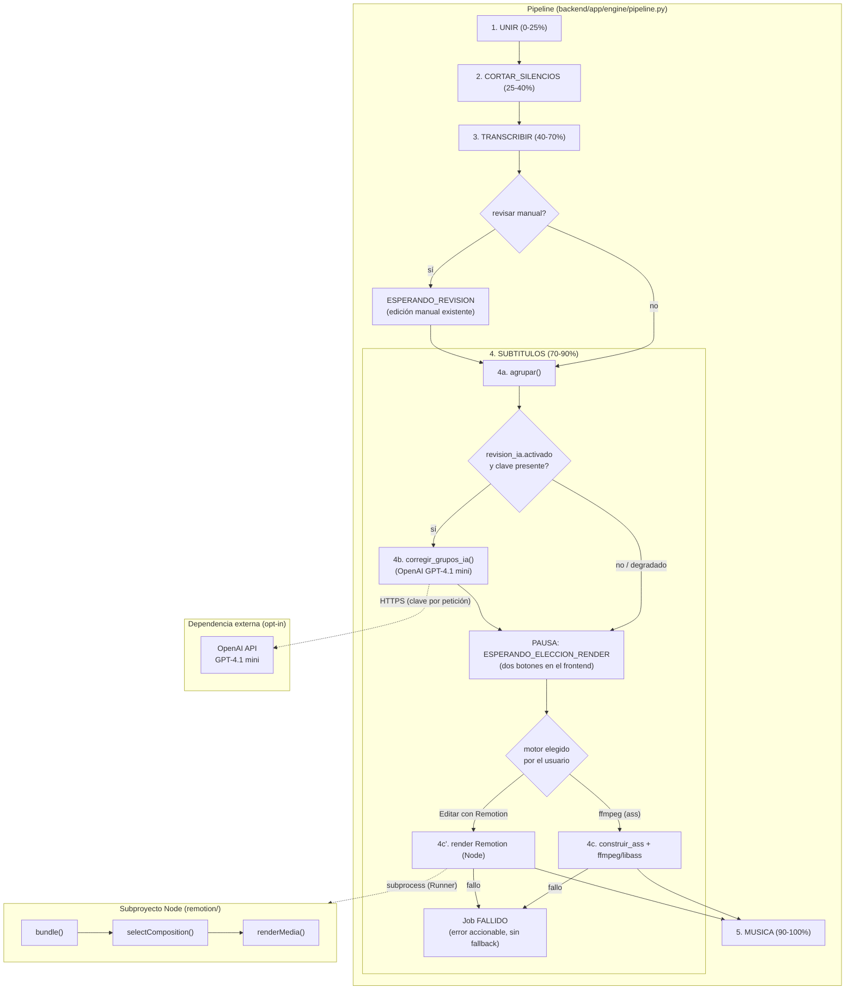
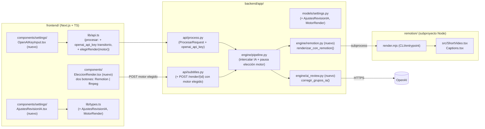
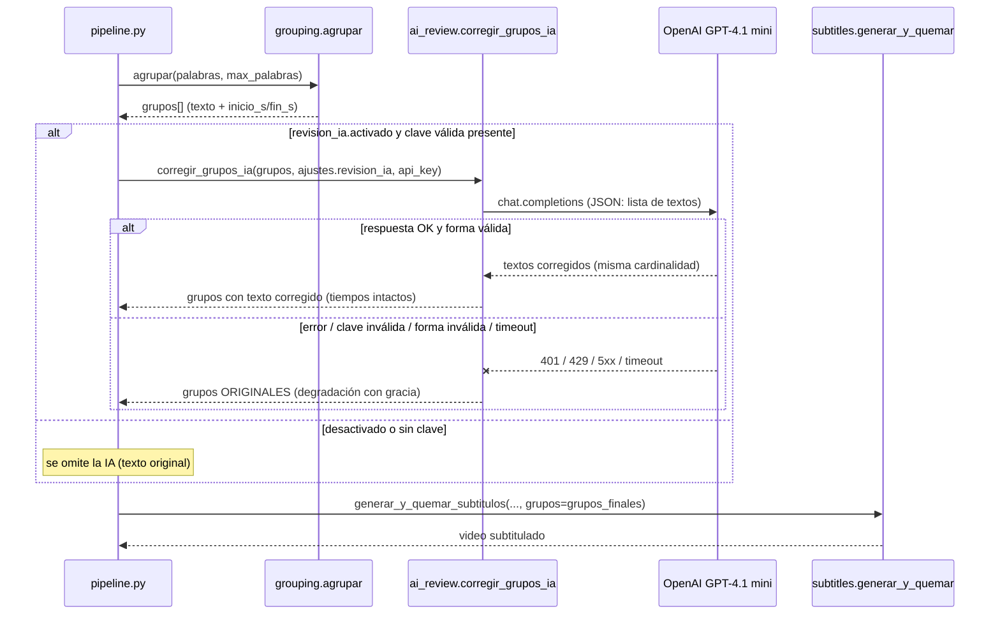
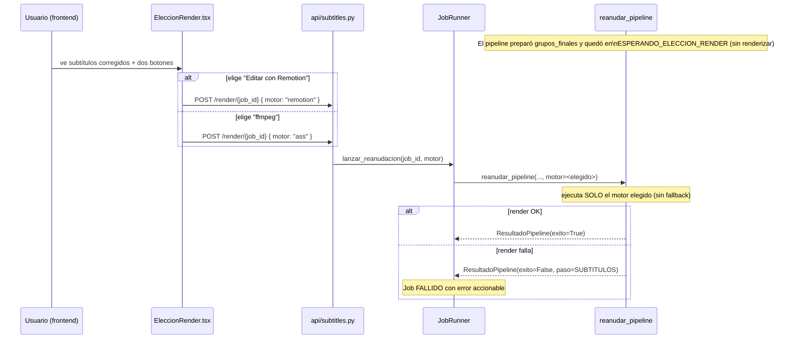
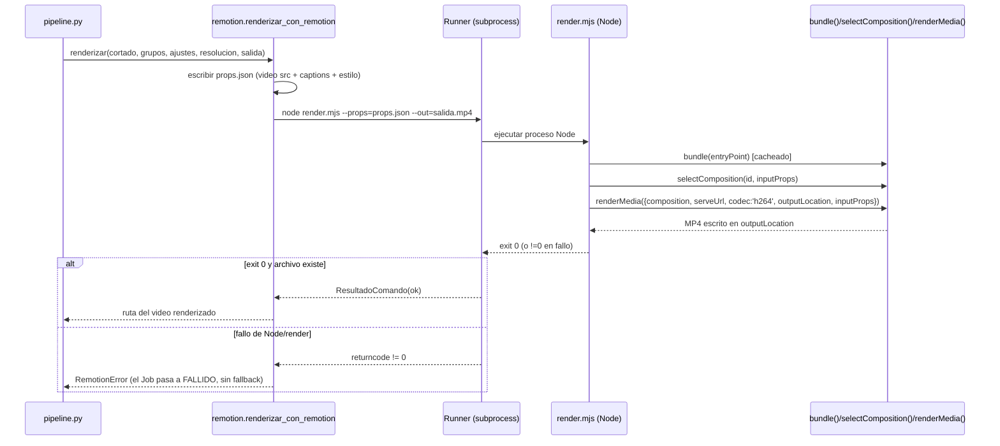

# Documento de Diseño: Subtítulos IA + Render Remotion

## Overview

Este diseño incorpora **dos capacidades nuevas** al editor de shorts verticales (backend FastAPI en Python + frontend Next.js), respetando su arquitectura de pipeline de 5 pasos inyectables y su principio rector de operación **100 % local**:

1. **Verificación/corrección de subtítulos con IA (OpenAI GPT-4.1 mini).** Un paso **opcional** (opt-in) que se ejecuta *después* de la agrupación de palabras (`grouping.agrupar`) y *antes* de quemar los subtítulos (`subtitles.generar_y_quemar_subtitulos`). Corrige la ortografía del texto de cada grupo y, si el usuario lo pide, fuerza minúsculas, **preservando los tiempos por grupo** (`inicio_s`/`fin_s`): la IA solo edita texto. La clave de API se introduce manualmente en la interfaz Next.js y se envía al backend por petición, **sin persistirse nunca en disco**. Ante una clave ausente/inválida o un fallo de la API, el paso **degrada con gracia**: usa el texto original y el pipeline no falla.

2. **Mejora del render con Remotion + elección MANUAL del motor.** Se añade un **motor de render alternativo/complementario** basado en Remotion (vídeo programático con React) que sustituye —cuando el usuario lo elige— al quemado ASS con ffmpeg/libass. Remotion permite subtítulos animados de mayor calidad (estilo TikTok con resaltado palabra por palabra, transiciones, overlays) renderizando frame a frame en un navegador headless. **La elección del motor es interactiva por Job:** tras la corrección de subtítulos (o tras la agrupación si la IA está desactivada), el pipeline se **pausa** y el frontend presenta al usuario **dos botones** —"Editar con Remotion" y "ffmpeg"— para que **él** decida qué motor ejecutar. No hay decisión automática por un ajuste guardado de antemano ni *fallback* automático: se ejecuta exactamente el motor elegido y, si ese motor falla, el Job pasa a **FALLIDO** con un error accionable.

Ambas capacidades se integran mediante los puntos de extensión que el sistema ya expone: nuevos campos en el modelo `Ajustes` (Pydantic), nuevas funciones de motor inyectables, un nuevo punto de pausa/decisión en el pipeline, y controles de UI en `frontend/components/`. El diseño prioriza la **compatibilidad hacia atrás**: si la corrección con IA está desactivada, su comportamiento es idéntico al actual; la elección de motor reutiliza el mecanismo de pausa ya existente.

> **Nota de alcance / privacidad:** el proyecto es 100 % local y la corrección con OpenAI es la **primera dependencia de red externa**. Por ello es estrictamente opt-in, se divulga explícitamente en la UI, y la clave nunca se guarda. Remotion se ejecuta localmente (Node + Chromium headless) y no requiere red.

---

## Arquitectura

### Pipeline extendido

El paso 4 (`SUBTITULOS`, rango 70–90 %) se descompone conceptualmente en: **agrupar → (corregir con IA)? → [PAUSA: el usuario elige motor] → renderizar (ASS ffmpeg | Remotion)**. La corrección IA es un sub-paso opcional intercalado. Tras preparar los grupos finales, el pipeline se **pausa** (nuevo estado `ESPERANDO_ELECCION_RENDER`) y espera a que el usuario elija el motor mediante dos botones en el frontend. El render tiene dos back-ends intercambiables, pero **no hay fallback automático**: se ejecuta el motor elegido y, si falla, el Job pasa a FALLIDO.



### Componentes afectados y nuevos



---

## Diagramas de secuencia

### Flujo 1 — Corrección de subtítulos con IA (integrada en el pipeline)



### Flujo 2 — Pausa y elección MANUAL del motor de render

Tras preparar los grupos finales (con o sin corrección IA), el pipeline se pausa en `ESPERANDO_ELECCION_RENDER`. El usuario ve los subtítulos ya corregidos y **elige** el motor con uno de los dos botones. El backend reanuda la fase 2 ejecutando exactamente el motor elegido.



### Flujo 3 — Render con Remotion (una vez elegido)



---

## Componentes e Interfaces

### Componente 1: `engine/ai_review.py` (nuevo) — Corrección con IA

**Propósito:** corregir el texto de los `GrupoSubtitulo` mediante OpenAI GPT-4.1 mini, preservando los tiempos y con degradación con gracia. Es la única parte del sistema que realiza red externa.

**Responsabilidades:**
- Recibir la lista de grupos y devolver una lista **de la misma cardinalidad y con los mismos tiempos**, cambiando solo `texto`.
- Construir un prompt que instruya al modelo a corregir ortografía en español y, si `minusculas` está activo, devolver todo en minúscula.
- Solicitar salida estructurada (JSON) para poder emparejar por índice sin ambigüedad.
- Encapsular errores de red/HTTP/forma en una **degradación**: devolver los grupos originales (nunca propaga la excepción al pipeline salvo configuración inválida detectable a priori).
- Recibir la clave de API como **parámetro** (nunca leerla de disco ni de variables persistidas).

**Interfaz (Python):**
```python
class RevisionIAError(Exception):
    """Fallo irrecuperable de la revisión IA (solo para validación previa)."""

def corregir_grupos_ia(
    grupos: Sequence[GrupoSubtitulo],
    ajustes: "AjustesRevisionIA",
    api_key: Optional[str],
    *,
    cliente: Optional["OpenAIClienteProto"] = None,   # inyectable para tests
    minusculas: bool = False,
) -> List[GrupoSubtitulo]: ...
```

### Componente 2: `engine/remotion.py` (nuevo) — Motor de render Remotion

**Propósito:** puente entre el pipeline Python y el subproyecto Node de Remotion. Serializa los datos (ruta del vídeo cortado, grupos con tiempos, estilo) a un `props.json`, invoca `node render.mjs` mediante el `Runner` inyectable y valida el artefacto de salida.

**Responsabilidades:**
- Traducir `GrupoSubtitulo[]` al tipo `Caption[]`/props que consume la composición.
- Construir el comando Node y ejecutarlo con el `Runner` (mismo patrón que `subtitles.py`).
- Detectar fallos (código != 0, artefacto ausente, Node/Chromium no disponibles) y lanzar `RemotionError` con mensaje accionable.

**Interfaz (Python):**
```python
NOMBRE_REMOTION_MP4: str = "remotion.mp4"

class RemotionError(Exception):
    """El render con Remotion falló (Node ausente, error de render, sin salida)."""

def renderizar_con_remotion(
    entrada: Union[str, Path],
    grupos: Sequence[GrupoSubtitulo],
    subtitulos: "AjustesSubtitulos",
    resolucion: ResolucionObjetivo,
    fps: int,
    props_path: Union[str, Path],
    salida: Union[str, Path],
    *,
    runner: Runner = ejecutar_comando,
    existe_salida: Optional[Callable[[Path], bool]] = None,
    proyecto_dir: Optional[Path] = None,
) -> Path: ...
```

### Componente 3: `remotion/` (nuevo subproyecto Node)

**Propósito:** proyecto Remotion independiente con la composición `ShortVideo` que compone el vídeo de fondo (`<OffthreadVideo>`) más una capa de subtítulos animados (estilo TikTok con resaltado por palabra) y transiciones/overlays.

**Estructura:**
```
remotion/
  package.json          # remotion, @remotion/bundler, @remotion/renderer, @remotion/captions
  remotion.config.ts
  src/
    index.ts            # registerRoot(RemotionRoot)
    Root.tsx            # <Composition id="ShortVideo" .../> con calculateMetadata (fps/duración dinámicos)
    ShortVideo.tsx      # OffthreadVideo + <Captions/>
    Captions.tsx        # createTikTokStyleCaptions + resaltado token a token
  render.mjs            # entrypoint SSR: bundle() -> selectComposition() -> renderMedia()
```

**Contrato de `inputProps` (JSON que pasa Python → Node):**
```typescript
interface ShortVideoProps {
  videoSrc: string;              // ruta absoluta del vídeo cortado (staticFile o file://)
  fps: number;
  width: number;
  height: number;
  durationInFrames: number;      // derivado de la duración del vídeo * fps
  captions: Caption[];           // @remotion/captions: {text, startMs, endMs, timestampMs, confidence}
  estilo: {
    fuente: string;
    tamano: number;
    color: string;               // #RRGGBB
    colorResaltado: string;      // #RRGGBB
    posVerticalPct: number;      // 0..100
    animEntradaMs: number;
  };
  combineTokensWithinMs: number; // agrupación TikTok (p. ej. 1200)
}
```

### Componente 4: Frontend Next.js

- **`components/settings/OpenAIKeyInput.tsx` (nuevo):** campo `type="password"` para introducir la clave manualmente. La clave vive **solo en el estado de React** (no en `localStorage`, no se envía a `/configuracion`). Incluye un aviso de privacidad ("la clave se envía a OpenAI solo al procesar; no se guarda").
- **`components/settings/AjustesRevisionIA.tsx` (nuevo):** toggle `activado`, selector de `modelo` (por defecto `gpt-4.1-mini`) y aviso de red externa.
- **`components/EleccionRender.tsx` (nuevo):** se muestra cuando el Job está en `esperando_eleccion_render` (análogo a `SubtitleReview.tsx`). Presenta los subtítulos ya corregidos (solo lectura) y **dos botones** para que el usuario **elija** el motor: **"Editar con Remotion"** y **"ffmpeg"**. No es un selector persistido con descripción de *fallback*; es una decisión interactiva por Job. Al pulsar un botón, envía la elección (`POST /render/{id}` con `{ motor }`) y reanuda el pipeline. Puede resaltar un motor como preselección (p. ej. `render.motor` por defecto) meramente como sugerencia visual, pero la decisión efectiva es la del botón pulsado.
- **`lib/api.ts` / `lib/types.ts`:** el cuerpo de `POST /procesar` gana un campo **transitorio** `openai_api_key?: string | null` (no forma parte de `Ajustes`, por lo que nunca se persiste). Se añade `elegirRender(jobId, motor)` que hace `POST /render/{id}`. Los nuevos sub-ajustes de IA se añaden a `Ajustes`; `MotorRender` se expone como tipo para los botones.

---

## Modelos de datos

### Extensiones a `models/settings.py`

```python
# Modelos soportados de OpenAI para la corrección (validación de conjunto).
SUPPORTED_OPENAI_MODELS: FrozenSet[str] = frozenset(
    {"gpt-4.1-mini", "gpt-4.1", "gpt-4.1-nano", "gpt-4o-mini"}
)
DEFAULT_OPENAI_MODEL: str = "gpt-4.1-mini"

# Motor de render del paso de subtítulos. Se ELIGE en tiempo de ejecución por el
# usuario (dos botones en el frontend); NO se decide automáticamente por un
# ajuste persistido.
MotorRender = Literal["ass", "remotion"]
# Preselección de UI por defecto (solo sugerencia visual del botón resaltado).
DEFAULT_MOTOR_RENDER: MotorRender = "ass"

class AjustesRevisionIA(BaseModel):
    """Ajustes de la verificación/corrección de subtítulos con IA (opt-in)."""
    activado: bool = Field(default=False)          # OPT-IN: desactivado por defecto
    modelo: str = Field(default=DEFAULT_OPENAI_MODEL)
    # Ventana de agrupación de peticiones y límites de robustez.
    timeout_s: float = Field(default=20.0)
    max_reintentos: int = Field(default=1)
    # NOTA: la clave de API NO se declara aquí (no debe persistirse en disco).

class AjustesRender(BaseModel):
    """Ajustes del render de subtítulos (Paso 4c).

    NOTA: ya NO existe ``fallback_ass``. El motor NO se decide automáticamente
    desde aquí: la elección efectiva la hace el usuario en tiempo de ejecución
    con los dos botones del frontend. ``motor_preferido`` es SOLO una
    preselección de UI (qué botón aparece resaltado); no fuerza la ejecución.
    """
    motor_preferido: MotorRender = Field(default=DEFAULT_MOTOR_RENDER)  # solo UI
    combine_tokens_ms: int = Field(default=1200)   # agrupación estilo TikTok

class Ajustes(BaseModel):
    # ... campos existentes ...
    revision_ia: AjustesRevisionIA = Field(default_factory=AjustesRevisionIA)
    render: AjustesRender = Field(default_factory=AjustesRender)
```

**Validación (extiende `validar_ajustes` / `RANGOS_MOTOR`):**
```python
RANGOS_MOTOR.update({
    "revision_ia.timeout_s": (1.0, 120.0),
    "revision_ia.max_reintentos": (0, 5),
    "render.combine_tokens_ms": (0, 5000),
})
# En validar_ajustes(): si revision_ia.activado y modelo not in SUPPORTED_OPENAI_MODELS
#   => añadir "revision_ia.modelo" a la lista de inválidos.
# El motor de render efectivo (elegido por el usuario) se valida por el Literal
# MotorRender en el endpoint POST /render/{id}; no depende de un ajuste persistido.
```

### Motor de render como parámetro transitorio de la reanudación

Análogamente a `openai_api_key`, el **motor de render elegido no se persiste como
decisión automática**: se recibe en tiempo de ejecución por Job. El nuevo estado
`ESPERANDO_ELECCION_RENDER` deja el Job a la espera; cuando el usuario pulsa un
botón, `POST /render/{id}` recibe `{ motor: "ass" | "remotion" }` y ese valor se
propaga como **parámetro de la reanudación** (`reanudar_pipeline(..., motor=...)`).
`render.motor_preferido` solo influye en qué botón aparece resaltado en la UI.

### Campo transitorio en `ProcesarRequest` (`api/process.py`)

```python
class ProcesarRequest(BaseModel):
    orden_clips: Optional[List[str]] = None
    musica_id: Optional[str] = None
    ajustes: Optional[Ajustes] = None
    # TRANSITORIO: la clave viaja con la petición de procesado y se propaga al
    # JobState en memoria; NUNCA se serializa a disco (config_store solo guarda
    # Ajustes). Se omite de logs y de cualquier volcado del estado del Job.
    openai_api_key: Optional[str] = Field(default=None, repr=False)
```

**Propagación de la clave (sin persistencia):** `POST /procesar` la pasa a `manager.crear_job(...)`, que la guarda en un atributo **no serializado** de `JobState` (p. ej. excluido de `model_dump`) o en un mapa aparte `job_id -> api_key` en el `JobManager`. El `JobRunner` la lee al ejecutar y la pasa a `corregir_grupos_ia`. Al terminar el Job (éxito o fallo) la clave se **elimina de memoria**.

### Tipo `Caption` (contrato con Remotion, del paquete `@remotion/captions`)

`GrupoSubtitulo(texto, inicio_s, fin_s, palabras?)` se transforma a `Caption[]`:
```
inicio_s * 1000  -> startMs
fin_s   * 1000   -> endMs
(inicio_s+fin_s)/2 * 1000 -> timestampMs
confidence = null
```
Cuando hay `palabras` (timestamps por palabra), se emite un `Caption` por palabra (con espacio inicial en `text`, requisito de whitespace de `createTikTokStyleCaptions`); si no, un `Caption` por grupo.

---

## Especificaciones formales (Low-Level)

### Función `corregir_grupos_ia`

```python
def corregir_grupos_ia(grupos, ajustes, api_key, *, cliente=None, minusculas=False) -> List[GrupoSubtitulo]
```

**Precondiciones:**
- `grupos` es una secuencia (posiblemente vacía) de `GrupoSubtitulo` con `inicio_s <= fin_s`.
- `ajustes` es un `AjustesRevisionIA` válido (`modelo ∈ SUPPORTED_OPENAI_MODELS`, `timeout_s`/`max_reintentos` en rango).
- `api_key` puede ser `None`, cadena vacía o una clave real.

**Postcondiciones:**
- Devuelve una lista `resultado` con `len(resultado) == len(grupos)`.
- ∀ i: `resultado[i].inicio_s == grupos[i].inicio_s ∧ resultado[i].fin_s == grupos[i].fin_s` (**tiempos invariantes**).
- ∀ i: `resultado[i].palabras == grupos[i].palabras` (los timestamps por palabra no se alteran).
- Si `api_key` es falsy **o** `ajustes.activado` es `False` **o** la llamada a OpenAI falla/expira/devuelve forma inválida ⇒ `resultado[i].texto == grupos[i].texto` ∀ i (**degradación: identidad**).
- Si la llamada tiene éxito y devuelve `n == len(grupos)` textos ⇒ `resultado[i].texto` es el texto corregido (en minúscula si `minusculas`), y `resultado[i].texto` no está vacío (si el modelo devuelve vacío, se conserva el original de ese índice).
- **Sin efectos secundarios** sobre `grupos` (entrada inmutable); no escribe en disco; no registra la `api_key`.

**Invariantes de bucle (emparejado por índice):**
- Al procesar la respuesta, para todo índice `k` ya emparejado: el grupo `k` de salida conserva los tiempos del grupo `k` de entrada y tiene texto no vacío.

### Algoritmo (pseudocódigo estructurado)

```pascal
ALGORITHM corregir_grupos_ia(grupos, ajustes, api_key, minusculas)
BEGIN
  // Degradación temprana: nada que corregir o sin habilitar/clave.
  IF longitud(grupos) = 0 OR NOT ajustes.activado OR es_vacia(api_key) THEN
    RETURN copia_identidad(grupos)
  END IF

  textos_entrada <- [g.texto FOR g IN grupos]

  TRY
    respuesta <- llamar_openai_con_reintentos(
        cliente, ajustes.modelo, textos_entrada,
        minusculas, ajustes.timeout_s, ajustes.max_reintentos)
    textos_corregidos <- parsear_json_lista(respuesta)   // exige lista de strings
  CATCH (RedError | HTTPError | TimeoutError | FormatoError) AS e
    LOG_WARNING("Revisión IA degradada: " + tipo(e))     // sin incluir la clave
    RETURN copia_identidad(grupos)                        // Postcondición: identidad
  END TRY

  // Emparejamiento estricto por índice; cardinalidad debe coincidir.
  IF longitud(textos_corregidos) <> longitud(grupos) THEN
    LOG_WARNING("Cardinalidad IA inválida; se conserva original")
    RETURN copia_identidad(grupos)
  END IF

  resultado <- []
  FOR i <- 0 TO longitud(grupos) - 1 DO
    ASSERT resultado conserva tiempos para todo j < i        // invariante
    t <- recortar(textos_corregidos[i])
    IF minusculas THEN t <- minuscula(t) END IF
    IF es_vacio(t) THEN t <- grupos[i].texto END IF          // no perder líneas
    resultado.append(GrupoSubtitulo(
        texto := t,
        inicio_s := grupos[i].inicio_s,                      // TIEMPOS INTACTOS
        fin_s := grupos[i].fin_s,
        palabras := grupos[i].palabras))
  END FOR

  RETURN resultado
END
```

**Prompt (resumen del contenido enviado a GPT-4.1 mini):** system = "Eres un corrector ortográfico de subtítulos en español. Corrige solo ortografía/acentos; NO cambies el significado, NO fusiones ni dividas líneas, NO añadas puntuación nueva innecesaria. Devuelve EXACTAMENTE un array JSON de strings con la misma cantidad de elementos que la entrada, en el mismo orden." user = array JSON con `textos_entrada`. Se usa salida estructurada (`response_format` tipo JSON) para robustez del parseo.

### Integración en `pipeline.py` (paso 4)

El paso 4 se divide en dos partes separadas por la **pausa de elección de motor**:

**Parte A (fin de fase 1):** preparar `grupos_finales` (agrupar + IA opcional) y
pausar el Job en `ESPERANDO_ELECCION_RENDER` sin renderizar todavía.

```pascal
ALGORITHM preparar_grupos_y_pausar(cortado, palabras, grupos, ajustes, api_key)
BEGIN
  // 1) Determinar grupos base (igual que hoy).
  grupos_base <- (grupos SI grupos <> NULL SINO agrupar(palabras, ajustes.subtitulos.max_palabras))

  // 2) Sub-paso IA opcional (no puede tumbar el pipeline; degrada al original).
  grupos_finales <- corregir_grupos_ia(
      grupos_base, ajustes.revision_ia, api_key,
      minusculas := ajustes.subtitulos.minusculas)

  // 3) PAUSA: el usuario debe elegir el motor. No se renderiza aún.
  guardar_para_eleccion(cortado, grupos_finales)      // JobState + workdir sin limpiar
  RETURN Estado(ESPERANDO_ELECCION_RENDER, grupos := grupos_finales)
END
```

**Parte B (reanudación, tras la elección):** `reanudar_pipeline` recibe el
`motor` **elegido por el usuario** y ejecuta EXACTAMENTE ese motor. No hay
fallback: si el motor elegido falla, el Job pasa a FALLIDO (Req 10.7).

```pascal
ALGORITHM renderizar_con_motor_elegido(cortado, grupos_finales, ajustes, resolucion, motor)
BEGIN
  ASSERT motor IN {"ass", "remotion"}          // validado en POST /render/{id}

  IF motor = "remotion" THEN
    // Sin try/fallback: un RemotionError se propaga y el Job pasa a FALLIDO.
    RETURN renderizar_con_remotion(cortado, grupos_finales, ajustes.subtitulos,
                                   resolucion, ajustes.generales.fps, props, salida)
  ELSE  // motor = "ass"
    RETURN generar_y_quemar_subtitulos(cortado, [], ajustes.subtitulos,
                                       resolucion, ass, salida, grupos := grupos_finales)
  END IF
END
```

> Como `generar_y_quemar_subtitulos` ya acepta `grupos` ya construidos (parámetro `grupos=`), la corrección IA se inyecta sin tocar la lógica de construcción del ASS. Cuando `revision_ia.activado=False`, `corregir_grupos_ia` devuelve identidad y el comportamiento del texto es idéntico al actual. La diferencia respecto al flujo previo es que ahora, antes de renderizar, el pipeline **siempre** pasa por la pausa de elección de motor y ejecuta solo el motor que el usuario pulsó (sin fallback automático).

### Función `renderizar_con_remotion` — especificación

**Precondiciones:** `entrada` es un vídeo existente; `grupos` con tiempos válidos; `resolucion`/`fps` en rango del motor; el subproyecto `remotion/` está instalado (Node + dependencias) y Chromium headless disponible.

**Postcondiciones:**
- En éxito, devuelve `Path(salida)` y el archivo existe; el original (`entrada`) se conserva.
- En fallo (código != 0, artefacto ausente, Node/Chromium no disponibles) lanza `RemotionError` con mensaje accionable; **no** deja artefactos parciales referenciados como salida.
- No modifica `grupos` ni `subtitulos` (entrada inmutable).

### `render.mjs` (Node, SSR) — API real de Remotion

```javascript
// render.mjs — grounded en @remotion/bundler + @remotion/renderer (SSR).
import path from 'node:path';
import { readFileSync } from 'node:fs';
import { bundle } from '@remotion/bundler';
import { renderMedia, selectComposition } from '@remotion/renderer';

const props = JSON.parse(readFileSync(process.env.PROPS_PATH, 'utf-8'));
const out = process.env.OUT_PATH;

// bundle() se cachea: solo se recompila si cambia el código fuente.
const serveUrl = await bundle({
  entryPoint: path.resolve(process.cwd(), 'remotion/src/index.ts'),
  webpackOverride: (c) => c,
});

const composition = await selectComposition({
  serveUrl,
  id: 'ShortVideo',
  inputProps: props,   // calculateMetadata deriva fps/durationInFrames de props
});

await renderMedia({
  composition,
  serveUrl,
  codec: 'h264',
  outputLocation: out,
  inputProps: props,   // mismos inputProps en select y render (requisito Remotion)
});
```

### Composición Remotion (TypeScript) — API real

```tsx
// Captions.tsx — resaltado token a token con @remotion/captions.
import { AbsoluteFill, useCurrentFrame, useVideoConfig, interpolate } from 'remotion';
import { createTikTokStyleCaptions, type Caption } from '@remotion/captions';

export const Captions: React.FC<{ captions: Caption[]; estilo: Estilo; combineMs: number }> = ({
  captions, estilo, combineMs,
}) => {
  const frame = useCurrentFrame();
  const { fps } = useVideoConfig();
  const ms = (frame / fps) * 1000;
  const { pages } = createTikTokStyleCaptions({ captions, combineTokensWithinMilliseconds: combineMs });
  const page = pages.find((p) => ms >= p.startMs && ms < p.startMs + p.durationMs);
  if (!page) return null;
  return (
    <AbsoluteFill style={{ justifyContent: 'flex-end', alignItems: 'center' }}>
      <div style={{ whiteSpace: 'pre', bottom: `${100 - estilo.posVerticalPct}%`,
                    fontFamily: estilo.fuente, fontSize: estilo.tamano }}>
        {page.tokens.map((t, i) => {
          const activo = ms >= t.fromMs && ms < t.toMs;      // palabra activa
          return <span key={i} style={{ color: activo ? estilo.colorResaltado : estilo.color }}>{t.text}</span>;
        })}
      </div>
    </AbsoluteFill>
  );
};
```

```tsx
// ShortVideo.tsx — vídeo de fondo + capa de subtítulos.
import { AbsoluteFill, OffthreadVideo } from 'remotion';
export const ShortVideo: React.FC<ShortVideoProps> = (props) => (
  <AbsoluteFill>
    <OffthreadVideo src={props.videoSrc} />
    <Captions captions={props.captions} estilo={props.estilo} combineMs={props.combineTokensWithinMs} />
  </AbsoluteFill>
);
```

`Root.tsx` registra `<Composition id="ShortVideo">` con `calculateMetadata` para derivar `fps`, `durationInFrames`, `width` y `height` desde `inputProps` (patrón recomendado por Remotion para metadatos dinámicos).

---

## Example Usage

### Backend — corrección IA aislada

```python
grupos = agrupar(palabras, ajustes.subtitulos.max_palabras)
corregidos = corregir_grupos_ia(
    grupos, ajustes.revision_ia, api_key="sk-...", minusculas=ajustes.subtitulos.minusculas,
)
# corregidos preserva len y tiempos; solo cambia el texto.
video = generar_y_quemar_subtitulos(
    cortado, palabras, ajustes.subtitulos, resolucion, ass_path, salida, grupos=corregidos,
)
```

### Frontend — envío de la clave transitoria

```typescript
await procesar({
  orden_clips: orden,
  musica_id: musicaId,
  ajustes,                          // incluye revision_ia.activado y render.motor
  openai_api_key: claveEnEstado,    // solo si el usuario activó la revisión IA
});
// La clave NO se guarda con guardarConfiguracion(ajustes): esa función solo persiste Ajustes.
```

---

## Correctness Properties

1. **Preservación de tiempos (IA):** ∀ grupos, ajustes, clave: `corregir_grupos_ia` devuelve una lista de igual longitud donde cada elemento conserva `inicio_s`, `fin_s` y `palabras` de su homólogo de entrada.
2. **Degradación con gracia = identidad:** si la clave es falsy, la IA está desactivada, o la API falla/expira/devuelve forma o cardinalidad inválida, entonces el texto de salida es idéntico al de entrada, elemento a elemento (y el pipeline no falla).
3. **Solo edita texto:** el único campo que puede diferir tras la corrección es `texto`; ningún otro campo del grupo cambia.
4. **No pérdida de líneas:** ningún grupo de salida tiene `texto` vacío (si el modelo devuelve vacío para un índice, se conserva el original de ese índice).
5. **Idempotencia de desactivación:** con `revision_ia.activado = False`, el resultado del paso de subtítulos es byte-idéntico al comportamiento previo (mismo ASS/misma salida).
6. **No persistencia de la clave:** para toda petición, `config_store` nunca escribe `openai_api_key`; un volcado (`model_dump`) del `JobState` no contiene la clave; los logs no contienen la clave.
7. **Fidelidad de captions Remotion:** el mapeo `GrupoSubtitulo → Caption` cumple `startMs = round(inicio_s*1000)` y `endMs = round(fin_s*1000)`, y `startMs <= endMs`.
8. **El motor ejecutado es exactamente el elegido por el usuario:** para todo Job pausado en `ESPERANDO_ELECCION_RENDER`, si el usuario envía `POST /render/{id}` con `motor = m` (`m ∈ {"ass", "remotion"}`), entonces se invoca el motor `m` y **solo** el motor `m`. Con `m = "ass"` no se invoca Remotion; con `m = "remotion"` no se invoca el quemado ASS. Ningún ajuste persistido puede cambiar el motor efectivamente ejecutado.
9. **Conservación del original en render:** tanto ASS como Remotion escriben en un archivo de salida distinto de la entrada; ante fallo, el vídeo de entrada se conserva.
10. **Sin fallback — fallo propaga a FALLIDO:** si el motor elegido falla (p. ej. `RemotionError`, o error del quemado ASS), el Job pasa a `FALLIDO` con `error = {"paso": "SUBTITULOS", "motivo": ...}` accionable; **no** se reintenta con el otro motor ni se produce un vídeo con un motor distinto del elegido.
11. **Validación de ajustes:** un `Ajustes` con `revision_ia.activado = True` y `modelo ∉ SUPPORTED_OPENAI_MODELS` es rechazado por `validar_ajustes` (campo `revision_ia.modelo`), sin crear Job.

---

## Error Handling

| Escenario | Condición | Respuesta | Recuperación |
|---|---|---|---|
| Clave ausente/vacía | `openai_api_key` falsy y `revision_ia.activado` | Se omite la IA | Texto original; pipeline continúa |
| Clave inválida | OpenAI responde `401` | `corregir_grupos_ia` captura y degrada | Texto original; log de advertencia (sin clave) |
| Límite de tasa | OpenAI responde `429` | Reintento(s) según `max_reintentos`; si persiste, degrada | Texto original |
| Timeout / red caída | Excede `timeout_s` / error de conexión | Captura y degrada | Texto original |
| Respuesta malformada | JSON no-lista o cardinalidad != N | Se descarta la respuesta | Texto original |
| Modelo no soportado | `modelo ∉ SUPPORTED_OPENAI_MODELS` | `validar_ajustes` rechaza en `POST /procesar` (400) | El usuario corrige el ajuste; no se crea Job |
| Node/Remotion ausente | `node` no encontrado / paquetes sin instalar | `RemotionError` accionable | Job FALLIDO (Req 10.7); el usuario puede relanzar y elegir "ffmpeg" |
| Render Remotion falla | `renderMedia` código != 0 / sin artefacto | `RemotionError` | Job FALLIDO con mensaje accionable (sin fallback) |
| Chromium headless falta libs (Linux) | Error de dependencias | `RemotionError` con guía (instalar libs) | Job FALLIDO; el usuario puede relanzar y elegir "ffmpeg" |
| Quemado ASS falla | ffmpeg/libass error | `SubtitulosError` | Job FALLIDO (Req 10.7) |

**Principio:** la IA **nunca** convierte un Job en fallido (siempre degrada al texto original). El **render**, en cambio, **no tiene fallback automático**: se ejecuta exactamente el motor que el usuario eligió con los botones y, si ese motor falla, el Job pasa a FALLIDO con un error accionable. Si el usuario desea el otro motor, puede volver a lanzar el Job y elegirlo.

---

## Security Considerations

- **Clave de API manual, no hardcodeada.** La clave se introduce en la UI (`type="password"`), viaja en el cuerpo de `POST /procesar` sobre localhost, se guarda en memoria del proceso backend solo mientras dura el Job y se descarta al terminar. **Nunca** se escribe en `config_store` (que solo persiste `Ajustes`), ni en `localStorage`, ni en logs (campo con `repr=False`; los mensajes de error jamás incluyen la clave).
- **Divulgación de red externa.** La revisión IA es opt-in y la UI muestra un aviso claro: el texto de los subtítulos (no el vídeo ni el audio) se envía a OpenAI. Solo se transmite texto transcrito, minimizando la exposición de datos.
- **Superficie de red mínima.** Solo `engine/ai_review.py` abre conexiones externas (HTTPS a `api.openai.com`). El resto del sistema, incluido Remotion, es 100 % local.
- **Transporte.** Llamadas a OpenAI por HTTPS/TLS. En despliegue local, el backend escucha en `127.0.0.1`.
- **No inyección de comandos en Remotion.** Los datos (rutas, textos, estilo) se pasan a Node vía un archivo `props.json` y variables de entorno, **no** concatenados en la línea de comandos; el `Runner` recibe una lista de argumentos (sin shell), como el resto del motor.
- **Contención en workdir.** `props.json` y el MP4 de Remotion se escriben dentro del `JobWorkdir` y se limpian al terminar (Req 13.4/13.5), salvo el `Video_Final` preservado.

---

## Testing Strategy

### Pruebas unitarias
- `corregir_grupos_ia` con **cliente OpenAI inyectado (doble)**: éxito, `401`, `429`, timeout, JSON malformado, cardinalidad incorrecta, texto vacío, `activado=False`, `api_key=None`.
- `renderizar_con_remotion` con **`Runner` inyectado**: construcción correcta del comando/`props.json`, código 0 con salida presente, código != 0, artefacto ausente.
- `validar_ajustes` con nuevos campos (rangos y modelo soportado).
- Serialización: `config_store.guardar_ajustes` **no** contiene la clave; `JobState.model_dump()` no expone la clave.

### Pruebas basadas en propiedades (property-based)
- **Librería:** `hypothesis` (backend, ya usada por el proyecto según `tests/`); `fast-check` para utilidades TS del frontend (ya presente en `devDependencies`).
- Propiedades 1–4 y 7: generar listas arbitrarias de `GrupoSubtitulo` y verificar preservación de tiempos, identidad en degradación, solo-texto y mapeo a `Caption`.
- Propiedad 5: equivalencia con IA desactivada (salida idéntica al camino actual).

### Pruebas de integración
- Pipeline completo con dobles de OpenAI y del render (parametrizado `motor ∈ {ass, remotion}`), verificando que se ejecuta **exactamente** el motor elegido y que el otro motor **no** se invoca (Propiedad 8).
- Pausa/elección: el pipeline se detiene en `ESPERANDO_ELECCION_RENDER`; `POST /render/{id}` con `motor` reanuda y ejecuta ese motor; si el doble del motor lanza error, el Job termina `FALLIDO` (Propiedad 10, sin fallback al otro motor).
- Contrato API: `POST /procesar` acepta `openai_api_key` y responde `202`; `PUT /configuracion` ignora cualquier clave; `POST /render/{id}` rechaza con `409` si el Job no está en `ESPERANDO_ELECCION_RENDER` y con `400` si `motor` no es válido.
- (Opcional, marcada `slow`) Render Remotion real de extremo a extremo si Node/Chromium están disponibles en CI.

---

## Performance Considerations

- **IA:** una única llamada por Job con todos los textos en un array (batch), no una por grupo, para minimizar latencia y coste. Con `timeout_s` acotado y `max_reintentos` pequeño, el peor caso está limitado. La IA añade segundos, no minutos, dentro del rango 70–90 % del paso de subtítulos.
- **Remotion:** el render frame a frame en Chromium headless es **más lento** que el quemado ASS de ffmpeg (que copia el vídeo y superpone libass). Mitigaciones: `bundle()` cacheado (solo recompila ante cambios de código), `concurrency` de `renderMedia` según CPU, y `<OffthreadVideo>` (extrae frames con ffmpeg fuera del navegador). Se documenta como compromiso: Remotion = mayor calidad visual a costa de tiempo/recursos; ASS = rápido y ligero.
- **Reparto de progreso:** el sub-paso IA y el render Remotion se reportan dentro del rango 70–90 % del paso `SUBTITULOS`, manteniendo la monotonicidad del porcentaje (Req 10.5).

---

## Trade-offs: Remotion vs ffmpeg+libass (ASS)

| Aspecto | ffmpeg + libass (ASS, actual) | Remotion (nuevo) |
|---|---|---|
| Calidad visual | Buena (animaciones ASS: slide/fade/karaoke) | Superior (React: cualquier animación, overlays, transiciones) |
| Velocidad de render | Rápida (copia vídeo, filtro `ass`) | Más lenta (renderiza cada frame en Chromium) |
| Dependencias | ffmpeg con libass | Node + `@remotion/*` + Chromium headless |
| Recursos | Bajos | Altos (CPU/memoria por navegador) |
| Flexibilidad de estilo | Limitada a ASS | Ilimitada (JSX/CSS, componentes) |
| Riesgo/integración | Ya integrado y probado | Subproyecto Node nuevo, superficie mayor |
| Red | Local | Local |

Esta tabla es **informativa**: sirve para que el usuario decida, en el momento de la pausa, qué botón pulsar. **ffmpeg (ASS)** es la opción rápida y ligera (sin dependencias nuevas obligatorias); **Remotion** es la opción de máxima calidad visual, a costa de más tiempo/recursos y de requerir Node + Chromium. La elección es **manual por Job** (dos botones); no hay fallback automático de un motor a otro: si el motor elegido falla, el Job falla y el usuario puede relanzarlo eligiendo el otro motor. `render.motor_preferido` puede resaltar un botón como sugerencia, pero no decide por el usuario.

---

## Dependencies

**Backend (Python):**
- `openai` (SDK oficial) para la corrección con GPT-4.1 mini. Se aísla tras un protocolo inyectable para tests sin red.

**Node (subproyecto `remotion/`):**
- `remotion`, `@remotion/bundler`, `@remotion/renderer`, `@remotion/captions` (misma versión exacta entre paquetes, p. ej. `4.0.x`).
- Node.js LTS y Chromium headless (Remotion lo descarga si falta). En Linux, dependencias compartidas de Chrome Headless Shell.

**Frontend (Next.js):** sin dependencias nuevas obligatorias (los nuevos componentes usan React/estado existentes).

---

## Referencias de documentación (Remotion)

Contenido reformulado a partir de la documentación oficial de Remotion para cumplir con las restricciones de licencia:
- SSR: [bundle()](https://www.remotion.dev/docs/bundle), [selectComposition()](https://www.remotion.dev/docs/renderer/select-composition), [renderMedia()](https://www.remotion.dev/docs/renderer/render-media), [ejemplo SSR Node](https://www.remotion.dev/docs/ssr-node).
- Props: [Passing props / inputProps](https://www.remotion.dev/docs/passing-props).
- Subtítulos: [@remotion/captions](https://www.remotion.dev/docs/captions), [Caption](https://www.remotion.dev/docs/captions/caption), [createTikTokStyleCaptions()](https://www.remotion.dev/docs/captions/create-tiktok-style-captions).
- Vídeo de fondo: [<OffthreadVideo>](https://www.remotion.dev/docs/offthreadvideo).

*Contenido de la documentación de Remotion reformulado para cumplir con las restricciones de licencia.*
