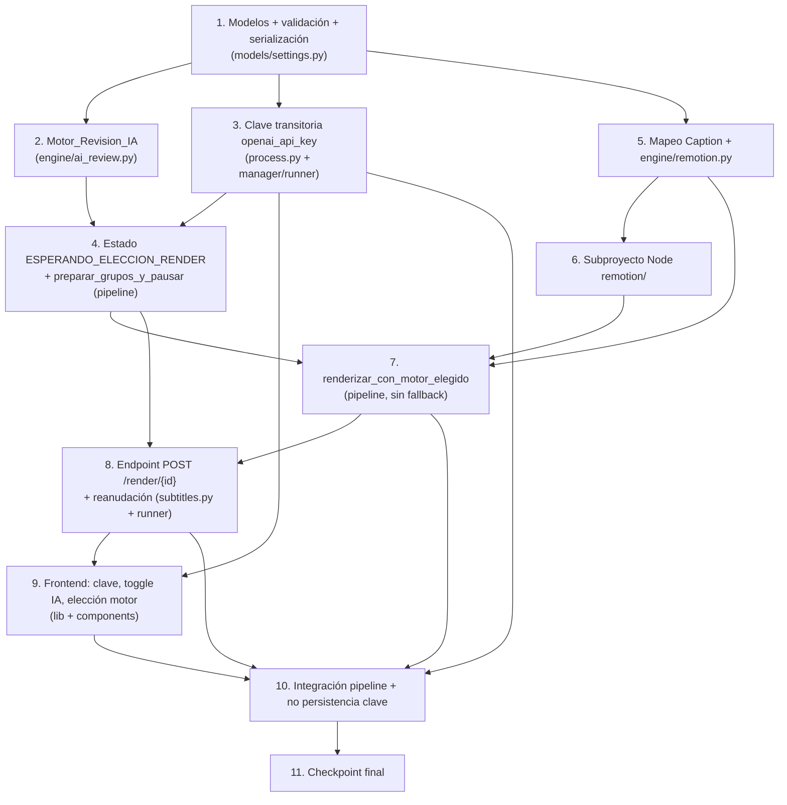

# Plan de Implementación: Subtítulos IA + Render Remotion

## Overview

Este plan convierte el diseño en una serie de pasos de codificación incrementales que un
agente de código puede ejecutar en orden. Cada paso se apoya en los anteriores y termina
integrándose en el pipeline y en el frontend, sin dejar código huérfano.

El lenguaje de implementación viene fijado por el diseño: **Python** para el backend
(FastAPI + pipeline) y **TypeScript/JavaScript** para el subproyecto Node de Remotion y los
componentes de Next.js. No se introduce pseudocódigo.

El plan cubre de forma incremental las dos capacidades:

1. **Corrección de subtítulos con IA (OpenAI GPT-4.1 mini, opt-in):** modelos → validación →
   `engine/ai_review.py` → clave transitoria → integración/pausa en el pipeline → frontend.
2. **Render con elección manual de motor:** estado `ESPERANDO_ELECCION_RENDER` → endpoint
   `POST /render/{id}` → `engine/remotion.py` + mapeo `Caption` → subproyecto Node `remotion/`
   → integración sin fallback en el pipeline → frontend de elección.

Las pruebas (unitarias con dobles inyectados, basadas en propiedades con `hypothesis`/`fast-check`,
e integración) se incluyen como sub-tareas junto a la implementación que validan.

> **Convención de pruebas:** los property tests deben ejecutar un mínimo de 100 iteraciones y
> anotarse con `Feature: subtitulos-ia-remotion, Property {n}: {texto}`. Las sub-tareas marcadas
> con `*` son opcionales (pruebas) y no se implementan automáticamente.

---

## Task Dependency Graph

---

## Tasks

- [x] 1. Modelos de datos, validación y serialización de ajustes
  - [x] 1.1 Añadir modelos y constantes de IA/render en `models/settings.py`
    - Definir `SUPPORTED_OPENAI_MODELS` (`gpt-4.1-mini`, `gpt-4.1`, `gpt-4.1-nano`, `gpt-4o-mini`) y `DEFAULT_OPENAI_MODEL`.
    - Definir el tipo `MotorRender = Literal["ass", "remotion"]` y `DEFAULT_MOTOR_RENDER = "ass"`.
    - Crear `AjustesRevisionIA` (`activado: bool = False`, `modelo`, `timeout_s`, `max_reintentos`) **sin** campo de clave de API.
    - Crear `AjustesRender` (`motor_preferido: MotorRender`, `combine_tokens_ms: int = 1200`) **sin** `fallback_ass`.
    - Añadir `revision_ia` y `render` al modelo `Ajustes` con `default_factory`.
    - _Requisitos: 1.1, 14.3_
  - [x] 1.2 Extender la validación de ajustes
    - Ampliar `RANGOS_MOTOR` con `revision_ia.timeout_s` (1.0–120.0), `revision_ia.max_reintentos` (0–5) y `render.combine_tokens_ms` (0–5000).
    - En `validar_ajustes`: si `revision_ia.activado` y `revision_ia.modelo ∉ SUPPORTED_OPENAI_MODELS`, marcar `revision_ia.modelo` como inválido.
    - _Requisitos: 11.1, 11.2, 11.3, 11.4_
  - [x]* 1.3 Prueba de propiedad: round-trip de serialización de `Ajustes`
    - **Property 15: Serialización round-trip** — para todo `Ajustes` válido (con `revision_ia` y `render`), serializar y deserializar produce un `Ajustes` equivalente y la representación es JSON válido.
    - Usar `hypothesis` para generar instancias arbitrarias de `Ajustes`.
    - **Validates: Requirements 15.1, 15.2**
  - [x]* 1.4 Pruebas unitarias de validación de ajustes
    - Casos de rango fuera de límite y modelo no soportado; verificar el campo reportado como inválido.
    - **Property 11: Validación de ajustes** — un `Ajustes` con `revision_ia.activado=True` y modelo no soportado es rechazado por `validar_ajustes` (campo `revision_ia.modelo`).
    - **Validates: Requirements 11.1, 11.2, 11.3, 11.4**

- [x] 2. Motor_Revision_IA en `engine/ai_review.py`
  - [x] 2.1 Implementar `corregir_grupos_ia` con cliente OpenAI inyectable
    - Definir el protocolo `OpenAIClienteProto` y la excepción `RevisionIAError`.
    - Firma: `corregir_grupos_ia(grupos, ajustes, api_key, *, cliente=None, minusculas=False) -> List[GrupoSubtitulo]`.
    - Degradación temprana: si `len(grupos)==0`, `not ajustes.activado`, o `api_key` falsy → devolver copia identidad.
    - Construir el prompt (system en español: corrige solo ortografía/acentos, conserva número y orden de líneas; salida JSON array) y pedir salida estructurada.
    - Emparejar por índice; si la cardinalidad no coincide o la forma es inválida → degradar a identidad.
    - Preservar `inicio_s`, `fin_s`, `palabras`; aplicar `minusculas`; si un texto corregido queda vacío, conservar el original de ese índice.
    - Capturar red/HTTP/timeout/formato y degradar; reintentar hasta `max_reintentos` ante 429; registrar advertencia **sin** incluir la clave.
    - Tratar `grupos` como inmutable (sin efectos secundarios).
    - _Requisitos: 3.1, 3.2, 3.3, 3.4, 4.1, 4.2, 4.3, 4.4, 5.1, 5.2, 5.4, 5.5, 12.2_
  - [ ]* 2.2 Prueba de propiedad: preservación de tiempos
    - **Property 1: Preservación de tiempos (IA)** — con un cliente doble que devuelve textos válidos, para toda lista de grupos generada, la salida tiene igual longitud y conserva `inicio_s`/`fin_s`/`palabras`.
    - Usar `hypothesis`.
    - **Validates: Requirements 3.1, 3.2**
  - [ ]* 2.3 Prueba de propiedad: degradación con gracia = identidad
    - **Property 2: Degradación con gracia = identidad** — con `activado=False`, `api_key` falsy, o cliente doble que lanza error/timeout/forma o cardinalidad inválida, el texto de salida es idéntico al de entrada elemento a elemento.
    - **Validates: Requirements 5.1, 5.2, 5.3**
  - [ ]* 2.4 Prueba de propiedad: solo edita texto y no pierde líneas
    - **Property 3: Solo edita texto** — el único campo que puede diferir es `texto`.
    - **Property 4: No pérdida de líneas** — ningún grupo de salida tiene `texto` vacío (si el modelo devuelve vacío, se conserva el original).
    - **Validates: Requirements 3.3, 4.4**
  - [ ]* 2.5 Pruebas unitarias con doble de OpenAI inyectado
    - Casos: éxito, 401, 429 (con reintentos), timeout, JSON malformado, cardinalidad incorrecta, texto vacío, `activado=False`, `api_key=None`; verificar que la advertencia de log no contiene la clave.
    - **Validates: Requirements 4.1, 4.2, 4.3, 5.4, 5.5, 12.2**

- [ ] 3. Clave de API transitoria y su propagación no persistida
  - [~] 3.1 Añadir `openai_api_key` transitorio a `ProcesarRequest` (`api/process.py`)
    - Campo `openai_api_key: Optional[str] = Field(default=None, repr=False)`, fuera del modelo `Ajustes`.
    - Propagar la clave a `manager.crear_job(...)` al aceptar `POST /procesar`.
    - _Requisitos: 2.2, 8.3, 14.3_
  - [~] 3.2 Almacenar la clave fuera de la serialización del Job (`jobs/manager.py`, `models/job.py`)
    - Guardar la clave en un atributo no serializado del `JobState` (excluido de `model_dump`) o en un mapa aparte `job_id -> api_key` en el `JobManager`.
    - Eliminar la clave de memoria cuando el Job alcance estado terminal (`COMPLETADO`/`FALLIDO`).
    - Asegurar que `PUT /configuracion` (`config_store`) ignora cualquier clave y solo persiste `Ajustes`.
    - _Requisitos: 2.3, 2.4, 2.5, 2.6_
  - [~] 3.3 Leer la clave en el `JobRunner` y pasarla a la corrección IA (`jobs/runner.py`)
    - El runner recupera la clave del Job y la pasa a `corregir_grupos_ia`; nunca la registra en logs.
    - _Requisitos: 2.4, 1.2_
  - [ ]* 3.4 Prueba de propiedad: no persistencia de la clave
    - **Property 6: No persistencia de la clave** — para toda petición, `config_store` nunca escribe `openai_api_key`, un `model_dump` del `JobState` no contiene la clave, y la representación serializada de `Ajustes` la excluye.
    - Usar `hypothesis` para generar claves y ajustes arbitrarios.
    - **Validates: Requirements 2.3, 2.4, 15.3**
  - [ ]* 3.5 Pruebas unitarias de ciclo de vida de la clave
    - Verificar eliminación de memoria al terminar el Job y que `PUT /configuracion` ignora la clave.
    - **Validates: Requirements 2.1, 2.5, 2.6**

- [ ] 4. Estado de pausa y preparación de grupos en el pipeline
  - [~] 4.1 Añadir el estado `ESPERANDO_ELECCION_RENDER` al modelo de Job (`models/job.py`)
    - Estado no terminal; asegurar transiciones válidas y persistencia del estado en el `JobManager`.
    - _Requisitos: 6.1_
  - [~] 4.2 Implementar `preparar_grupos_y_pausar` en `engine/pipeline.py`
    - Determinar `grupos_base` (parámetro `grupos` si viene, si no `agrupar(...)`), invocar `corregir_grupos_ia` (IA opcional), guardar `cortado` + `grupos_finales` para la elección y pausar en `ESPERANDO_ELECCION_RENDER` sin renderizar.
    - Mantener el progreso monótono dentro del rango 70–90 % del paso `SUBTITULOS`.
    - _Requisitos: 1.2, 1.3, 6.1, 6.4_
  - [ ]* 4.3 Prueba de propiedad: idempotencia de desactivación
    - **Property 5: Idempotencia de desactivación** — con `revision_ia.activado=False`, los `grupos_finales` producidos son idénticos a los grupos base (comportamiento previo).
    - **Validates: Requirements 14.1**
  - [ ]* 4.4 Pruebas unitarias de la pausa
    - Verificar que el pipeline se detiene en `ESPERANDO_ELECCION_RENDER` sin producir vídeo y conserva el workdir.
    - **Validates: Requirements 6.1**

- [ ] 5. Mapeo `Caption` y motor Remotion (Python) en `engine/remotion.py`
  - [~] 5.1 Implementar el mapeo `GrupoSubtitulo → Caption`
    - `startMs = round(inicio_s*1000)`, `endMs = round(fin_s*1000)`, `timestampMs = round((inicio_s+fin_s)/2*1000)`, `confidence = null`; garantizar `startMs <= endMs`.
    - Si el grupo tiene `palabras`, emitir un `Caption` por palabra (con espacio inicial en `text`); si no, un `Caption` por grupo.
    - _Requisitos: 10.1, 10.2, 10.3_
  - [~] 5.2 Implementar `renderizar_con_remotion` con `Runner` inyectable
    - Definir `NOMBRE_REMOTION_MP4` y la excepción `RemotionError`.
    - Serializar `props.json` (videoSrc, fps, width/height, durationInFrames, captions, estilo, combineTokensWithinMs) dentro del `JobWorkdir`.
    - Construir el comando `node render.mjs` pasando argumentos como **lista** (sin shell), con rutas vía `props.json`/variables de entorno.
    - Validar salida: código 0 + artefacto presente → devolver `Path(salida)` conservando la entrada; en fallo (código != 0, artefacto ausente, Node/Chromium ausentes) lanzar `RemotionError` accionable sin dejar artefactos parciales.
    - _Requisitos: 9.1, 9.2, 9.3, 9.4, 12.3, 12.4, 13.1_
  - [ ]* 5.3 Prueba de propiedad: fidelidad de captions Remotion
    - **Property 7: Fidelidad de captions Remotion** — para toda lista de grupos con tiempos válidos, el mapeo cumple `startMs = round(inicio_s*1000)`, `endMs = round(fin_s*1000)` y `startMs <= endMs`.
    - Usar `hypothesis`.
    - **Validates: Requirements 10.1, 10.2**
  - [ ]* 5.4 Pruebas unitarias de `renderizar_con_remotion` con `Runner` inyectado
    - Casos: construcción correcta del comando y `props.json`, código 0 con salida presente, código != 0, artefacto ausente; verificar `RemotionError`.
    - **Property 9: Conservación del original en render** — la salida es un archivo distinto de la entrada; ante fallo, la entrada se conserva.
    - **Validates: Requirements 9.1, 9.2, 9.3, 9.4, 13.1, 13.2**

- [ ] 6. Subproyecto Node `remotion/`
  - [~] 6.1 Inicializar el proyecto Remotion
    - Crear `remotion/package.json` con `remotion`, `@remotion/bundler`, `@remotion/renderer`, `@remotion/captions` (misma versión), `remotion.config.ts` y `src/index.ts` con `registerRoot`.
    - _Requisitos: 9.1_
  - [~] 6.2 Implementar `Root.tsx` y la composición `ShortVideo`
    - `Root.tsx` con `<Composition id="ShortVideo">` y `calculateMetadata` para derivar `fps`, `durationInFrames`, `width`, `height` desde `inputProps`.
    - `ShortVideo.tsx` con `<OffthreadVideo>` de fondo + capa `<Captions/>`.
    - _Requisitos: 9.1_
  - [~] 6.3 Implementar `Captions.tsx` con `@remotion/captions`
    - Usar `createTikTokStyleCaptions` (con `combineTokensWithinMilliseconds`), seleccionar página por tiempo actual y resaltar el token activo con `colorResaltado`.
    - _Requisitos: 10.3_
  - [~] 6.4 Implementar `render.mjs` (entrypoint SSR)
    - Leer `props.json` (vía variable de entorno), `bundle()` (cacheado) → `selectComposition({id:'ShortVideo', inputProps})` → `renderMedia({codec:'h264', outputLocation, inputProps})`; salir con código != 0 ante error.
    - _Requisitos: 9.1, 9.3, 9.4_
  - [ ]* 6.5 Prueba de propiedad (fast-check) del mapeo/estilo de captions en TS
    - **Property 7: Fidelidad de captions Remotion** — para todo array de captions generado, la utilidad de selección/estilo respeta `startMs <= endMs` y no altera los tiempos.
    - Usar `fast-check` (ya presente en `devDependencies`).
    - **Validates: Requirements 10.2, 10.3**

- [ ] 7. Render con motor elegido en el pipeline (sin fallback)
  - [~] 7.1 Implementar `renderizar_con_motor_elegido` en `engine/pipeline.py`
    - `ASSERT motor IN {"ass","remotion"}`; si `remotion` → `renderizar_con_remotion(...)` (un `RemotionError` se propaga); si `ass` → `generar_y_quemar_subtitulos(..., grupos=grupos_finales)`.
    - Sin try/fallback: ejecutar exactamente el motor elegido.
    - _Requisitos: 7.1, 7.2, 7.3, 13.1_
  - [~] 7.2 Manejar el fallo del motor como Job `FALLIDO`
    - Si el motor elegido falla, marcar el Job `FALLIDO` con `error = {"paso": "SUBTITULOS", "motivo": ...}` accionable, sin reintentar el otro motor; conservar el vídeo de entrada; limpiar `props.json` y el MP4 de Remotion conservando el `Video_Final`.
    - _Requisitos: 7.4, 13.2, 13.3_
  - [ ]* 7.3 Pruebas unitarias del despacho de motor con dobles
    - Con dobles de ambos motores, verificar que solo se invoca el elegido y que un fallo produce `FALLIDO` sin invocar el otro.
    - **Property 8: El motor ejecutado es exactamente el elegido** — con `motor=m`, se invoca solo el motor `m`.
    - **Property 10: Sin fallback — fallo propaga a FALLIDO** — si el motor elegido falla, el Job pasa a `FALLIDO` sin reintentar el otro.
    - **Validates: Requirements 7.1, 7.2, 7.3, 7.4**

- [ ] 8. Endpoint de elección de render y reanudación
  - [~] 8.1 Implementar `POST /render/{id}` en `api/subtitles.py`
    - Cuerpo `{ motor: "ass" | "remotion" }`; validar: `400` si el motor no es válido, `409` si el Job no está en `ESPERANDO_ELECCION_RENDER`.
    - Lanzar la reanudación (`lanzar_reanudacion(job_id, motor)`) que llama a `reanudar_pipeline(..., motor=motor)` con `renderizar_con_motor_elegido`.
    - _Requisitos: 6.3, 7.1, 7.2, 8.1, 8.2_
  - [~] 8.2 Integrar la reanudación en el `JobRunner` (`jobs/runner.py`)
    - Reanudar desde `ESPERANDO_ELECCION_RENDER` con los `grupos_finales` guardados y el `motor` recibido; reportar progreso 70–90 % monótono.
    - _Requisitos: 6.4, 7.3_
  - [ ]* 8.3 Pruebas unitarias/contrato del endpoint
    - `POST /render/{id}` con motor inválido → `400`; Job en estado incorrecto → `409`; motor válido → reanuda; `POST /procesar` con `openai_api_key` → `202`.
    - **Validates: Requirements 8.1, 8.2, 8.3**

- [ ] 9. Frontend Next.js (clave, toggle IA y elección de motor)
  - [~] 9.1 Añadir tipos y llamadas de API (`lib/types.ts`, `lib/api.ts`)
    - Añadir `AjustesRevisionIA` y `MotorRender` a los tipos; añadir `revision_ia`/`render` a `Ajustes`.
    - Extender `procesar(...)` con el campo transitorio `openai_api_key?: string | null` (no persistido con `guardarConfiguracion`) y añadir `elegirRender(jobId, motor)` (`POST /render/{id}`).
    - _Requisitos: 2.2, 6.3, 14.3_
  - [~] 9.2 Implementar `components/settings/OpenAIKeyInput.tsx`
    - Campo `type="password"`; la clave vive solo en el estado de React (sin `localStorage`); incluir aviso de privacidad (la clave se envía a OpenAI solo al procesar y no se guarda).
    - _Requisitos: 2.1, 12.1_
  - [~] 9.3 Implementar `components/settings/AjustesRevisionIA.tsx`
    - Toggle `activado`, selector de `modelo` (por defecto `gpt-4.1-mini`) y aviso de red externa cuando `activado` es `True`.
    - _Requisitos: 1.1, 12.1_
  - [~] 9.4 Implementar `components/EleccionRender.tsx`
    - Mostrar cuando el Job está en `esperando_eleccion_render`: subtítulos corregidos en solo lectura + dos botones ("Editar con Remotion" y "ffmpeg"); al pulsar, llamar a `elegirRender(id, motor)`; `render.motor_preferido` solo resalta un botón.
    - _Requisitos: 6.2, 6.3_
  - [ ]* 9.5 Pruebas de componente/utilidades del frontend
    - Verificar que la clave no se escribe en `localStorage` y que cada botón envía el motor correcto; property test con `fast-check` sobre la utilidad de construcción del cuerpo de `procesar` (la clave se omite cuando la IA está desactivada).
    - **Validates: Requirements 2.1, 6.2, 6.3**

- [ ] 10. Integración del pipeline y verificación de no persistencia
  - [~] 10.1 Pruebas de integración del pipeline con dobles (parametrizado por motor)
    - Con dobles de OpenAI y de ambos motores de render, ejecutar el pipeline completo; verificar la pausa en `ESPERANDO_ELECCION_RENDER`, que `POST /render/{id}` reanuda y ejecuta **exactamente** el motor elegido y que el otro **no** se invoca.
    - **Property 8: El motor ejecutado es exactamente el elegido**
    - _Requisitos: 6.1, 7.1, 7.2, 7.3_
  - [~] 10.2 Prueba de integración del fallo sin fallback
    - Con el doble del motor elegido lanzando error, verificar que el Job termina `FALLIDO` con error accionable y sin invocar el otro motor.
    - **Property 10: Sin fallback — fallo propaga a FALLIDO**
    - _Requisitos: 7.4, 13.2_
  - [~] 10.3 Prueba de integración de no persistencia de la clave y round-trip de ajustes
    - `POST /procesar` con `openai_api_key` → `202`; comprobar que `config_store`/`PUT /configuracion` nunca escriben la clave y que `Ajustes` serializado/deserializado es equivalente y excluye la clave.
    - **Property 6: No persistencia de la clave** · **Property 15: Serialización round-trip**
    - _Requisitos: 2.3, 2.4, 2.6, 8.3, 15.2, 15.3_
  - [ ]* 10.4 Prueba de compatibilidad hacia atrás
    - Con `revision_ia.activado=False` y motor `"ass"`, verificar salida idéntica al comportamiento previo.
    - **Property 5: Idempotencia de desactivación**
    - **Validates: Requirements 14.1, 14.2**

- [~] 11. Checkpoint final
  - Asegurar que todas las pruebas pasan (backend con `pytest`, frontend con su runner en modo `--run`); consultar al usuario si surgen dudas.

## Notas

- Las sub-tareas marcadas con `*` son opcionales (pruebas) y pueden omitirse para un MVP más rápido; no se implementan automáticamente.
- Cada tarea referencia los requisitos que satisface para trazabilidad.
- Los property tests usan `hypothesis` (backend) y `fast-check` (frontend), con mínimo 100 iteraciones y anotación `Feature: subtitulos-ia-remotion, Property {n}`.
- El diseño incluye una sección de "Correctness Properties"; por ello se incluyen sub-tareas de pruebas basadas en propiedades junto a la implementación correspondiente.
