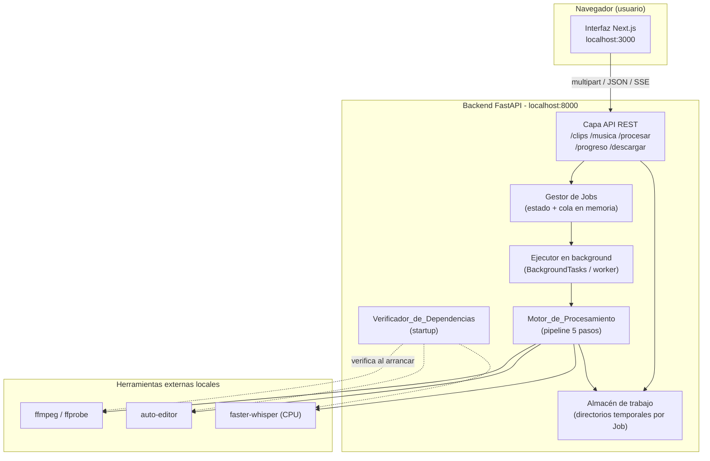
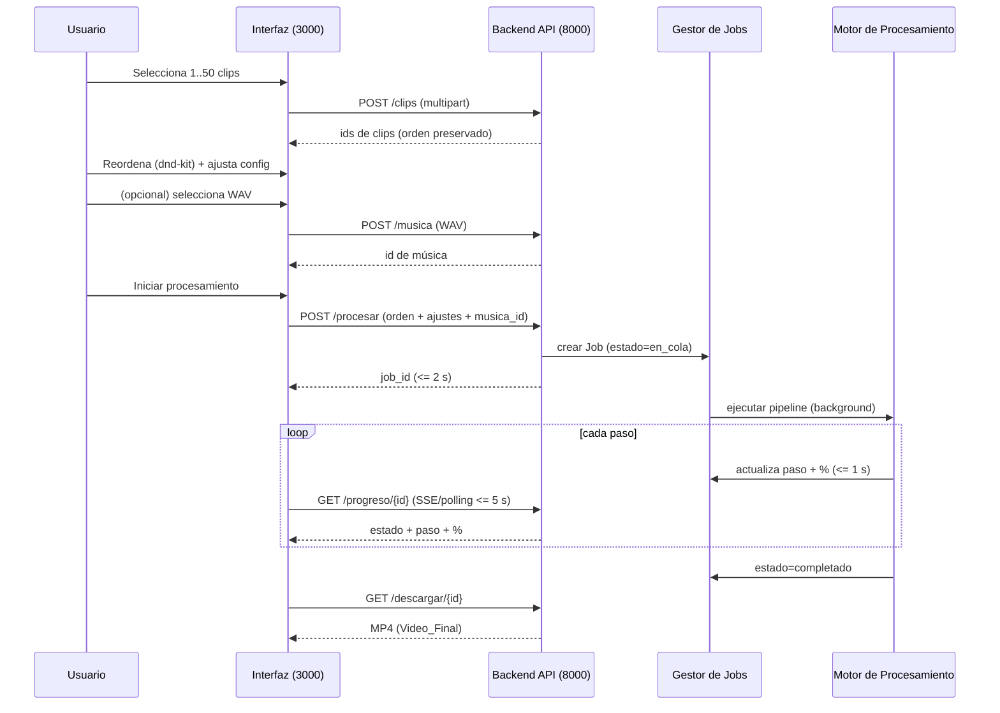
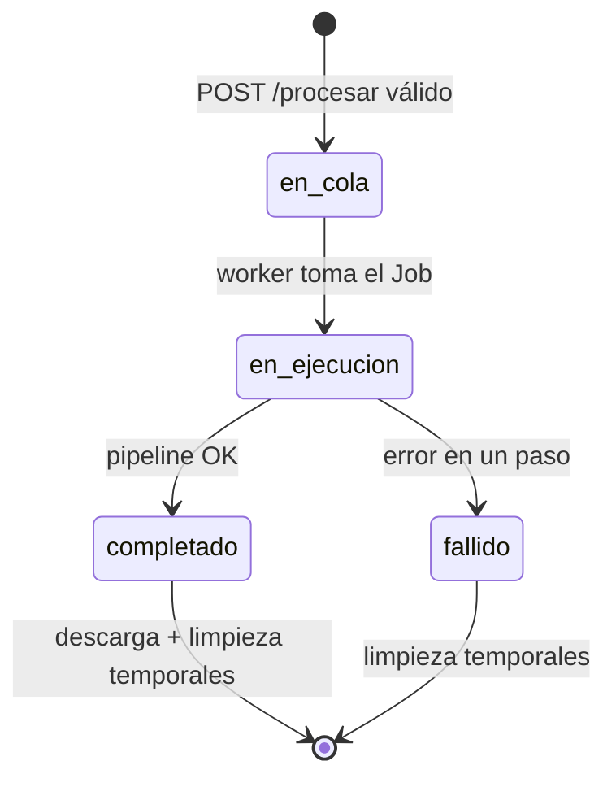

# Documento de Diseño

## Visión General

Este documento describe el diseño técnico de una aplicación **local** con interfaz gráfica que automatiza la edición de shorts verticales hablados sobre macOS. El sistema se compone de dos procesos que se ejecutan en `localhost`:

- **Interfaz (Frontend):** Aplicación Next.js (App Router) + TypeScript + Tailwind en `localhost:3000`. Permite seleccionar clips, reordenarlos con arrastrar y soltar (dnd-kit), configurar todos los ajustes, lanzar el procesamiento, seguir el progreso y previsualizar/descargar el resultado.
- **Backend (FastAPI):** Aplicación Python FastAPI en `localhost:8000` que expone endpoints REST y envuelve el **Motor de Procesamiento**, un pipeline determinista basado en `ffmpeg`, `auto-editor` y `faster-whisper`.

El diseño respeta una arquitectura fija: sin autenticación, sin servicios externos, sin claves de API. Todo el cómputo (incluida la transcripción con `faster-whisper` en CPU) ocurre en la máquina local.

El **pipeline de procesamiento** ejecuta cinco pasos en orden estricto:

1. **UNIR:** normalizar cada clip a 9:16 (por defecto 1080x1920) con escala + relleno (letterbox) respetando el orden del usuario y concatenar.
2. **CORTAR SILENCIOS:** eliminar pausas con `auto-editor` (opcional).
3. **TRANSCRIBIR:** obtener timestamps por palabra con `faster-whisper` (CPU, `word_timestamps=True`).
4. **SUBTÍTULOS ANIMADOS:** agrupar palabras, generar un archivo `.ass` con overrides `{\anN\move(...)\fad(entrada,salida)}` y quemarlos con `ffmpeg`.
5. **MÚSICA:** mezclar música WAV de fondo con ducking (`sidechaincompress`).

### Objetivos de Diseño

| Objetivo | Cómo se logra | Requisitos |
|----------|---------------|------------|
| Operación 100% local y sin auth | Procesos en localhost, sin llamadas de red salientes | 13.1, 13.2, 13.7 |
| Orden de clips preservado extremo a extremo | El `Orden_de_Clips` viaja del frontend al backend y gobierna la concatenación | 2.3, 2.4, 3.4 |
| Normalización vertical sin deformación | `scale=...:force_original_aspect_ratio=decrease` + `pad` centrado | 3.1, 3.3 |
| Subtítulos legibles y animados estilo shorts | Agrupación de N palabras + ASS con `\move` + `\fad` | 6.x, 7.x |
| Voz siempre inteligible sobre la música | Ducking con `sidechaincompress` | 8.3, 8.5, 8.6 |
| Progreso observable por paso | Estado de Job + SSE/polling | 10.x |
| Sin residuos en disco | Directorio de trabajo por Job y limpieza | 13.3-13.6 |
| Arranque reproducible en Mac | README + `requirements.txt` + `package.json` | 14.x |

## Arquitectura

### Vista de componentes



### Flujo extremo a extremo (secuencia)



### Ciclo de vida del Job



### Modelo de concurrencia y ejecución

- El backend mantiene un **Gestor de Jobs en memoria** (diccionario `job_id -> JobState`) protegido por un lock/estructura asíncrona.
- El pipeline se ejecuta en **background** para no bloquear la respuesta de `POST /procesar` (que devuelve el `job_id` en <= 2 s, Req 10.1). Se usa un ejecutor de tareas (por ejemplo `asyncio` + `run_in_executor`/worker dedicado) porque los pasos son intensivos en CPU/IO (ffmpeg, whisper).
- Los procesos externos (`ffmpeg`, `auto-editor`) se lanzan con `subprocess` capturando `returncode`, `stdout` y `stderr`. `faster-whisper` se invoca como biblioteca Python en CPU.
- El estado de progreso es la **fuente de verdad** consultada por `GET /progreso/{id}` y transmitida por SSE.

## Estructura de Directorios

### Frontend (`frontend/`)

```
frontend/
├── package.json
├── next.config.js
├── tsconfig.json
├── tailwind.config.ts
├── postcss.config.js
├── app/
│   ├── layout.tsx
│   ├── page.tsx                 # Pantalla principal del editor
│   └── globals.css
├── components/
│   ├── ClipUploader.tsx         # Selección + validación de clips (Req 1)
│   ├── ClipList.tsx             # Lista reordenable dnd-kit (Req 2)
│   ├── SortableClipItem.tsx     # Ítem arrastrable con indicador de destino
│   ├── MusicUploader.tsx        # Selección WAV + volumen (Req 8, 9.4)
│   ├── settings/
│   │   ├── SubtitleSettings.tsx # Ajustes de subtítulos (Req 9.1)
│   │   ├── SilenceSettings.tsx  # Ajustes de silencios (Req 9.2)
│   │   ├── TranscriptionSettings.tsx # Idioma/modelo/resolución (Req 9.3)
│   │   └── GeneralSettings.tsx  # Resolución/fps objetivo
│   ├── ProcessButton.tsx        # Validación global + POST /procesar (Req 9.5, 9.6)
│   ├── ProgressPanel.tsx        # Progreso por paso (Req 10.6)
│   └── ResultPreview.tsx        # Previsualización + descarga (Req 11)
├── lib/
│   ├── api.ts                   # Cliente HTTP hacia el backend
│   ├── validation.ts            # Validación de rangos de ajustes (Req 9)
│   ├── types.ts                 # Tipos compartidos (Clip, Settings, JobProgress)
│   └── progress.ts              # Suscripción SSE / fallback polling
└── public/
```

### Backend (`backend/`)

```
backend/
├── requirements.txt             # fastapi, uvicorn, auto-editor, faster-whisper, python-multipart
├── main.py                      # Creación de la app FastAPI + arranque + startup checks
├── app/
│   ├── __init__.py
│   ├── config.py                # Puertos, límites, rutas de trabajo, defaults
│   ├── api/
│   │   ├── clips.py             # POST /clips
│   │   ├── music.py             # POST /musica
│   │   ├── process.py           # POST /procesar
│   │   ├── progress.py          # GET /progreso/{id} (JSON + SSE)
│   │   └── download.py          # GET /descargar/{id}
│   ├── models/
│   │   ├── clip.py              # Modelo Clip
│   │   ├── settings.py          # Modelos de ajustes (Pydantic) + validación de rangos
│   │   ├── job.py               # JobState, JobStatus, PipelineStep, Progress
│   │   └── errors.py            # Modelos de error homogéneos
│   ├── jobs/
│   │   ├── manager.py           # Registro de Jobs en memoria + transiciones de estado
│   │   └── runner.py            # Ejecución en background del pipeline
│   ├── engine/
│   │   ├── pipeline.py          # Orquestación de los 5 pasos
│   │   ├── normalize.py         # Paso 1: escala+pad+fps y concat (ffmpeg)
│   │   ├── silence.py           # Paso 2: auto-editor
│   │   ├── transcribe.py        # Paso 3: faster-whisper
│   │   ├── grouping.py          # Agrupación de palabras (Req 6) [lógica pura]
│   │   ├── ass_builder.py       # Generación de ASS + overrides (Req 7) [lógica pura]
│   │   ├── subtitles.py         # Quemado de ASS con ffmpeg
│   │   ├── music.py             # Ducking con sidechaincompress (Req 8)
│   │   └── ffprobe.py           # Inspección de clips (resolución, fps, validez)
│   ├── deps/
│   │   └── checker.py           # Verificador_de_Dependencias (Req 12)
│   ├── storage/
│   │   └── workdir.py           # Directorios temporales por Job + limpieza (Req 13)
│   └── util/
│       ├── units.py             # Conversión de unidades UI<->motor (dB<->%, ms<->s)
│       └── ass_time.py          # Formato de tiempos ASS (h:mm:ss.cs)
└── tests/
    ├── test_grouping.py         # Property-based (Req 6)
    ├── test_normalize.py        # Property-based (Req 3)
    ├── test_ass_builder.py      # Property-based (Req 7)
    ├── test_ordering.py         # Property-based (Req 2, 3.4)
    ├── test_units.py            # Property-based (conversión de unidades)
    ├── test_api.py              # Integración endpoints
    └── test_deps.py             # Verificador de dependencias
```

### Raíz del proyecto

```
/
├── README.md                    # Instalación macOS + arranque (Req 14.1-14.4)
├── requirements.txt             # Referencia/duplicado accesible en raíz (Req 14.5)
├── frontend/
└── backend/
```

> Nota de trazabilidad (Req 14.5): el requisito exige un `requirements.txt` en la **raíz del proyecto**. El diseño coloca el archivo canónico de dependencias de Python en `backend/requirements.txt` y expone en la raíz un `requirements.txt` (mediante copia o instrucción `pip install -r backend/requirements.txt` documentada en el README) para satisfacer literalmente el criterio. El README documentará la ruta efectiva.

## Componentes e Interfaces

### Interfaz (Frontend)

| Componente | Responsabilidad | Requisitos |
|------------|-----------------|------------|
| `ClipUploader` | Validar formato/tamaño (<=500 MB), máximo 50 archivos, enviar multipart, manejar timeout 60 s | 1.1, 1.4, 1.5, 1.7 |
| `ClipList` + `SortableClipItem` | Reordenamiento dnd-kit (>=2 clips), indicador visual de destino, revertir en cancelación, actualización <=500 ms | 2.1, 2.2, 2.5, 2.6 |
| `MusicUploader` | Validar extensión WAV, subir a `POST /musica`, ajustar volumen base | 8.1, 9.4, 9.7 |
| `settings/*` | Formularios validados por rango para subtítulos, silencios, transcripción y generales | 9.1, 9.2, 9.3 |
| `ProcessButton` | Validación global previa; si todo es válido `POST /procesar` con orden + ajustes; si no, bloquea y señala campo | 9.5, 9.6, 2.3 |
| `ProgressPanel` | Mostrar paso actual + % con SSE/polling (>= cada 5 s) | 10.6 |
| `ResultPreview` | Previsualizar Video_Final (<=3 s), ofrecer descarga; fallback si la previsualización falla | 11.1, 11.5 |

### Backend: contratos de API

Todos los endpoints devuelven errores con un envoltorio homogéneo:

```json
{ "error": { "code": "STRING_CODE", "message": "descripción legible", "details": { } } }
```

#### `POST /clips` — Subida de clips (Req 1)

- **Request:** `multipart/form-data` con uno o más campos `files` (1..50 archivos de video). El orden de las partes define el orden de recepción.
- **Response 200:**

```json
{
  "clips": [
    { "id": "clip_01H...", "nombre_original": "toma1.mp4", "posicion": 1, "tamano_bytes": 12345678, "duracion_s": 12.4 },
    { "id": "clip_01H...", "nombre_original": "toma2.mov", "posicion": 2, "tamano_bytes": 9876543, "duracion_s": 8.1 }
  ]
}
```

- **Reglas:** el backend conserva el orden de recepción (Req 1.3). Si no puede almacenar uno o más clips, responde error y **no** deja almacenamiento parcial (Req 1.6, atomicidad). Límites de formato/tamaño se validan primero en la Interfaz (Req 1.4) y se revalidan en el backend.
- **Errores:** `422 CLIP_STORAGE_FAILED` (identifica los clips no almacenados), `413 CLIP_TOO_LARGE`, `415 UNSUPPORTED_FORMAT`.

#### `POST /musica` — Subida de música (Req 8.1, 8.2)

- **Request:** `multipart/form-data` con campo `file` (WAV).
- **Response 200:** `{ "musica_id": "mus_01H...", "nombre_original": "beat.wav", "duracion_s": 60.0 }`
- **Errores:** `415 INVALID_WAV` (no es WAV válido), `413 MUSIC_TOO_LARGE` (> 100 MB). En ambos casos se conservan audio y video originales sin modificar (Req 8.2).

#### `POST /procesar` — Iniciar Job (Req 9.5, 10.1, 10.2)

- **Request (JSON):**

```json
{
  "orden_clips": ["clip_a", "clip_b", "clip_c"],
  "musica_id": "mus_01H... | null",
  "ajustes": { "generales": {...}, "silencios": {...}, "transcripcion": {...}, "subtitulos": {...}, "musica": {...} }
}
```

- **Response 202:** `{ "job_id": "job_01H...", "estado": "en_cola" }` en <= 2 s.
- **Errores (`400 INVALID_REQUEST`):** sin `orden_clips`, orden vacío, > 500 clips, o ajustes faltantes/ inválidos (Req 10.2). El detalle identifica el motivo/campo.

#### `GET /progreso/{id}` — Progreso (Req 10.3, 10.4, 10.6)

- **Response 200 (JSON, polling):**

```json
{
  "job_id": "job_01H...",
  "estado": "en_ejecucion",
  "paso_actual": "TRANSCRIBIR",
  "indice_paso": 3,
  "total_pasos": 5,
  "porcentaje": 55,
  "mensaje": "Transcribiendo audio (es)",
  "error": null
}
```

- **Variante SSE:** `GET /progreso/{id}?stream=true` responde `text/event-stream` emitiendo el mismo objeto como eventos `progreso` al menos cada vez que cambia el paso (Req 10.5) y periódicamente (heartbeat) para cumplir la actualización <= 5 s (Req 10.6). La Interfaz usa SSE por defecto y cae a polling si SSE no está disponible.
- **Errores:** `404 JOB_NOT_FOUND` sin modificar estado (Req 10.4).
- **Estados:** `en_cola | en_ejecucion | completado | fallido`. En `fallido`, `error` contiene `{ "paso": "...", "motivo": "..." }` (Req 10.7).

#### `GET /descargar/{id}` — Descarga (Req 11.2, 11.3, 11.4)

- **Response 200:** stream del MP4 (`Content-Type: video/mp4`, `Content-Disposition: attachment`), transferencia iniciada en <= 2 s.
- **Errores:** `409 RESULT_NOT_READY` si el Job no finalizó correctamente (Req 11.3); `404 JOB_NOT_FOUND` si no existe (Req 11.4).

### Modelo completo de ajustes de configuración

El objeto `ajustes` enviado en `POST /procesar` agrupa cinco secciones. Los rangos siguen el Requisito 9 (validación de la Interfaz) y se revalidan en el backend con el rango del motor cuando difiere. Donde el Req 9 (UI) y los Req 3–8 (motor) usan rangos/unidades distintos, se aplica el **rango de la UI en la Interfaz** y una **conversión de unidades** antes de invocar las herramientas (ver `util/units.py`).

```json
{
  "generales": {
    "resolucion": { "ancho": 1080, "alto": 1920 },      // Req 3.2: 2..7680, def 1080x1920
    "fps": 30                                             // Req 3.5: 1..120, def 30
  },
  "silencios": {
    "activado": true,                                     // Req 4.3
    "umbral_db": -30,                                     // Req 9.2 UI: -60..0 dB (motor: 0..100%)
    "margen_ms": 200                                      // Req 9.2 UI: 0..5000 ms (motor: 0..5 s)
  },
  "transcripcion": {
    "idioma": "es",                                       // Req 5.2: def "es", admite "auto"
    "modelo": "small"                                     // Req 5.3: modelo válido de faster-whisper
  },
  "subtitulos": {
    "max_palabras": 4,                                    // Req 6.1: UI 1..20 / motor 1..10, def 4
    "posicion_vertical": "inferior",                      // Req 7.5: superior|centro|inferior
    "posicion_horizontal": "centro",                      // Req 7.6: izquierda|centro|derecha
    "pos_vertical_pct": 85,                               // Req 9.1: 0..100 % de la altura
    "pos_horizontal_pct": 50,                             // Req 9.1: 0..100 % del ancho
    "margen_px": 60,                                      // Req 7.7: 0..500 / Req 9.1: 0..500
    "fuente": "Arial",                                    // Req 7.8, 9.1
    "tamano": 72,                                         // Req 7.8: 12..200 / Req 9.1: 8..200, def 72
    "color": "#FFFFFF",                                   // Req 7.8, 9.1
    "color_borde": "#000000",                             // Req 7.8, 9.1
    "grosor_borde": 5,                                    // Req 7.8: 0..20 / Req 9.1: 0..50, def 4-5
    "negrita": true,                                      // Req 7.8, 9.1
    "anim_entrada_ms": 300,                               // Req 7.3: 100..2000 / Req 9.1: 0..5000, def 300
    "anim_salida_ms": 300,                                // Req 7.3: 100..2000 / Req 9.1: 0..5000, def 300
    "slide_px": 50                                        // Req 7.4: 1..500 / Req 9.1: 0..500, def 50
  },
  "musica": {
    "volumen_base_pct": 30,                               // Req 8.4: 0..100 %, def 30
    "reduccion_db": 12,                                   // Req 8.5: >= 12 dB de reducción
    "umbral_voz_dbfs": -30,                               // Req 8.5/8.6: -30 dBFS
    "ataque_ms": 250,                                     // Req 8.5: <= 250 ms
    "liberacion_ms": 500                                  // Req 8.6: <= 500 ms
  }
}
```

> **Reconciliación de rangos (UI vs motor):** para varios campos el Requisito 9 define rangos de UI más amplios que los rangos del motor de los Requisitos 3–8 (p. ej. `tamano` UI 8..200 vs motor 12..200; `max_palabras` UI 1..20 vs motor 1..10; `grosor_borde` UI 0..50 vs motor 0..20). La Interfaz valida contra el rango de UI (Req 9.6); el backend aplica el rango del motor y, cuando el valor excede el rango del motor, lo rechaza (Req 7.11) o aplica el valor por defecto seguro (Req 6.2 para `max_palabras`). Esta política se documenta explícitamente por campo en `models/settings.py`.

## Motor de Procesamiento (Pipeline)

El pipeline se orquesta en `engine/pipeline.py`. Cada paso reporta al Gestor de Jobs su inicio y avance (Req 10.5). Todos los artefactos intermedios se escriben en el **directorio de trabajo del Job** (`storage/workdir.py`, Req 13.3).

Distribución de porcentaje por paso (referencia para `GET /progreso`):

| Índice | Paso | Rango de % |
|--------|------|------------|
| 1 | UNIR (normalizar + concat) | 0–25 |
| 2 | CORTAR SILENCIOS | 25–40 |
| 3 | TRANSCRIBIR | 40–70 |
| 4 | SUBTÍTULOS (ASS + quemado) | 70–90 |
| 5 | MÚSICA (ducking) | 90–100 |

### Paso 1 — Unir y normalizar a 9:16 (Req 3)

**Objetivo:** convertir clips heterogéneos (resolución, fps, orientación) en un único video continuo vertical sin deformar y respetando el `Orden_de_Clips`.

**Sub-pasos:**

1. Para cada clip, inspeccionar con `ffprobe` su validez, resolución, rotación y fps. Si un clip es corrupto/no decodificable, **detener** el paso, no producir salida parcial y reportar el clip que falló (Req 3.6).
2. Normalizar cada clip a un archivo intermedio con parámetros idénticos (misma resolución, fps, códec, tasa de muestreo y canales de audio), de modo que la concatenación posterior sea segura.
3. Concatenar los intermedios **en el orden del usuario** con el demuxer `concat` de ffmpeg.

**Filtro de normalización (escala + pad centrado):**

```
-vf "scale=w={W}:h={H}:force_original_aspect_ratio=decrease,\
pad={W}:{H}:(ow-iw)/2:(oh-ih)/2:color=black,\
setsar=1,fps={FPS}"
```

- `force_original_aspect_ratio=decrease` garantiza que el contenido **cabe completo** conservando la relación de aspecto (sin recorte ni deformación) (Req 3.1).
- `pad ...:(ow-iw)/2:(oh-ih)/2:color=black` centra el contenido y rellena con **barras negras** (Req 3.1).
- `setsar=1` evita deformación por relación de aspecto de píxel no cuadrado.
- `fps={FPS}` normaliza a `Cuadros_Por_Segundo_Objetivo` (Req 3.3, 3.5).
- El audio de cada intermedio se normaliza a un formato común (p. ej. `-ar 48000 -ac 2`).

**Concatenación (preservando el orden):** se construye una lista `concat.txt` con las rutas de los intermedios en el orden exacto de `orden_clips` y se ejecuta:

```
ffmpeg -f concat -safe 0 -i concat.txt -c copy unido.mp4
```

> Como todos los intermedios comparten códec/parámetros, la concatenación con `-c copy` es válida y mantiene el orden (Req 3.4). Si algún clip carece de pista de audio, se le inyecta audio silencioso (`anullsrc`) durante la normalización para que la concatenación sea homogénea.

### Paso 2 — Corte de silencios (Req 4)

**Objetivo:** eliminar pausas para lograr ritmo dinámico, si está activado.

- Si `silencios.activado == false`: se **omite** el paso y se conserva el video sin recortar (Req 4.3).
- Conversión de unidades (`util/units.py`): la UI expresa `umbral_db` (-60..0 dB) y `margen_ms` (0..5000 ms); el motor/`auto-editor` usan porcentaje (0..100%) y segundos (0..5 s). Se mapea `umbral_pct = round(10^(umbral_db/20) * 100, )` y `margen_s = margen_ms / 1000`.
- Validación de rangos del motor (Req 4.2, 4.4): si el umbral o el margen quedan fuera de rango, se rechaza el valor, se indica error y se conserva el último valor válido.
- Comando:

```
auto-editor unido.mp4 --edit "audio:threshold={umbral_pct}%" --margin {margen_s}s \
  --no-open -o cortado.mp4
```

- Si `auto-editor` falla (código de salida != 0), se indica error y se conserva el video original sin recortar (Req 4.5); el pipeline continúa con `unido.mp4` **solo si** el paso está definido como no bloqueante; por defecto el fallo marca el Job como fallido (Req 10.7). La política se documenta: fallo de `auto-editor` => Job fallido con mensaje que identifica el paso.

### Paso 3 — Transcripción con timestamps por palabra (Req 5)

**Objetivo:** obtener `Timestamps_por_Palabra` con precisión de milisegundos.

- Validaciones previas (antes de transcribir):
  - Si `idioma != "auto"` y no está entre los idiomas soportados por faster-whisper => rechazar, error "idioma no válido", sin producir timestamps (Req 5.5).
  - Si `modelo` no está entre los soportados => rechazar, error "modelo no válido", sin producir timestamps (Req 5.6).
- Extracción de audio del video (`ffmpeg -i cortado.mp4 -vn -ar 16000 -ac 1 audio.wav`).
- Transcripción local en CPU:

```python
from faster_whisper import WhisperModel
model = WhisperModel(modelo, device="cpu", compute_type="int8")
segments, info = model.transcribe(
    "audio.wav",
    language=None if idioma == "auto" else idioma,   # None => detección automática (Req 5.4)
    word_timestamps=True,                             # Req 5.1
)
palabras = [
    { "texto": w.word, "inicio_s": round(w.start, 3), "fin_s": round(w.end, 3) }
    for seg in segments for w in seg.words
]
```

- Cada palabra incluye `inicio_s`/`fin_s` en segundos con precisión de 0.001 s (Req 5.1).
- Si el audio es ilegible/corrupto o sin voz reconocible => finalizar con error que señala la causa, sin timestamps parciales (Req 5.7).

### Paso 4 — Subtítulos animados (Req 6 y 7)

Se divide en tres subcomponentes de **lógica pura** (agrupación y construcción del ASS) más un subcomponente de **efecto** (quemado con ffmpeg).

#### 4a. Agrupación de palabras (Req 6, `engine/grouping.py`)

- Agrupar las palabras en `Grupos_de_Subtítulo` de tamaño <= `max_palabras` (validado, Req 6.1). Si `max_palabras` está fuera de 1..10 (rango del motor), usar el valor por defecto 4 e indicar configuración inválida (Req 6.2).
- El último grupo contiene las palabras restantes cuando son menos que el máximo (Req 6.3).
- Tiempos del grupo: `inicio = primera_palabra.inicio_s`, `fin = ultima_palabra.fin_s` (Req 6.4).
- Si una palabra del grupo carece de timestamp válido => indicar la ausencia y **no** generar tiempos inválidos para ese grupo (Req 6.5). Estrategia: excluir/marcar el grupo afectado y registrar advertencia; nunca emitir `inicio > fin` ni valores nulos.

Pseudocódigo:

```python
def agrupar(palabras, max_n):
    n = max_n if 1 <= max_n <= 10 else 4  # Req 6.2
    grupos = []
    for i in range(0, len(palabras), n):
        trozo = palabras[i:i+n]           # Req 6.3 (último trozo puede ser menor)
        if any(p.inicio_s is None or p.fin_s is None for p in trozo):
            registrar_advertencia_timestamp(trozo)   # Req 6.5
            continue
        grupos.append(Grupo(
            texto=" ".join(p.texto for p in trozo),
            inicio_s=trozo[0].inicio_s,   # Req 6.4
            fin_s=trozo[-1].fin_s,        # Req 6.4
        ))
    return grupos
```

#### 4b. Construcción del archivo ASS (Req 7, `engine/ass_builder.py`)

**Cálculo de la alineación `\an` (Req 7.5, 7.6):** combinación de posición vertical y horizontal en el teclado numérico ASS:

| | izquierda | centro | derecha |
|---|---|---|---|
| **superior** | an7 | an8 | an9 |
| **centro** | an4 | an5 | an6 |
| **inferior** | an1 | an2 | an3 |

**Posición base (x,y):** se calcula desde `pos_horizontal_pct`/`pos_vertical_pct` sobre la `Resolución_Objetivo`, respetando `margen_px` (Req 7.7, 9.1):

```
x = clamp(ancho  * pos_horizontal_pct/100, margen_px, ancho  - margen_px)
y_final = clamp(alto * pos_vertical_pct/100, margen_px, alto - margen_px)
```

**Animación (Req 7.3, 7.4):** entrada = slide-up; salida = fade. La coordenada Y inicial es igual a la Y final más `slide_px`:

```
y_inicial = y_final + slide_px      # Req 7.4 (invariante clave)
```

**Override por línea (Req 7.4):**

```
{\an{N}\move({x},{y_inicial},{x},{y_final},0,{anim_entrada_ms})\fad({anim_entrada_ms},{anim_salida_ms})}
```

- `\move(x, y_inicial, x, y_final, 0, anim_entrada_ms)` produce el deslizamiento hacia arriba durante la animación de entrada.
- `\fad(anim_entrada_ms, anim_salida_ms)` produce el desvanecimiento (la salida es fade, Req 7.3).

**Estilo (Req 7.8, 7.9):** se emite una línea `Style:` en `[V4+ Styles]` con fuente, tamaño (12..200, def 72), color primario, color de borde (`Outline` + `OutlineColour`), grosor de borde (0..20, def 4–5) y negrita. Colores `#RRGGBB` se convierten al formato ASS `&HAABBGGRR`. `PlayResX/PlayResY` = `Resolución_Objetivo`.

**Formato de tiempo ASS (`util/ass_time.py`):** `h:mm:ss.cs` (centésimas). La conversión desde segundos redondea a centésimas de segundo.

Estructura del archivo generado:

```
[Script Info]
ScriptType: v4.00+
PlayResX: 1080
PlayResY: 1920

[V4+ Styles]
Format: Name, Fontname, Fontsize, PrimaryColour, OutlineColour, Bold, Outline, Alignment, MarginL, MarginR, MarginV, ...
Style: Short,Arial,72,&H00FFFFFF,&H00000000,-1,5,2,60,60,60,...

[Events]
Format: Layer, Start, End, Style, Text
Dialogue: 0,0:00:00.50,0:00:01.20,Short,,{\an2\move(540,1690,540,1640,0,300)\fad(300,300)}hola qué tal
```

#### 4c. Quemado de subtítulos (Req 7.2, 7.10)

```
ffmpeg -i cortado.mp4 -vf "ass=subtitulos.ass" -c:a copy subtitulado.mp4
```

- Si ffmpeg devuelve código != 0 o no produce archivo de salida => conservar el video original y mostrar error (Req 7.10).
- Si algún valor de configuración de subtítulos está fuera de rango => rechazar la configuración e indicar error **antes** de quemar (Req 7.11), validado en `models/settings.py`.

### Paso 5 — Música de fondo con ducking (Req 8)

**Objetivo:** mezclar música WAV bajando su volumen cuando hay voz (ducking).

- Solo si se proporcionó un WAV válido (Req 8.3); si no, el Video_Final es `subtitulado.mp4` sin música.
- Filtro (`sidechaincompress`): la voz del video actúa como cadena lateral (sidechain) que comprime la música.

```
ffmpeg -i subtitulado.mp4 -i musica.wav -filter_complex "\
[0:a]asplit=2[voz][sc]; \
[1:a]volume={volumen_base_pct/100}[mus]; \
[mus][sc]sidechaincompress=threshold={thr_lin}:ratio={ratio}:attack={ataque_ms}:release={liberacion_ms}:makeup=1[duck]; \
[voz][duck]amix=inputs=2:duration=first:normalize=0[aout]" \
-map 0:v -map "[aout]" -c:v copy -shortest final.mp4
```

- `threshold={thr_lin}`: umbral de -30 dBFS convertido a amplitud lineal `10^(-30/20) ≈ 0.0316` (Req 8.5, 8.6).
- `ratio` se elige para garantizar **>= 12 dB** de reducción sobre el volumen base cuando hay voz por encima del umbral (Req 8.5).
- `attack={ataque_ms}` <= 250 ms (Req 8.5); `release={liberacion_ms}` <= 500 ms (Req 8.6).
- `volume` aplica el `volumen_base_pct` (0..100 %, def 30 %) (Req 8.4).
- Si `sidechaincompress` falla => indicar error (Req 8.7).

El resultado `final.mp4` es el `Video_Final` disponible para previsualización y descarga (Req 11).

### Verificación de dependencias al iniciar (Req 12)

`deps/checker.py` se ejecuta en el evento de arranque de FastAPI (`main.py`):

- Comprueba `ffmpeg`, `ffprobe`, `auto-editor` y `faster-whisper` en <= 10 s (Req 12.1), cada comprobación con timeout individual.
- `ffmpeg`/`ffprobe`/`auto-editor`: ejecutar `--version` vía `subprocess` con timeout.
- `faster-whisper`: verificar importabilidad del módulo (`import faster_whisper`).
- Si una comprobación excede 10 s => tratar la dependencia como no disponible y registrarla como "no verificable" (Req 12.3).
- Si faltan una o más => registrar mensaje que identifique **por nombre** cada dependencia faltante (Req 12.2) e **impedir** que el backend complete el arranque, indicando fallo de inicialización (Req 12.4).
- Si todas están disponibles => permitir continuar el arranque (Req 12.5).

### Operación local y archivos temporales (Req 13)

- **Sin red saliente (Req 13.1, 13.2):** el sistema no realiza llamadas a servicios externos. `faster-whisper` se configura para usar modelos locales/caché; se documenta la descarga previa del modelo. Cualquier intento de conexión saliente se bloquea y se registra sin interrumpir el Job en curso (política defensiva y advertencia registrada).
- **Directorio de trabajo por Job (`storage/workdir.py`, Req 13.3):** al iniciar un Job se crea `.<workdir>/jobs/{job_id}/` y todos los artefactos intermedios (intermedios normalizados, `unido.mp4`, `cortado.mp4`, `audio.wav`, `subtitulos.ass`, `subtitulado.mp4`, `final.mp4`) se escriben ahí.
- **Limpieza (Req 13.4, 13.5, 13.6):** al completar o terminar por error/cancelación, se eliminan los temporales en <= 5 s. Si una eliminación falla, se reintenta hasta 3 veces; si persiste, se registra el archivo afectado sin interrumpir otros Jobs. El `Video_Final` para descarga se conserva en una ruta de salida separada del directorio temporal para permitir la descarga tras la limpieza.
- **Sin autenticación (Req 13.7):** ningún endpoint requiere credenciales.

## Modelos de Datos

Los modelos del backend se definen con Pydantic (validación de rangos incluida).

### Clip

```python
class Clip:
    id: str                 # identificador único (Req 1.2)
    nombre_original: str
    ruta_almacenada: str    # dentro del almacén de clips
    posicion: int           # orden de recepción (Req 1.3)
    tamano_bytes: int       # <= 500 MB (Req 1.4)
    duracion_s: float | None
    formato: str
```

### Ajustes (secciones)

```python
class ResolucionObjetivo:      # Req 3.2, 3.5
    ancho: int   # 2..7680, def 1080
    alto: int    # 2..7680, def 1920

class AjustesGenerales:
    resolucion: ResolucionObjetivo
    fps: int     # 1..120, def 30

class AjustesSilencios:        # Req 4, 9.2
    activado: bool = True
    umbral_db: float   # UI -60..0
    margen_ms: int     # UI 0..5000

class AjustesTranscripcion:    # Req 5, 9.3
    idioma: str = "es"         # "auto" o idioma soportado
    modelo: str                # modelo soportado por faster-whisper

class AjustesSubtitulos:       # Req 6, 7, 9.1
    max_palabras: int          # UI 1..20 / motor 1..10, def 4
    posicion_vertical: Literal["superior","centro","inferior"]
    posicion_horizontal: Literal["izquierda","centro","derecha"]
    pos_vertical_pct: float    # 0..100
    pos_horizontal_pct: float  # 0..100
    margen_px: int             # 0..500
    fuente: str
    tamano: int                # motor 12..200, def 72
    color: str                 # #RRGGBB
    color_borde: str           # #RRGGBB
    grosor_borde: int          # motor 0..20, def 4-5
    negrita: bool
    anim_entrada_ms: int       # motor 100..2000, def 300
    anim_salida_ms: int        # motor 100..2000, def 300
    slide_px: int              # motor 1..500, def 50

class AjustesMusica:           # Req 8
    volumen_base_pct: int      # 0..100, def 30
    reduccion_db: float        # >= 12
    umbral_voz_dbfs: float     # -30
    ataque_ms: int             # <= 250
    liberacion_ms: int         # <= 500

class Ajustes:
    generales: AjustesGenerales
    silencios: AjustesSilencios
    transcripcion: AjustesTranscripcion
    subtitulos: AjustesSubtitulos
    musica: AjustesMusica | None
```

### Palabra y Grupo de Subtítulo

```python
class Palabra:                 # Req 5.1
    texto: str
    inicio_s: float | None     # precisión 0.001 s
    fin_s: float | None

class GrupoSubtitulo:          # Req 6.4
    texto: str
    inicio_s: float            # = primera palabra.inicio_s
    fin_s: float               # = última palabra.fin_s
```

### Job, estado y progreso

```python
class JobStatus(str, Enum):    # Req 10.3
    EN_COLA = "en_cola"
    EN_EJECUCION = "en_ejecucion"
    COMPLETADO = "completado"
    FALLIDO = "fallido"

class PipelineStep(str, Enum):
    UNIR = "UNIR"
    CORTAR_SILENCIOS = "CORTAR_SILENCIOS"
    TRANSCRIBIR = "TRANSCRIBIR"
    SUBTITULOS = "SUBTITULOS"
    MUSICA = "MUSICA"

class Progress:                # Req 10.3, 10.5, 10.7
    estado: JobStatus
    paso_actual: PipelineStep | None
    indice_paso: int           # 0..5
    total_pasos: int = 5
    porcentaje: int            # 0..100
    mensaje: str
    error: dict | None         # { "paso": ..., "motivo": ... }

class JobState:
    id: str
    orden_clips: list[str]     # 1..500 (Req 10.1, 10.2)
    musica_id: str | None
    ajustes: Ajustes
    workdir: str               # Req 13.3
    ruta_video_final: str | None
    progreso: Progress
    creado_en: datetime
    actualizado_en: datetime
```

### Error homogéneo

```python
class ApiError:
    code: str
    message: str
    details: dict | None
```


## Propiedades de Correctitud

*Una propiedad es una característica o comportamiento que debe cumplirse en todas las ejecuciones válidas de un sistema; en esencia, una afirmación formal sobre lo que el sistema debe hacer. Las propiedades son el puente entre las especificaciones legibles por humanos y las garantías de correctitud verificables por máquina.*

Estas propiedades se derivan del análisis de prework y se han consolidado para eliminar redundancias (por ejemplo, la preservación de orden de los criterios 2.4 y 3.4 se unifica; la validación de idioma/modelo de 5.5 y 5.6 se unifica; las decisiones del verificador de dependencias 12.2/12.4/12.5 se unifican). Cada propiedad es universalmente cuantificada y se implementará con un único test property-based (mínimo 100 iteraciones).

### Propiedad 1: Almacenamiento de clips preserva orden, cardinalidad e identidad

*Para cualquier* lista de 1 a 50 clips recibida por `POST /clips`, el backend devuelve exactamente un identificador por clip, todos los identificadores son distintos entre sí, y las posiciones asignadas (1..n) reproducen exactamente el orden de recepción.

**Validates: Requirements 1.2, 1.3**

### Propiedad 2: Almacenamiento de clips es atómico

*Para cualquier* fallo de almacenamiento en cualquier posición de la petición `POST /clips`, el número de clips de esa petición que quedan almacenados es cero (no hay almacenamiento parcial).

**Validates: Requirements 1.6**

### Propiedad 3: La validación de archivos conserva exactamente los válidos

*Para cualquier* selección mixta de archivos, el conjunto de archivos aceptados por la Interfaz es exactamente el subconjunto de archivos con formato soportado y tamaño <= 500 MB, y cada archivo rechazado tiene asociado un motivo que lo identifica.

**Validates: Requirements 1.4**

### Propiedad 4: El reordenamiento produce la permutación esperada y la cancelación es identidad

*Para cualquier* orden de clips y cualquier operación de arrastre válida que mueva un elemento de la posición i a la posición j, el orden resultante es la permutación que coloca ese elemento en j conservando el multiconjunto de clips; y *para cualquier* arrastre cancelado o soltado fuera del área válida, el orden resultante es idéntico al orden previo.

**Validates: Requirements 2.2, 2.6**

### Propiedad 5: Preservación del orden de clips extremo a extremo

*Para cualquier* `Orden_de_Clips` recibido por el motor, la secuencia de concatenación (el contenido de `concat.txt`) es exactamente igual, elemento a elemento, al orden recibido; unir los clips normalizados nunca reordena, omite ni duplica clips.

**Validates: Requirements 2.4, 3.4**

### Propiedad 6: Normalización 9:16 sin deformación (escala + pad centrado)

*Para cualquier* dimensión de entrada (w, h) y cualquier `Resolución_Objetivo` (W, H) válidas, el factor de escala aplicado es `min(W/w, H/h)` (idéntico en ambos ejes, por lo que se preserva la relación de aspecto sin deformar), las dimensiones escaladas no exceden el objetivo (`w·s <= W` y `h·s <= H`), y el relleno por lado es no negativo y centrado (`padX = (W - w·s)/2 >= 0`, `padY = (H - h·s)/2 >= 0`).

**Validates: Requirements 3.1**

### Propiedad 7: Homogeneización de clips heterogéneos

*Para cualquier* conjunto de clips con resoluciones, fps u orientaciones distintas, tras la normalización todos los intermedios comparten idéntica resolución objetivo (W, H) e idénticos `Cuadros_Por_Segundo_Objetivo`, condición necesaria para concatenar sin fallar.

**Validates: Requirements 3.3**

### Propiedad 8: Conversión de unidades UI↔motor monótona y acotada

*Para cualquier* valor de umbral en dB (-60..0) y margen en ms (0..5000) provenientes de la Interfaz, la conversión a las unidades del motor (umbral en %, margen en s) es monótona no decreciente y el resultado queda dentro de los rangos del motor (umbral 0..100 %, margen 0..5 s); análogamente para el umbral de voz en dBFS convertido a amplitud lineal usado por el ducking.

**Validates: Requirements 4.2, 8.5**

### Propiedad 9: El corte de silencios desactivado es un no-op

*Para cualquier* video de entrada, si el corte de silencios está desactivado, el video de salida del paso 2 es idéntico al de entrada.

**Validates: Requirements 4.3**

### Propiedad 10: Validación de umbral/margen conserva el último valor válido

*Para cualquier* valor de umbral o margen fuera de su rango permitido, el motor rechaza el valor, señala error y el valor efectivo conservado es el último valor válido previo.

**Validates: Requirements 4.4**

### Propiedad 11: Validación de idioma y modelo antes de transcribir

*Para cualquier* idioma distinto de "auto" que no pertenezca al conjunto soportado, o *para cualquier* nombre de modelo fuera del conjunto soportado por faster-whisper, el motor rechaza la operación antes de iniciar la transcripción y no produce `Timestamps_por_Palabra`.

**Validates: Requirements 5.5, 5.6**

### Propiedad 12: Tamaño de grupo acotado y fallback del máximo

*Para cualquier* lista de palabras y cualquier valor de `max_palabras`, el tamaño efectivo usado está en 1..10 (usando 4 cuando el valor está fuera de rango), y todo `Grupo_de_Subtítulo` producido tiene un tamaño mayor que cero y menor o igual al tamaño efectivo.

**Validates: Requirements 6.1, 6.2**

### Propiedad 13: La agrupación preserva todas las palabras en orden (cobertura sin pérdida)

*Para cualquier* lista de palabras con timestamps válidos, la concatenación en orden de los textos de todos los `Grupos_de_Subtítulo` es igual a la lista original de palabras, y la suma de los tamaños de los grupos es igual al número total de palabras.

**Validates: Requirements 6.3**

### Propiedad 14: Tiempos de grupo derivados de los timestamps por palabra

*Para cualquier* `Grupo_de_Subtítulo`, su tiempo de inicio es igual al timestamp de inicio de su primera palabra y su tiempo de fin es igual al timestamp de fin de su última palabra.

**Validates: Requirements 6.4**

### Propiedad 15: Robustez ante timestamps ausentes

*Para cualquier* lista de palabras que incluya palabras sin timestamp válido, ningún `Grupo_de_Subtítulo` emitido contiene tiempos inválidos (nunca `inicio > fin`, nunca valores nulos) y se registra una indicación de la ausencia.

**Validates: Requirements 6.5**

### Propiedad 16: Monotonicidad y no-solapamiento de los tiempos de subtítulos

*Para cualquier* secuencia de palabras cuyos timestamps sean no decrecientes en el tiempo, los `Grupos_de_Subtítulo` resultantes, tomados en orden, cumplen `inicio <= fin` para cada grupo y el inicio de cada grupo es mayor o igual al fin del grupo anterior (tiempos monótonos no decrecientes y sin solapamiento).

**Validates: Requirements 6.4**

### Propiedad 17: Round-trip del archivo ASS

*Para cualquier* lista de `Grupos_de_Subtítulo`, al generar el `Archivo_ASS` y volver a parsear sus líneas `Dialogue:`, se recuperan el mismo número de grupos, los mismos textos y tiempos equivalentes (dentro de la precisión de centésimas del formato ASS).

**Validates: Requirements 7.1**

### Propiedad 18: Invariante de animación slide-up en el override ASS

*Para cualquier* configuración de subtítulos válida, cada override de línea generado tiene la forma `{\anN\move(x,y_inicial,x,y_final,0,entrada)\fad(entrada,salida)}`, donde `y_inicial - y_final == slide_px` (deslizamiento hacia arriba) y contiene un `\anN`, un `\move` y un `\fad(entrada,salida)` bien formados con las duraciones configuradas.

**Validates: Requirements 7.3, 7.4**

### Propiedad 19: Mapeo correcto de alineación `\an`

*Para cualquier* combinación de posición vertical (superior/centro/inferior) y horizontal (izquierda/centro/derecha), el valor `\anN` generado corresponde exactamente a la celda del teclado numérico ASS (superior→7/8/9, centro→4/5/6, inferior→1/2/3 según izquierda/centro/derecha).

**Validates: Requirements 7.5, 7.6**

### Propiedad 20: Validación de ajustes (aceptado si y solo si todos los campos están en rango)

*Para cualquier* conjunto de ajustes, la validación lo acepta si y solo si todos sus campos están dentro de sus rangos/conjuntos permitidos; si algún campo está fuera de rango, se rechaza y el mensaje de error identifica el campo inválido.

**Validates: Requirements 7.11, 9.1, 9.6**

### Propiedad 21: Rechazo de peticiones de procesamiento inválidas sin crear Job

*Para cualquier* petición a `POST /procesar` sin `orden_clips`, con orden vacío, con más de 500 clips o sin los ajustes requeridos, el backend la rechaza con un error que indica el motivo y no crea ningún Job.

**Validates: Requirements 10.2**

### Propiedad 22: Invariantes de progreso (rango y monotonicidad)

*Para cualquier* estado de progreso reportado por `GET /progreso/{id}`, el porcentaje está en el intervalo [0, 100] y el estado pertenece al conjunto {en_cola, en_ejecucion, completado, fallido}; y a lo largo de la ejecución de un Job, el porcentaje y el índice de paso son monótonos no decrecientes.

**Validates: Requirements 10.3, 10.5**

### Propiedad 23: El fallo de un paso detiene el pipeline

*Para cualquier* paso del pipeline que falle, el Job pasa al estado `fallido`, ningún paso posterior se ejecuta, y la respuesta de progreso incluye un error que identifica el paso que falló y el motivo.

**Validates: Requirements 10.7**

### Propiedad 24: La descarga requiere Job completado

*Para cualquier* Job en un estado distinto de `completado`, `GET /descargar/{id}` rechaza la solicitud, no devuelve ningún archivo y responde con un error indicando que el `Video_Final` no está disponible.

**Validates: Requirements 11.3**

### Propiedad 25: Decisión del verificador de dependencias

*Para cualquier* subconjunto de dependencias faltantes entre {ffmpeg, ffprobe, auto-editor, faster-whisper}, el verificador reporta por nombre exactamente ese subconjunto y bloquea el arranque si y solo si el subconjunto es no vacío (permite el arranque únicamente cuando todas están disponibles).

**Validates: Requirements 12.2, 12.4, 12.5**

### Propiedad 26: Contención de archivos temporales en el workdir del Job

*Para cualquier* Job, toda ruta de archivo temporal creada por el motor está contenida (tiene como prefijo) el directorio de trabajo asignado a ese Job.

**Validates: Requirements 13.3**

### Propiedad 27: Toda terminación de Job limpia los temporales

*Para cualquier* Job que finalice, ya sea correctamente o por error/cancelación, tras la limpieza no queda ningún archivo temporal creado durante ese Job dentro de su directorio de trabajo.

**Validates: Requirements 13.4, 13.5**

### Propiedad 28: Política de reintento de limpieza acotada

*Para cualquier* archivo temporal cuya eliminación falle de forma persistente, el motor realiza como máximo 3 reintentos y, tras agotarlos, registra una indicación que identifica el archivo afectado sin interrumpir el procesamiento de otros Jobs.

**Validates: Requirements 13.6**

## Manejo de Errores

El sistema aplica una estrategia de errores homogénea (envoltorio `ApiError` con `code`, `message`, `details`) y distingue entre errores de validación (rechazo temprano) y fallos de ejecución (Job fallido).

### Errores de la Interfaz (previos al backend)

| Caso | Comportamiento | Requisitos |
|------|----------------|------------|
| Archivo con formato no soportado o > 500 MB | Rechazar antes de enviar, mensaje con archivo + motivo, conservar válidos | 1.4 |
| Selección > 50 archivos | Rechazar selección, mensaje de límite | 1.5 |
| Timeout 60 s / error de red en `POST /clips` | Mensaje de carga incompleta, conservar selección para reintento | 1.7 |
| Arrastre cancelado / fuera de área | Conservar orden previo, indicar no aplicado | 2.6 |
| Ajuste fuera de rango al procesar | Bloquear envío, identificar campo, conservar ajustes | 9.6 |
| Música no WAV | Rechazar selección, indicar formato requerido | 9.7 |
| Fallo de `POST /procesar` | Mensaje de fallo, conservar ajustes | 9.8 |
| Previsualización no carga | Mensaje + ofrecer descarga | 11.5 |

### Errores del Backend (validación de entrada)

| Caso | Respuesta | Requisitos |
|------|-----------|------------|
| No puede almacenar clips | Error identificando clips, rollback total (atómico) | 1.6 |
| WAV inválido / > 100 MB | Rechazar, conservar audio/video originales | 8.2 |
| Petición `POST /procesar` inválida | `400 INVALID_REQUEST` sin crear Job, motivo | 10.2 |
| `GET /progreso` id inexistente | `404 JOB_NOT_FOUND`, sin efectos | 10.4 |
| Descarga de Job no completado | `409 RESULT_NOT_READY` | 11.3 |
| Descarga de id inexistente | `404 JOB_NOT_FOUND` | 11.4 |
| Idioma/modelo inválido | Rechazo antes de transcribir, sin timestamps | 5.5, 5.6 |
| `max_palabras` fuera de 1..10 | Fallback a 4 + advertencia | 6.2 |
| Config de subtítulos fuera de rango | Rechazo con identificación del campo | 7.11 |
| Umbral/margen de silencio fuera de rango | Rechazo + conservar último válido | 4.4 |

### Fallos de ejecución del pipeline (Job fallido)

Cada fallo marca el Job como `fallido`, detiene los pasos restantes y expone `error = { paso, motivo }` en `GET /progreso` (Req 10.7). Casos límite considerados:

- **Clip corrupto/no decodificable (Req 3.6):** `ffprobe`/normalización detecta el fallo; se detiene la unión, no se produce salida parcial y el error identifica el clip.
- **Fallo de `auto-editor` (Req 4.5):** exit != 0 => error; política por defecto: Job fallido conservando el video original sin recortar como artefacto de diagnóstico.
- **Audio ilegible/sin voz (Req 5.7):** error con causa, sin timestamps parciales.
- **Fallo de ffmpeg al quemar subtítulos (Req 7.10):** conservar el video original + error.
- **Fallo de `sidechaincompress` (Req 8.7):** error en el paso de música.
- **Fallo de eliminación de temporales (Req 13.6):** hasta 3 reintentos; si persiste, log del archivo afectado sin interrumpir otros Jobs.
- **Conflicto de puerto 8000/3000 (Req 14.4):** el componente afectado finaliza el arranque con mensaje de conflicto, sin dejar procesos parciales.
- **Intento de red saliente (Req 13.2):** bloquear + registrar, sin interrumpir el Job en curso.
- **Dependencia faltante o no verificable en arranque (Req 12.2-12.4):** impedir arranque del backend con mensaje que nombra cada dependencia.

## Estrategia de Testing

Se adopta un enfoque dual: **tests property-based** para las propiedades universales (lógica pura del motor y validaciones) y **tests basados en ejemplos / integración / smoke** para interacciones concretas, comportamiento de herramientas externas y configuración.

### Aplicabilidad de PBT

PBT **sí aplica** a este sistema porque contiene abundante lógica pura con propiedades universales: preservación de orden de clips, matemática de escala+pad para 9:16, agrupación de palabras, cálculo y monotonicidad de tiempos de subtítulos, generación/round-trip del ASS, conversión de unidades y validación de ajustes. PBT **no aplica** a: el comportamiento interno de `ffmpeg`/`auto-editor`/`faster-whisper` (integración), el render/interacción de UI (ejemplos y tests de interacción), y la configuración de arranque/dependencias/README (smoke).

### Tests property-based

- **Biblioteca:** se usará una biblioteca de property-based testing existente por lenguaje: **Hypothesis** para el backend Python y **fast-check** para la lógica del frontend TypeScript. No se implementará PBT desde cero.
- **Iteraciones:** mínimo **100 iteraciones** por propiedad.
- **Etiquetado:** cada test property-based incluye un comentario con el formato **Feature: vertical-shorts-editor, Property {número}: {texto de la propiedad}** y referencia la propiedad del diseño.
- **Cobertura:** una única prueba property-based por cada Propiedad de Correctitud (Propiedades 1–28). Los generadores cubren explícitamente casos límite (listas vacías/al máximo, dimensiones extremas 2 y 7680, palabras sin timestamp, caracteres especiales/no ASCII en textos de subtítulos, valores en los bordes de los rangos).

Reparto principal de propiedades por módulo:

| Módulo de test | Propiedades |
|----------------|-------------|
| `test_ordering.py` (backend) / lógica de reorden (frontend) | 4, 5 |
| `test_normalize.py` | 6, 7 |
| `test_grouping.py` | 12, 13, 14, 15, 16 |
| `test_ass_builder.py` | 17, 18, 19 |
| `test_units.py` | 8 |
| `test_settings.py` | 20 |
| `test_api.py` (con dobles/mocks) | 1, 2, 21, 22, 23, 24 |
| `test_clips_validation` (frontend fast-check) | 3 |
| `test_deps.py` | 25 |
| `test_workdir.py` | 26, 27, 28 |
| `test_transcribe.py` | 11 |
| `test_silence.py` | 9, 10 |

### Tests basados en ejemplos y de integración

- **Ejemplos (unit):** subida multipart (1.1), envío de orden vigente (2.3), indicador de arrastre (2.5), defaults móviles de estilo (7.9), envío con ajustes válidos (9.5), fallo de `POST /procesar` (9.8), creación de Job y latencia (10.1), refresco de progreso en UI (10.6), previsualización y descarga (11.1, 11.2), fallback de previsualización (11.5).
- **Edge cases (unit):** límites de 50 archivos (1.5), habilitación con >=2 clips (2.1), rangos de resolución/fps (3.2, 3.5), clip corrupto (3.6), fallo de auto-editor (4.5), audio inválido (5.7), rangos de márgenes/estilo (7.7, 7.8), WAV inválido/>100MB (8.2), volumen base (8.4), fallo de sidechaincompress (8.7), rangos de silencios/idioma/modelo/volumen (9.2, 9.3, 9.4), id inexistente en progreso/descarga (10.4, 11.4), timeout de dependencia (12.3), conflicto de puerto (14.4), bloqueo de red saliente (13.2).
- **Integración (1-3 ejemplos):** corte de silencios con audio conocido (4.1), transcripción con audio real (5.1, 5.4), quemado de subtítulos (7.2), mezcla con ducking y medición de >=12 dB / attack / release (8.3, 8.5, 8.6), arranque de servicios accesibles (14.3). Estas pruebas usan medios de prueba cortos para acotar el costo.
- **Smoke:** verificación de dependencias al iniciar (12.1), operación local sin red/API keys (13.1), backend sin auth (13.7), presencia y contenido del README (14.1, 14.2), `requirements.txt` con dependencias mínimas (14.5), `package.json` con dependencias (14.6).

### Configuración de tests de rendimiento/latencia

Las latencias exigidas (POST /procesar <=2 s, /progreso <=2 s, actualización <=1 s, preview <=3 s, descarga <=2 s, arranque <=60 s, verificación <=10 s, reorden <=500 ms) se validan con aserciones de tiempo en tests de integración específicos, no con PBT.

## Trazabilidad Diseño ↔ Requisitos

| Requisito | Componentes de diseño | Propiedades / Tests |
|-----------|-----------------------|----------------------|
| 1. Selección de clips | `ClipUploader`, `POST /clips`, `models/clip.py`, almacén de clips | P1, P2, P3; ejemplos 1.1, 1.7; edge 1.5 |
| 2. Reordenamiento dnd-kit | `ClipList`, `SortableClipItem`, `lib/types.ts` | P4, P5; ejemplos 2.3, 2.5; edge 2.1 |
| 3. Unir y normalizar 9:16 | `engine/normalize.py`, `engine/ffprobe.py`, filtro scale+pad, concat demuxer | P5, P6, P7; edge 3.2, 3.5, 3.6 |
| 4. Corte de silencios | `engine/silence.py`, `util/units.py`, auto-editor | P8, P9, P10; integración 4.1; edge 4.5 |
| 5. Transcripción | `engine/transcribe.py`, faster-whisper (CPU) | P11; integración 5.1, 5.4; ejemplo 5.2; edge 5.3, 5.7 |
| 6. Agrupación de palabras | `engine/grouping.py` (lógica pura) | P12, P13, P14, P15, P16 |
| 7. Subtítulos animados | `engine/ass_builder.py`, `engine/subtitles.py`, `util/ass_time.py`, ffmpeg `ass=` | P17, P18, P19, P20; edge 7.3, 7.7, 7.8, 7.10; ejemplo 7.9; integración 7.2 |
| 8. Música con ducking | `engine/music.py`, `sidechaincompress` | P8 (umbral); integración 8.3, 8.5, 8.6; edge 8.2, 8.4, 8.7 |
| 9. Configuración desde UI | `components/settings/*`, `lib/validation.ts`, `models/settings.py` | P20; ejemplos 9.5, 9.8; edge 9.2, 9.3, 9.4, 9.7 |
| 10. Progreso del Job | `jobs/manager.py`, `jobs/runner.py`, `GET /progreso` (JSON+SSE), `ProgressPanel` | P21, P22, P23; ejemplos 10.1, 10.6; edge 10.4 |
| 11. Previsualización y descarga | `ResultPreview`, `GET /descargar` | P24; ejemplos 11.1, 11.2, 11.5; edge 11.4 |
| 12. Verificación de dependencias | `deps/checker.py`, arranque en `main.py` | P25; smoke 12.1; edge 12.3 |
| 13. Operación local + temporales | `storage/workdir.py`, `config.py` | P26, P27, P28; smoke 13.1, 13.7; edge 13.2 |
| 14. Arranque del proyecto | `README.md`, `requirements.txt` (raíz + backend), `package.json` | smoke 14.1, 14.2, 14.5, 14.6; integración 14.3; edge 14.4 |
