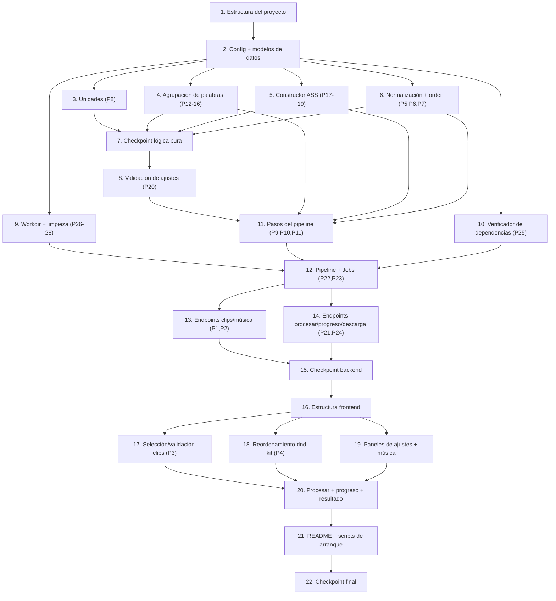

# Plan de Implementación: vertical-shorts-editor

## Visión General

Este plan convierte el diseño aprobado en una serie de tareas de código incrementales para construir, desde cero, la aplicación local de edición de shorts verticales: un backend FastAPI (`localhost:8000`) que envuelve el Motor de Procesamiento de 5 pasos y un frontend Next.js (`localhost:3000`).

El repositorio `ksaljdlkasjdklasd` solo contiene un README placeholder; la primera tarea vacía la raíz y crea la estructura `frontend/` + `backend/`. Cada tarea posterior construye sobre las anteriores y termina integrándose con el resto (sin código huérfano).

Se prioriza la **lógica pura del motor** (conversión de unidades, agrupación de palabras, construcción del ASS, matemática de escala+pad, preservación de orden, validación de ajustes) con **tests property-based** (Hypothesis en el backend Python, fast-check en el frontend TypeScript), etiquetados con `Feature: vertical-shorts-editor, Property N`.

Convenciones:
- Las sub-tareas marcadas con `*` son de testing y opcionales (pueden omitirse para un MVP más rápido); las tareas de implementación base nunca se marcan opcionales.
- Cada tarea referencia los requisitos (`_Requisitos: X.Y_`) y, cuando aplica, las propiedades de correctitud del diseño.
- Solo se incluyen tareas de código (escritura, modificación o testing).

## Tareas

- [x] 1. Preparar el repositorio y la estructura del proyecto
  - Vaciar el `README.md` placeholder de la raíz (se reescribirá en la tarea final de arranque)
  - Crear los directorios raíz `frontend/` y `backend/` según la estructura del diseño
  - Crear `backend/requirements.txt` declarando como mínimo `fastapi`, `uvicorn`, `auto-editor`, `faster-whisper`, `python-multipart` y las libs de test (`pytest`, `hypothesis`)
  - Crear un `requirements.txt` en la raíz que referencie/duplique las dependencias de Python (nota de trazabilidad del diseño para Req 14.5)
  - Crear `backend/main.py` mínimo que instancie la app FastAPI (sin lógica aún) y `backend/app/__init__.py`
  - _Requisitos: 14.5, 14.6_

- [x] 2. Definir la configuración y los modelos de datos del backend
  - [x] 2.1 Implementar `backend/app/config.py`
    - Definir puertos (8000), límites (500 MB por clip, 100 MB música, máx 50 clips por adición, máx 500 clips por Job), ruta base del directorio de trabajo, ruta de salida de videos finales y valores por defecto (resolución 1080x1920, fps 30, etc.)
    - _Requisitos: 1.4, 8.2, 10.1, 10.2, 13.3_
  - [x] 2.2 Implementar los modelos de dominio en `backend/app/models/`
    - `clip.py` (`Clip` con id, nombre_original, ruta_almacenada, posicion, tamano_bytes, duracion_s, formato)
    - `job.py` (`JobStatus`, `PipelineStep`, `Progress`, `JobState`)
    - `errors.py` (`ApiError` con code, message, details) y helpers para el envoltorio de error homogéneo
    - `settings.py` con estructuras Pydantic (`ResolucionObjetivo`, `AjustesGenerales`, `AjustesSilencios`, `AjustesTranscripcion`, `AjustesSubtitulos`, `AjustesMusica`, `Ajustes`) SIN la lógica de validación de rangos todavía (se completa en la tarea 8)
    - _Requisitos: 1.2, 1.3, 10.3, 3.2, 3.5_

- [x] 3. Implementar la lógica pura de conversión de unidades UI↔motor
  - [x] 3.1 Implementar `backend/app/util/units.py`
    - Conversión de umbral de silencio dB (-60..0) a porcentaje del motor (0..100 %)
    - Conversión de margen ms (0..5000) a segundos (0..5 s)
    - Conversión de umbral de voz dBFS (-30) a amplitud lineal para el ducking
    - Garantizar monotonicidad no decreciente y acotamiento a los rangos del motor
    - _Requisitos: 4.2, 8.5_
  - [x]* 3.2 Escribir test property-based de conversión de unidades en `backend/tests/test_units.py`
    - **Propiedad 8: Conversión de unidades UI↔motor monótona y acotada**
    - Etiqueta: `Feature: vertical-shorts-editor, Property 8`
    - **Validates: Requisitos 4.2, 8.5**

- [x] 4. Implementar la lógica pura de agrupación de palabras en subtítulos
  - [x] 4.1 Implementar `backend/app/engine/grouping.py`
    - Definir `Palabra` y `GrupoSubtitulo` (o reutilizar de modelos) y la función `agrupar(palabras, max_n)`
    - Acotar tamaño de grupo a 1..10, con fallback a 4 cuando `max_palabras` está fuera de rango, registrando advertencia (Req 6.2)
    - Último grupo con palabras restantes (Req 6.3); tiempo de inicio = primera palabra, fin = última palabra (Req 6.4)
    - Robustez ante palabras sin timestamp válido: excluir/marcar el grupo y registrar advertencia, sin emitir tiempos inválidos (Req 6.5)
    - _Requisitos: 6.1, 6.2, 6.3, 6.4, 6.5_
  - [x]* 4.2 Escribir test property-based de tamaño de grupo y fallback en `backend/tests/test_grouping.py`
    - **Propiedad 12: Tamaño de grupo acotado y fallback del máximo**
    - Etiqueta: `Feature: vertical-shorts-editor, Property 12`
    - **Validates: Requisitos 6.1, 6.2**
  - [x]* 4.3 Escribir test property-based de cobertura sin pérdida en `backend/tests/test_grouping.py`
    - **Propiedad 13: La agrupación preserva todas las palabras en orden**
    - Etiqueta: `Feature: vertical-shorts-editor, Property 13`
    - **Validates: Requisitos 6.3**
  - [x]* 4.4 Escribir test property-based de tiempos de grupo en `backend/tests/test_grouping.py`
    - **Propiedad 14: Tiempos de grupo derivados de los timestamps por palabra**
    - Etiqueta: `Feature: vertical-shorts-editor, Property 14`
    - **Validates: Requisitos 6.4**
  - [x]* 4.5 Escribir test property-based de robustez ante timestamps ausentes en `backend/tests/test_grouping.py`
    - **Propiedad 15: Robustez ante timestamps ausentes**
    - Etiqueta: `Feature: vertical-shorts-editor, Property 15`
    - **Validates: Requisitos 6.5**
  - [x]* 4.6 Escribir test property-based de monotonicidad y no-solapamiento en `backend/tests/test_grouping.py`
    - **Propiedad 16: Monotonicidad y no-solapamiento de los tiempos de subtítulos**
    - Etiqueta: `Feature: vertical-shorts-editor, Property 16`
    - **Validates: Requisitos 6.4**

- [x] 5. Implementar la lógica pura de construcción del archivo ASS
  - [x] 5.1 Implementar `backend/app/util/ass_time.py`
    - Formato de tiempo ASS `h:mm:ss.cs` (centésimas) con redondeo desde segundos
    - _Requisitos: 7.1_
  - [x] 5.2 Implementar `backend/app/engine/ass_builder.py`
    - Cálculo de alineación `\anN` desde posición vertical/horizontal (tabla del teclado numérico ASS)
    - Cálculo de posición base (x, y_final) desde porcentajes + `margen_px` con clamp
    - Invariante de animación: `y_inicial = y_final + slide_px` y override `{\anN\move(x,y_inicial,x,y_final,0,entrada)\fad(entrada,salida)}`
    - Conversión de color `#RRGGBB` a formato ASS `&HAABBGGRR` y emisión de secciones `[Script Info]`, `[V4+ Styles]`, `[Events]`
    - _Requisitos: 7.1, 7.3, 7.4, 7.5, 7.6, 7.7, 7.8, 7.9_
  - [x]* 5.3 Escribir test property-based de round-trip del ASS en `backend/tests/test_ass_builder.py`
    - **Propiedad 17: Round-trip del archivo ASS**
    - Generadores que cubran textos con caracteres especiales/no ASCII
    - Etiqueta: `Feature: vertical-shorts-editor, Property 17`
    - **Validates: Requisitos 7.1**
  - [x]* 5.4 Escribir test property-based del invariante slide-up en `backend/tests/test_ass_builder.py`
    - **Propiedad 18: Invariante de animación slide-up en el override ASS**
    - Etiqueta: `Feature: vertical-shorts-editor, Property 18`
    - **Validates: Requisitos 7.3, 7.4**
  - [x]* 5.5 Escribir test property-based del mapeo de alineación en `backend/tests/test_ass_builder.py`
    - **Propiedad 19: Mapeo correcto de alineación `\an`**
    - Etiqueta: `Feature: vertical-shorts-editor, Property 19`
    - **Validates: Requisitos 7.5, 7.6**

- [x] 6. Implementar la lógica pura de normalización 9:16 y orden de concatenación
  - [x] 6.1 Implementar los cálculos puros en `backend/app/engine/normalize.py`
    - Función pura de factor de escala `s = min(W/w, H/h)` y cálculo de relleno centrado (`padX`, `padY`) no negativos
    - Función pura que construye la lista de concatenación (`concat.txt`) a partir del `orden_clips`, garantizando igualdad elemento a elemento con el orden recibido (sin reordenar, omitir ni duplicar)
    - Construcción de la cadena de filtro `scale=...:force_original_aspect_ratio=decrease,pad=...,setsar=1,fps=...` como valor computado (sin ejecutar ffmpeg aún)
    - _Requisitos: 3.1, 3.3, 3.4, 2.4_
  - [x]* 6.2 Escribir test property-based de normalización sin deformación en `backend/tests/test_normalize.py`
    - **Propiedad 6: Normalización 9:16 sin deformación (escala + pad centrado)**
    - Generadores que cubran dimensiones extremas (2 y 7680)
    - Etiqueta: `Feature: vertical-shorts-editor, Property 6`
    - **Validates: Requisitos 3.1**
  - [x]* 6.3 Escribir test property-based de homogeneización en `backend/tests/test_normalize.py`
    - **Propiedad 7: Homogeneización de clips heterogéneos**
    - Etiqueta: `Feature: vertical-shorts-editor, Property 7`
    - **Validates: Requisitos 3.3**
  - [x]* 6.4 Escribir test property-based de preservación de orden extremo a extremo en `backend/tests/test_ordering.py`
    - **Propiedad 5: Preservación del orden de clips extremo a extremo**
    - Etiqueta: `Feature: vertical-shorts-editor, Property 5`
    - **Validates: Requisitos 2.4, 3.4**

- [x] 7. Checkpoint - Asegurar que la lógica pura del motor pasa sus tests
  - Ejecutar la suite de tests del backend (`pytest`) para units, grouping, ass_builder, normalize y ordering
  - Asegurar que todos los tests pasan; consultar al usuario si surgen dudas.

- [x] 8. Completar la validación de ajustes en los modelos
  - [x] 8.1 Añadir la validación de rangos a `backend/app/models/settings.py`
    - Aplicar rangos del motor y política de reconciliación UI↔motor documentada por campo (tamaño 12..200, max_palabras 1..10 con fallback a 4, grosor_borde 0..20, anim 100..2000, slide 1..500, etc.)
    - Aceptar el conjunto de ajustes si y solo si todos los campos están en rango; rechazar identificando el campo inválido
    - Validación de idioma/modelo de transcripción contra los conjuntos soportados por faster-whisper (rechazo antes de transcribir)
    - _Requisitos: 7.11, 9.1, 9.6, 4.4, 5.5, 5.6, 6.2_
  - [x]* 8.2 Escribir test property-based de validación de ajustes en `backend/tests/test_settings.py`
    - **Propiedad 20: Validación de ajustes (aceptado si y solo si todos los campos están en rango)**
    - Etiqueta: `Feature: vertical-shorts-editor, Property 20`
    - **Validates: Requisitos 7.11, 9.1, 9.6**

- [x] 9. Implementar el almacén de trabajo por Job y su limpieza
  - [x] 9.1 Implementar `backend/app/storage/workdir.py`
    - Crear directorio de trabajo `{<workdir>}/jobs/{job_id}/` al iniciar un Job y resolver rutas de artefactos siempre dentro de ese directorio (contención por prefijo)
    - Limpieza al finalizar (éxito o error/cancelación) con política de hasta 3 reintentos y registro del archivo afectado si persiste el fallo, sin interrumpir otros Jobs
    - Conservar el `Video_Final` en una ruta de salida separada del directorio temporal
    - _Requisitos: 13.3, 13.4, 13.5, 13.6_
  - [x]* 9.2 Escribir test property-based de contención de temporales en `backend/tests/test_workdir.py`
    - **Propiedad 26: Contención de archivos temporales en el workdir del Job**
    - Etiqueta: `Feature: vertical-shorts-editor, Property 26`
    - **Validates: Requisitos 13.3**
  - [x]* 9.3 Escribir test property-based de limpieza en toda terminación en `backend/tests/test_workdir.py`
    - **Propiedad 27: Toda terminación de Job limpia los temporales**
    - Etiqueta: `Feature: vertical-shorts-editor, Property 27`
    - **Validates: Requisitos 13.4, 13.5**
  - [x]* 9.4 Escribir test property-based de política de reintento de limpieza en `backend/tests/test_workdir.py`
    - **Propiedad 28: Política de reintento de limpieza acotada**
    - Etiqueta: `Feature: vertical-shorts-editor, Property 28`
    - **Validates: Requisitos 13.6**

- [x] 10. Implementar el Verificador de Dependencias y su integración en el arranque
  - [x] 10.1 Implementar `backend/app/deps/checker.py`
    - Comprobar `ffmpeg`, `ffprobe`, `auto-editor` (vía `--version` con timeout individual) y `faster-whisper` (importabilidad), cada comprobación con timeout dentro del plazo de 10 s
    - Tratar como no disponible/no verificable cualquier comprobación que exceda el timeout
    - Reportar por nombre exactamente las dependencias faltantes y decidir bloqueo del arranque si y solo si hay al menos una faltante
    - _Requisitos: 12.1, 12.2, 12.3, 12.4, 12.5_
  - [x] 10.2 Integrar el verificador en el evento de arranque de FastAPI en `backend/main.py`
    - Ejecutar la verificación en startup; impedir que el backend complete el arranque si falta alguna dependencia, indicando fallo de inicialización; permitir continuar cuando todas están disponibles
    - _Requisitos: 12.4, 12.5_
  - [x]* 10.3 Escribir test property-based de la decisión del verificador en `backend/tests/test_deps.py`
    - **Propiedad 25: Decisión del verificador de dependencias**
    - Etiqueta: `Feature: vertical-shorts-editor, Property 25`
    - **Validates: Requisitos 12.2, 12.4, 12.5**
  - [x]* 10.4 Escribir test unitario del timeout de dependencia en `backend/tests/test_deps.py`
    - Verificar que una comprobación que excede 10 s se marca como no verificable
    - _Requisitos: 12.1, 12.3_

- [x] 11. Implementar los pasos del pipeline que invocan herramientas externas
  - [x] 11.1 Implementar la inspección de clips en `backend/app/engine/ffprobe.py`
    - Obtener resolución, rotación, fps y validez vía `ffprobe`; señalar clip corrupto/no decodificable
    - _Requisitos: 3.6_
  - [x] 11.2 Completar el Paso 1 (UNIR) en `backend/app/engine/normalize.py`
    - Normalizar cada clip a archivo intermedio con parámetros idénticos (resolución, fps, códec, audio; inyectar audio silencioso si falta pista) y concatenar con el demuxer `concat` en el orden del usuario
    - Detener y reportar sin salida parcial si un clip falla (Req 3.6)
    - _Requisitos: 3.1, 3.3, 3.4, 3.6_
  - [x] 11.3 Implementar el Paso 2 (CORTAR SILENCIOS) en `backend/app/engine/silence.py`
    - Invocar `auto-editor` con umbral (%) y margen (s) convertidos desde la UI; omitir el paso cuando está desactivado (no-op); rechazar valores fuera de rango conservando el último válido; marcar error si `auto-editor` falla
    - _Requisitos: 4.1, 4.2, 4.3, 4.4, 4.5_
  - [x]* 11.4 Escribir test property-based de silencios desactivados (no-op) en `backend/tests/test_silence.py`
    - **Propiedad 9: El corte de silencios desactivado es un no-op**
    - Etiqueta: `Feature: vertical-shorts-editor, Property 9`
    - **Validates: Requisitos 4.3**
  - [x]* 11.5 Escribir test property-based de validación de umbral/margen en `backend/tests/test_silence.py`
    - **Propiedad 10: Validación de umbral/margen conserva el último valor válido**
    - Etiqueta: `Feature: vertical-shorts-editor, Property 10`
    - **Validates: Requisitos 4.4**
  - [x] 11.6 Implementar el Paso 3 (TRANSCRIBIR) en `backend/app/engine/transcribe.py`
    - Extraer audio con ffmpeg y transcribir con faster-whisper (CPU, `word_timestamps=True`), idioma configurable con "auto"; validar idioma/modelo antes de transcribir; manejar audio ilegible/sin voz sin timestamps parciales
    - _Requisitos: 5.1, 5.2, 5.3, 5.4, 5.5, 5.6, 5.7_
  - [x]* 11.7 Escribir test property-based de validación de idioma/modelo en `backend/tests/test_transcribe.py`
    - **Propiedad 11: Validación de idioma y modelo antes de transcribir**
    - Etiqueta: `Feature: vertical-shorts-editor, Property 11`
    - **Validates: Requisitos 5.5, 5.6**
  - [x] 11.8 Implementar el Paso 4 (SUBTÍTULOS) en `backend/app/engine/subtitles.py`
    - Usar `grouping.py` + `ass_builder.py` para generar el `.ass` y quemarlo con `ffmpeg -vf "ass=..."`; conservar el video original y reportar error si ffmpeg falla; rechazar configuración fuera de rango antes de quemar
    - _Requisitos: 7.1, 7.2, 7.10, 7.11_
  - [x] 11.9 Implementar el Paso 5 (MÚSICA) en `backend/app/engine/music.py`
    - Mezclar música WAV con `sidechaincompress` (ducking): volumen base, reducción >= 12 dB, umbral -30 dBFS, attack <= 250 ms, release <= 500 ms; omitir si no hay WAV válido; reportar error si el filtro falla
    - _Requisitos: 8.3, 8.4, 8.5, 8.6, 8.7_
  - [x]* 11.10 Escribir tests de integración de los pasos con medios de prueba cortos en `backend/tests/test_engine_integration.py`
    - Corte de silencios con audio conocido (4.1); transcripción con audio real (5.1, 5.4); quemado de subtítulos (7.2); ducking midiendo >=12 dB / attack / release (8.3, 8.5, 8.6)
    - _Requisitos: 4.1, 5.1, 5.4, 7.2, 8.3, 8.5, 8.6_

- [x] 12. Orquestar el pipeline completo y el Gestor de Jobs
  - [x] 12.1 Implementar `backend/app/engine/pipeline.py`
    - Encadenar los 5 pasos en orden estricto usando el workdir del Job, reportando inicio y avance de cada paso con el reparto de porcentaje definido (0-25, 25-40, 40-70, 70-90, 90-100)
    - Al fallar un paso: marcar el Job como fallido, detener pasos restantes y exponer `error = { paso, motivo }`
    - _Requisitos: 3.x, 4.x, 5.x, 6.x, 7.x, 8.x, 10.5, 10.7_
  - [x] 12.2 Implementar `backend/app/jobs/manager.py`
    - Registro de Jobs en memoria (`job_id -> JobState`) protegido con estructura asíncrona; transiciones de estado (en_cola → en_ejecucion → completado/fallido); progreso como fuente de verdad con porcentaje 0..100 monótono no decreciente
    - _Requisitos: 10.3, 10.5_
  - [x] 12.3 Implementar `backend/app/jobs/runner.py`
    - Ejecutar el pipeline en background (asyncio + executor) sin bloquear la respuesta; invocar limpieza del workdir al completar o fallar
    - _Requisitos: 10.1, 13.4, 13.5_
  - [x]* 12.4 Escribir test property-based de invariantes de progreso en `backend/tests/test_api.py`
    - **Propiedad 22: Invariantes de progreso (rango y monotonicidad)**
    - Etiqueta: `Feature: vertical-shorts-editor, Property 22`
    - **Validates: Requisitos 10.3, 10.5**
  - [x]* 12.5 Escribir test property-based de fallo de paso detiene el pipeline en `backend/tests/test_api.py`
    - **Propiedad 23: El fallo de un paso detiene el pipeline**
    - Etiqueta: `Feature: vertical-shorts-editor, Property 23`
    - **Validates: Requisitos 10.7**

- [x] 13. Implementar los endpoints de subida de clips y música
  - [x] 13.1 Implementar `POST /clips` en `backend/app/api/clips.py`
    - Recibir multipart (1..50 archivos), almacenar cada clip preservando el orden de recepción y devolver un id único por clip con su posición (1..n); revalidar formato/tamaño
    - Atomicidad: si falla el almacenamiento de uno o más clips, responder error identificándolos y no dejar almacenamiento parcial
    - _Requisitos: 1.1, 1.2, 1.3, 1.6_
  - [x] 13.2 Implementar `POST /musica` en `backend/app/api/music.py`
    - Recibir WAV, validar formato y tamaño (<= 100 MB); rechazar conservando audio/video originales; devolver `musica_id`
    - _Requisitos: 8.1, 8.2_
  - [x] 13.3 Registrar los routers de clips y música en `backend/main.py`
    - Conectar los endpoints a la app FastAPI
    - _Requisitos: 1.1, 8.1_
  - [x]* 13.4 Escribir test property-based de orden/cardinalidad/identidad de clips en `backend/tests/test_api.py`
    - **Propiedad 1: Almacenamiento de clips preserva orden, cardinalidad e identidad**
    - Etiqueta: `Feature: vertical-shorts-editor, Property 1`
    - **Validates: Requisitos 1.2, 1.3**
  - [x]* 13.5 Escribir test property-based de atomicidad de almacenamiento en `backend/tests/test_api.py`
    - **Propiedad 2: Almacenamiento de clips es atómico**
    - Etiqueta: `Feature: vertical-shorts-editor, Property 2`
    - **Validates: Requisitos 1.6**
  - [x]* 13.6 Escribir tests unitarios de subida en `backend/tests/test_api.py`
    - Subida multipart correcta (1.1); WAV inválido/>100 MB (8.2)
    - _Requisitos: 1.1, 8.2_

- [x] 14. Implementar los endpoints de procesamiento, progreso y descarga
  - [x] 14.1 Implementar `POST /procesar` en `backend/app/api/process.py`
    - Validar la petición (orden 1..500 clips, ajustes requeridos); crear Job y devolver `job_id` en <= 2 s; rechazar con `400 INVALID_REQUEST` sin crear Job cuando la entrada es inválida
    - _Requisitos: 9.5, 10.1, 10.2_
  - [x] 14.2 Implementar `GET /progreso/{id}` en `backend/app/api/progress.py`
    - Variante JSON (polling) y variante SSE (`?stream=true`) que emite estado + paso + % (heartbeat <= 5 s); `404 JOB_NOT_FOUND` sin modificar estado
    - _Requisitos: 10.3, 10.4, 10.6_
  - [x] 14.3 Implementar `GET /descargar/{id}` en `backend/app/api/download.py`
    - Stream del MP4 con `Content-Disposition: attachment` para Job completado; `409 RESULT_NOT_READY` si no completó; `404 JOB_NOT_FOUND` si no existe
    - _Requisitos: 11.2, 11.3, 11.4_
  - [x] 14.4 Registrar los routers de procesar/progreso/descargar en `backend/main.py`
    - Conectar los endpoints y cablear con el Gestor de Jobs y el runner
    - _Requisitos: 9.5, 10.1, 11.2_
  - [x]* 14.5 Escribir test property-based de rechazo de peticiones inválidas en `backend/tests/test_api.py`
    - **Propiedad 21: Rechazo de peticiones de procesamiento inválidas sin crear Job**
    - Etiqueta: `Feature: vertical-shorts-editor, Property 21`
    - **Validates: Requisitos 10.2**
  - [x]* 14.6 Escribir test property-based de descarga requiere Job completado en `backend/tests/test_api.py`
    - **Propiedad 24: La descarga requiere Job completado**
    - Etiqueta: `Feature: vertical-shorts-editor, Property 24`
    - **Validates: Requisitos 11.3**
  - [x]* 14.7 Escribir tests unitarios de progreso/descarga/latencia en `backend/tests/test_api.py`
    - Creación de Job y latencia <= 2 s (10.1); id inexistente en progreso (10.4) y descarga (11.4)
    - _Requisitos: 10.1, 10.4, 11.4_

- [x] 15. Checkpoint - Asegurar que el backend completo pasa sus tests
  - Ejecutar la suite completa del backend (`pytest`), incluyendo tests property-based (mínimo 100 iteraciones) y de integración
  - Asegurar que todos los tests pasan; consultar al usuario si surgen dudas.

- [x] 16. Inicializar la estructura del frontend Next.js
  - [x] 16.1 Crear la configuración base del frontend
    - `frontend/package.json` (Next.js App Router, React, TypeScript, Tailwind, dnd-kit, fast-check para tests), `next.config.js`, `tsconfig.json`, `tailwind.config.ts`, `postcss.config.js`, `app/globals.css`
    - `app/layout.tsx` y `app/page.tsx` con la estructura mínima de la pantalla del editor
    - _Requisitos: 14.6_
  - [x] 16.2 Implementar tipos y cliente HTTP en `frontend/lib/`
    - `types.ts` (`Clip`, `Settings`/`Ajustes`, `JobProgress`) alineados con los contratos del backend
    - `api.ts` (funciones para `POST /clips`, `POST /musica`, `POST /procesar`, `GET /progreso`, `GET /descargar`) con manejo de timeout de 60 s en la subida
    - `progress.ts` (suscripción SSE con fallback a polling)
    - _Requisitos: 1.1, 8.1, 9.5, 10.6, 11.2_

- [x] 17. Implementar la selección y validación de clips en la Interfaz
  - [x] 17.1 Implementar la validación de archivos en `frontend/lib/validation.ts`
    - Aceptar exactamente los archivos con formato soportado y tamaño <= 500 MB; asociar motivo a cada archivo rechazado; rechazar selección de > 50 archivos
    - _Requisitos: 1.4, 1.5_
  - [x] 17.2 Implementar `frontend/components/ClipUploader.tsx`
    - Selección de 1..50 clips, validación previa, envío multipart a `POST /clips`, manejo de timeout 60 s / error de red conservando la selección para reintento
    - _Requisitos: 1.1, 1.4, 1.5, 1.7_
  - [x]* 17.3 Escribir test property-based de validación de archivos en `frontend/lib/__tests__/validation.test.ts`
    - **Propiedad 3: La validación de archivos conserva exactamente los válidos**
    - Etiqueta: `Feature: vertical-shorts-editor, Property 3`
    - **Validates: Requisitos 1.4**
  - [x]* 17.4 Escribir tests unitarios de límites de selección en `frontend/components/__tests__/ClipUploader.test.tsx`
    - Límite de 50 archivos (1.5); mensaje de timeout/reintento (1.7)
    - _Requisitos: 1.5, 1.7_

- [x] 18. Implementar el reordenamiento por arrastrar y soltar
  - [x] 18.1 Implementar `frontend/components/ClipList.tsx` y `SortableClipItem.tsx`
    - Lista reordenable con dnd-kit habilitada con >= 2 clips; indicador visual de destino durante el arrastre; actualización del orden <= 500 ms; revertir al orden previo si se cancela o se suelta fuera del área válida
    - Función pura de reordenamiento (mover de i a j) reutilizable para test
    - _Requisitos: 2.1, 2.2, 2.5, 2.6_
  - [x]* 18.2 Escribir test property-based de reordenamiento y cancelación en `frontend/lib/__tests__/reorder.test.ts`
    - **Propiedad 4: El reordenamiento produce la permutación esperada y la cancelación es identidad**
    - Etiqueta: `Feature: vertical-shorts-editor, Property 4`
    - **Validates: Requisitos 2.2, 2.6**

- [x] 19. Implementar los paneles de ajustes y la música en la Interfaz
  - [x] 19.1 Implementar `frontend/components/settings/*`
    - `SubtitleSettings.tsx` (Req 9.1), `SilenceSettings.tsx` (Req 9.2), `TranscriptionSettings.tsx` (Req 9.3), `GeneralSettings.tsx` (resolución/fps), cada uno validando rangos de UI y señalando el campo inválido
    - _Requisitos: 9.1, 9.2, 9.3_
  - [x] 19.2 Implementar `frontend/components/MusicUploader.tsx`
    - Selección de WAV (rechazar no-WAV indicando el formato requerido), subida a `POST /musica` y ajuste de volumen base (0..100 %)
    - _Requisitos: 8.1, 9.4, 9.7_
  - [x]* 19.3 Escribir tests unitarios de rangos de ajustes en `frontend/components/settings/__tests__/settings.test.tsx`
    - Rangos de silencios/idioma/modelo/volumen (9.2, 9.3, 9.4); rechazo de música no WAV (9.7)
    - _Requisitos: 9.2, 9.3, 9.4, 9.7_

- [x] 20. Implementar el disparo del procesamiento, el progreso y el resultado
  - [x] 20.1 Implementar `frontend/components/ProcessButton.tsx`
    - Validación global previa; si todo es válido enviar `POST /procesar` con el Orden_de_Clips vigente + ajustes + musica_id; si no, bloquear e identificar el campo inválido conservando los ajustes; manejar fallo del envío
    - _Requisitos: 2.3, 9.5, 9.6, 9.8_
  - [x] 20.2 Implementar `frontend/components/ProgressPanel.tsx`
    - Mostrar el paso actual y el porcentaje (0..100) con SSE/polling actualizándose al menos cada 5 s; reflejar estado fallido con su motivo
    - _Requisitos: 10.6, 10.7_
  - [x] 20.3 Implementar `frontend/components/ResultPreview.tsx`
    - Previsualización reproducible del Video_Final (<= 3 s) al completar; botón de descarga vía `GET /descargar/{id}`; fallback con mensaje + opción de descarga si la previsualización no carga
    - _Requisitos: 11.1, 11.5_
  - [x] 20.4 Cablear todos los componentes en `frontend/app/page.tsx`
    - Integrar uploader, lista reordenable, paneles de ajustes, música, botón de procesar, panel de progreso y previsualización en el flujo completo del editor
    - _Requisitos: 2.3, 9.5, 10.6, 11.1_
  - [x]* 20.5 Escribir tests unitarios del flujo de UI en `frontend/components/__tests__/flow.test.tsx`
    - Envío del orden vigente (2.3); envío con ajustes válidos (9.5); fallo de `POST /procesar` conserva ajustes (9.8); refresco de progreso (10.6); previsualización y descarga (11.1, 11.2); fallback de previsualización (11.5)
    - _Requisitos: 2.3, 9.5, 9.8, 10.6, 11.1, 11.2, 11.5_

- [x] 21. Implementar el README y los scripts de arranque en macOS
  - [x] 21.1 Reescribir `README.md` en la raíz del proyecto
    - Sección de instalación en macOS con los tres pasos ordenados: (a) `brew install ffmpeg`, (b) venv + `pip install -r requirements.txt`, (c) `npm install` en `frontend/`
    - Instrucciones/documentación para levantar el backend en `localhost:8000` y la Interfaz en `localhost:3000`
    - _Requisitos: 14.1, 14.2_
  - [x] 21.2 Crear scripts de arranque documentados (por ejemplo `scripts/start-backend.sh` y `scripts/start-frontend.sh`)
    - Lanzar backend (uvicorn en 8000) y frontend (Next.js en 3000); detectar conflicto de puertos 8000/3000, finalizar el arranque del componente afectado con mensaje de error y sin dejar procesos parciales
    - _Requisitos: 14.2, 14.3, 14.4_
  - [x]* 21.3 Escribir tests smoke de arranque/config en `backend/tests/test_startup.py`
    - Presencia y contenido del README (14.1, 14.2); `requirements.txt` con dependencias mínimas (14.5); `package.json` con dependencias (14.6); backend sin auth (13.7); operación local sin red/API keys (13.1)
    - _Requisitos: 14.1, 14.2, 14.5, 14.6, 13.1, 13.7_

- [x] 22. Checkpoint final - Asegurar que toda la suite pasa
  - Ejecutar tests del backend (`pytest`) y del frontend (fast-check / test runner) con un solo pase (sin modo watch)
  - Asegurar que todos los tests pasan; consultar al usuario si surgen dudas.

## Grafo de Dependencias de Tareas

## Notas

- Las sub-tareas marcadas con `*` son de testing y opcionales; pueden omitirse para un MVP más rápido, pero se recomienda mantenerlas para garantizar correctitud.
- Cada Propiedad de Correctitud (1–28) del diseño se implementa con un único test property-based de mínimo 100 iteraciones, etiquetado con `Feature: vertical-shorts-editor, Property N`.
- La lógica pura del motor (tareas 3–6, 8) se prioriza y valida con PBT antes de conectar herramientas externas (tarea 11) y la orquestación (tarea 12).
- Los checkpoints (tareas 7, 15, 22) aseguran validación incremental por capas: lógica pura → backend completo → sistema completo.
- Reparto de propiedades por módulo de test según el diseño: `test_units.py` (P8), `test_grouping.py` (P12-16), `test_ass_builder.py` (P17-19), `test_normalize.py` (P6,P7), `test_ordering.py` (P5), `test_settings.py` (P20), `test_workdir.py` (P26-28), `test_deps.py` (P25), `test_silence.py` (P9,P10), `test_transcribe.py` (P11), `test_api.py` (P1,P2,P21,P22,P23,P24), y en el frontend `validation.test.ts` (P3) y `reorder.test.ts` (P4).
